# 🎯 Patrones de Diseño - Design Patterns

Una colección completa de **Patrones de Diseño** implementados en **TypeScript** con ejemplos prácticos, diagramas UML y código ejecutable. Este repositorio está diseñado para aprender y entender los patrones fundamentales de la programación orientada a objetos.

## 📋 ¿Qué son los Patrones de Diseño?

Los **Patrones de Diseño** son soluciones reutilizables a problemas comunes en el diseño de software. Representan las mejores prácticas utilizadas por desarrolladores experimentados y proporcionan un vocabulario común para discutir soluciones de diseño.

### Beneficios:
- 🔄 **Reutilización**: Soluciones probadas y testadas
- 📖 **Comunicación**: Vocabulario común entre desarrolladores  
- 🏗️ **Estructura**: Mejor organización y arquitectura del código
- 🛡️ **Mantenibilidad**: Código más fácil de mantener y extender

## 🗺️ Clasificación de Patrones

```mermaid
graph TD
    A[Patrones de Diseño] --> B[Creacionales]
    A --> C[Estructurales]  
    A --> D[Comportamentales]
    
    B --> B1[Singleton]
    B --> B2[Factory Method]
    B --> B3[Abstract Factory]
    B --> B4[Builder]
    B --> B5[Prototype]
    
    C --> C1[Adapter]
    C --> C2[Bridge]
    C --> C3[Composite]
    C --> C4[Decorator]
    C --> C5[Facade]
    C --> C6[Flyweight]
    C --> C7[Proxy]
    
    D --> D1[Observer]
    D --> D2[Strategy]
    D --> D3[Command]
    D --> D4[State]
    D --> D5[Template Method]
    D --> D6[Chain of Responsibility]
    D --> D7[Mediator]
    D --> D8[Memento]
    D --> D9[Visitor]
    D --> D10[Iterator]
    D --> D11[Interpreter]
    
    classDef implemented fill:#4CAF50,stroke:#2E7D32,color:#fff
    classDef pending fill:#FF9800,stroke:#F57C00,color:#fff
    
    class B1,B2,B3,B4,B5,C1,C2 implemented
    class C3,C4,C5,C6,C7,D1,D2,D3,D4,D5,D6,D7,D8,D9,D10,D11 pending
```



## 🚀 Código Ejecutable de Ejemplo

Aquí tienes un ejemplo práctico que muestra cómo diferentes patrones trabajan juntos:

```typescript
// Ejemplo integrado: Sistema de Notificaciones con múltiples patrones

// 1. SINGLETON: Configuración global del sistema
class NotificationConfig {
    private static instance: NotificationConfig;
    private settings = {
        emailEnabled: true,
        smsEnabled: true,
        slackEnabled: true,
        maxRetries: 3
    };
    
    static getInstance(): NotificationConfig {
        if (!this.instance) {
            this.instance = new NotificationConfig();
        }
        return this.instance;
    }
    
    getSettings() { return this.settings; }
}

// 2. ABSTRACT FACTORY: Diferentes tipos de notificadores
abstract class NotificationFactory {
    abstract createEmailSender(): INotificationSender;
    abstract createSMSSender(): INotificationSender;
    abstract createSlackSender(): INotificationSender;
}

class ProductionNotificationFactory extends NotificationFactory {
    createEmailSender(): INotificationSender {
        return new EmailSender();
    }
    createSMSSender(): INotificationSender {
        return new SMSSender();
    }
    createSlackSender(): INotificationSender {
        return new SlackSender();
    }
}

// 3. BRIDGE: Separación entre abstracción (tipo notificación) e implementación (canal)
abstract class Notification {
    constructor(protected sender: INotificationSender) {}
    abstract send(message: string): void;
}

class UrgentNotification extends Notification {
    send(message: string): void {
        console.log("🚨 URGENTE:");
        this.sender.send(`[URGENTE] ${message}`);
    }
}

class SimpleNotification extends Notification {
    send(message: string): void {
        console.log("📢 Notificación:");
        this.sender.send(message);
    }
}

// 4. ADAPTER: Integrar servicio externo incompatible
class SlackAPIAdapter implements INotificationSender {
    private slackAPI = new ThirdPartySlackAPI();
    
    send(message: string): void {
        // Adaptar interfaz incompatible
        const slackMessage = {
            text: message,
            channel: "#general",
            username: "NotificationBot"
        };
        this.slackAPI.postMessage(slackMessage);
    }
}

// 5. BUILDER: Construcción compleja de notificaciones
class NotificationBuilder {
    private notification: ComplexNotification = new ComplexNotification();
    
    withRecipient(recipient: string): NotificationBuilder {
        this.notification.addRecipient(recipient);
        return this;
    }
    
    withTemplate(template: string): NotificationBuilder {
        this.notification.setTemplate(template);
        return this;
    }
    
    withPriority(priority: 'low' | 'medium' | 'high'): NotificationBuilder {
        this.notification.setPriority(priority);
        return this;
    }
    
    build(): ComplexNotification {
        return this.notification;
    }
}

// 6. PROTOTYPE: Clonar configuraciones de notificación
class NotificationTemplate {
    constructor(
        public type: string,
        public subject: string,
        public body: string,
        public metadata: Map<string, any>
    ) {}
    
    clone(): NotificationTemplate {
        return new NotificationTemplate(
            this.type,
            this.subject,
            this.body,
            new Map(this.metadata)
        );
    }
}

// USO INTEGRADO DE TODOS LOS PATRONES
function demonstratePatterns(): void {
    console.log("🎯 === DEMOSTRACIÓN DE PATRONES DE DISEÑO ===\n");
    
    // 1. Singleton: Configuración única
    const config = NotificationConfig.getInstance();
    console.log("📋 Configuración del sistema:", config.getSettings());
    
    // 2. Abstract Factory: Crear familia de notificadores
    const factory = new ProductionNotificationFactory();
    const emailSender = factory.createEmailSender();
    const smsSender = factory.createSMSSender();
    
    // 3. Bridge: Diferentes abstracciones con misma implementación
    const urgentEmail = new UrgentNotification(emailSender);
    const simpleSMS = new SimpleNotification(smsSender);
    
    urgentEmail.send("Sistema comprometido - Revisar inmediatamente");
    simpleSMS.send("Reporte diario generado exitosamente");
    
    // 4. Adapter: Integrar servicio externo
    const slackAdapter = new SlackAPIAdapter();
    const slackNotification = new SimpleNotification(slackAdapter);
    slackNotification.send("Nuevo deploy realizado en producción");
    
    // 5. Builder: Construir notificación compleja
    const complexNotification = new NotificationBuilder()
        .withRecipient("admin@company.com")
        .withRecipient("ops@company.com")
        .withTemplate("security-alert")
        .withPriority("high")
        .build();
    
    console.log("🔧 Notificación compleja:", complexNotification);
    
    // 6. Prototype: Clonar template
    const alertTemplate = new NotificationTemplate(
        "security",
        "Alerta de Seguridad",
        "Se detectó actividad sospechosa",
        new Map([["severity", "high"], ["department", "IT"]])
    );
    
    const clonedTemplate = alertTemplate.clone();
    clonedTemplate.metadata.set("timestamp", new Date().toISOString());
    
    console.log("📄 Template original:", alertTemplate);
    console.log("📄 Template clonado:", clonedTemplate);
    
    console.log("\n✅ ¡Demostración completada! Todos los patrones trabajando juntos.");
}

// EJECUTAR DEMOSTRACIÓN
demonstratePatterns();
```

### 🏃‍♂️ Cómo Ejecutar los Ejemplos

```bash
# Clonar el repositorio
git clone https://github.com/BernatQI/Design-Patterns.git
cd Design-Patterns

# Instalar dependencias (si es necesario)
npm install

# Ejecutar un patrón específico
npx ts-node prototype/Main.ts
npx ts-node singleton/Main.ts
npx ts-node bridge/Main.ts

# O compilar y ejecutar
npx tsc --project singleton/tsconfig.json
node singleton/Main.js
```

## 📚 Patrones Implementados

### 🏗️ Patrones Creacionales
Estos patrones se enfocan en la **creación de objetos**, proporcionando mecanismos que aumentan la flexibilidad y reutilización del código.

| Patrón | Descripción | Estado |
|--------|-------------|---------|
| [**Singleton**](./singleton/) | Garantiza una única instancia de una clase | ✅ Implementado |
| [**Factory Method**](./factory/) | Crea objetos sin especificar clases exactas | ✅ Implementado |
| [**Abstract Factory**](./abstract-factory/) | Crea familias de objetos relacionados | ✅ Implementado |
| [**Builder**](./builder/) | Construye objetos complejos paso a paso | ✅ Implementado |
| [**Prototype**](./prototype/) | Crea objetos clonando instancias existentes | ✅ Implementado |

### 🔗 Patrones Estructurales
Estos patrones se enfocan en la **composición de clases y objetos**, formando estructuras más grandes mientras mantienen flexibilidad y eficiencia.

| Patrón | Descripción | Estado |
|--------|-------------|---------|
| [**Adapter**](./adapter/) | Permite que interfaces incompatibles trabajen juntas | ✅ Implementado |
| [**Bridge**](./bridge/) | Separa abstracción de implementación | ✅ Implementado |
| **Composite** | Compone objetos en estructuras de árbol | 🔄 (próximamente) |
| **Decorator** | Añade comportamiento a objetos dinámicamente | 🔄 (próximamente) |
| **Facade** | Proporciona interfaz simplificada a subsistema complejo | 🔄 (próximamente) |
| **Flyweight** | Minimiza uso de memoria compartiendo datos eficientemente | 🔄 (próximamente) |
| **Proxy** | Proporciona sustituto o placeholder para otro objeto | 🔄 (próximamente) |

### 🎭 Patrones Comportamentales
Estos patrones se enfocan en la **comunicación entre objetos** y la asignación de responsabilidades entre ellos.

| Patrón | Descripción | Estado |
|--------|-------------|---------|
| **Observer** | Define dependencia uno-a-muchos entre objetos | 🔄 (próximamente) |
| **Strategy** | Define familia de algoritmos intercambiables | 🔄 (próximamente) |
| **Command** | Encapsula una solicitud como un objeto | 🔄 (próximamente) |
| **State** | Permite que objeto altere comportamiento cuando cambia estado | 🔄 (próximamente) |
| **Template Method** | Define esqueleto de algoritmo en clase base | 🔄 (próximamente) |
| **Chain of Responsibility** | Pasa solicitudes a lo largo de cadena de manejadores | 🔄 (próximamente) |
| **Mediator** | Define cómo interactúa un conjunto de objetos | 🔄 (próximamente) |
| **Memento** | Captura y restaura estado interno de objeto | 🔄 (próximamente) |
| **Visitor** | Separa algoritmos de objetos sobre los que operan | 🔄 (próximamente) |
| **Iterator** | Proporciona forma de acceder secuencialmente a elementos | 🔄 (próximamente) |
| **Interpreter** | Define representación para gramática de lenguaje | 🔄 (próximamente) |

## 🎓 Guía de Aprendizaje Recomendada

### 📈 Nivel Principiante
1. **Singleton** - Concepto fundamental de instancia única
2. **Factory Method** - Introducción a la creación de objetos
3. **Adapter** - Resolver incompatibilidades entre interfaces

### 📊 Nivel Intermedio  
4. **Builder** - Construcción compleja de objetos
5. **Bridge** - Separación de abstracción e implementación
6. **Prototype** - Clonación y gestión de prototipos

### 🏆 Nivel Avanzado
7. **Abstract Factory** - Familias complejas de objetos
8. **Observer** - Comunicación entre múltiples objetos
9. **Strategy** - Algoritmos intercambiables
10. **Command** - Encapsulación de operaciones

## 🔍 Características de cada Implementación

Cada patrón en este repositorio incluye:

- 📊 **Diagrama UML** detallado en Mermaid
- 🎯 **Problema específico** que resuelve el patrón
- ✅ **Código TypeScript** completamente funcional
- 🧪 **Ejemplos prácticos** del mundo real
- 📝 **Documentación exhaustiva** con casos de uso
- ⚡ **Código ejecutable** para probar inmediatamente
- 🔗 **Relaciones** con otros patrones
- 💡 **Mejores prácticas** y consideraciones

## 🛠️ Tecnologías Utilizadas

- **TypeScript** - Tipado fuerte y características modernas
- **Node.js** - Entorno de ejecución 
- **Mermaid** - Diagramas UML integrados en markdown
- **ts-node** - Ejecución directa de TypeScript

## 📖 Recursos Adicionales

### 📚 Libros Recomendados
- **"Design Patterns: Elements of Reusable Object-Oriented Software"** - Gang of Four (GoF)
- **"Head First Design Patterns"** - Eric Freeman & Elisabeth Robson
- **"Refactoring: Improving the Design of Existing Code"** - Martin Fowler

### 🌐 Referencias Online
- [Refactoring Guru - Design Patterns](https://refactoring.guru/design-patterns)
- [SourceMaking - Design Patterns](https://sourcemaking.com/design_patterns)
- [DoFactory - Design Patterns](https://www.dofactory.com/net/design-patterns)

## 🤝 Contribuir

¿Quieres contribuir? ¡Genial! Aquí hay algunas formas:

1. 🐛 **Reportar bugs** o problemas en los ejemplos
2. 💡 **Sugerir mejoras** en la documentación
3. 🔧 **Implementar patrones faltantes**
4. 📝 **Mejorar explicaciones** existentes
5. 🧪 **Añadir más ejemplos** prácticos

### Proceso de Contribución:
1. Fork el repositorio
2. Crea una rama para tu feature (`git checkout -b feature/nuevo-patron`)
3. Commit tus cambios (`git commit -am 'Añadir patrón Strategy'`)
4. Push a la rama (`git push origin feature/nuevo-patron`)
5. Abre un Pull Request

## 📄 Licencia

Este proyecto está bajo la licencia MIT. Ver el archivo [LICENSE](LICENSE) para más detalles.

## 👨‍💻 Autor

**Bernat QI** - [GitHub](https://github.com/BernatQI)

---

⭐ **¿Te resultó útil este repositorio?** ¡Dale una estrella y compártelo!

💬 **¿Tienes preguntas?** Abre un issue y te ayudaremos.

🚀 **¿Quieres más contenido?** Sígueme para estar al día con nuevos patrones y ejemplos.