# Patrón Abstract Factory

[🇺🇸 English Version](./README.md) | 🇪🇸 Versión en Español

## Diagrama UML

```mermaid
%%{init: {"theme": "dark", "themeVariables": {"darkMode": true, "background": "#0d1117", "primaryColor": "#21262d", "primaryTextColor": "#e6edf3", "primaryBorderColor": "#30363d", "lineColor": "#484f58", "secondaryColor": "#161b22", "tertiaryColor": "#0d1117"}}}%%
classDiagram
    %% Abstract Factory
    class FurnitureFactory {
        <<abstract>>
        +createChair(): Chair*
        +createSofa(): Sofa*
        +createTable(): Table*
    }

    %% Concrete Factories
    class ModernFurnitureFactory {
        +createChair(): Chair
        +createSofa(): Sofa
        +createTable(): Table
    }

    class VictorianFurnitureFactory {
        +createChair(): Chair
        +createSofa(): Sofa
        +createTable(): Table
    }

    class IndustrialFurnitureFactory {
        +createChair(): Chair
        +createSofa(): Sofa
        +createTable(): Table
    }

    %% Abstract Products
    class Chair {
        <<abstract>>
        #material: string
        #color: string
        +constructor(material: string, color: string)
        +sitOn(): void*
        +getDescription(): string*
    }

    class Sofa {
        <<abstract>>
        #material: string
        #seats: number
        +constructor(material: string, seats: number)
        +lieDown(): void*
        +getDescription(): string*
    }

    class Table {
        <<abstract>>
        #material: string
        #height: number
        +constructor(material: string, height: number)
        +placeItem(): void*
        +getDescription(): string*
    }

    %% Modern Products
    class ModernChair {
        +constructor(material: string, color: string)
        +sitOn(): void
        +getDescription(): string
        +adjustHeight(): void
    }

    class ModernSofa {
        +constructor(material: string, seats: number)
        +lieDown(): void
        +getDescription(): string
        +toggleRecline(): void
    }

    class ModernTable {
        +constructor(material: string, height: number)
        +placeItem(): void
        +getDescription(): string
        +extendSurface(): void
    }

    %% Victorian Products
    class VictorianChair {
        +constructor(material: string, color: string)
        +sitOn(): void
        +getDescription(): string
        +showOrnaments(): void
    }

    class VictorianSofa {
        +constructor(material: string, seats: number)
        +lieDown(): void
        +getDescription(): string
        +displayPattern(): void
    }

    class VictorianTable {
        +constructor(material: string, height: number)
        +placeItem(): void
        +getDescription(): string
        +polishWood(): void
    }

    %% Industrial Products
    class IndustrialChair {
        +constructor(material: string, color: string)
        +sitOn(): void
        +getDescription(): string
        +adjustBolts(): void
    }

    class IndustrialSofa {
        +constructor(material: string, seats: number)
        +lieDown(): void
        +getDescription(): string
        +showMetalFrame(): void
    }

    class IndustrialTable {
        +constructor(material: string, height: number)
        +placeItem(): void
        +getDescription(): string
        +showRivets(): void
    }

    %% Client/Store
    class FurnitureStore {
        -factory: FurnitureFactory
        +constructor(factory: FurnitureFactory)
        +createFurnitureSet(): FurnitureSet
        +displayCatalog(): void
    }

    class FurnitureSet {
        +chair: Chair
        +sofa: Sofa
        +table: Table
        +constructor(chair: Chair, sofa: Sofa, table: Table)
        +displaySet(): void
    }

    %% Factory Relationships
    ModernFurnitureFactory --|> FurnitureFactory : implements
    VictorianFurnitureFactory --|> FurnitureFactory : implements
    IndustrialFurnitureFactory --|> FurnitureFactory : implements

    %% Product Relationships
    ModernChair --|> Chair : implements
    ModernSofa --|> Sofa : implements
    ModernTable --|> Table : implements

    VictorianChair --|> Chair : implements
    VictorianSofa --|> Sofa : implements
    VictorianTable --|> Table : implements

    IndustrialChair --|> Chair : implements
    IndustrialSofa --|> Sofa : implements
    IndustrialTable --|> Table : implements

    %% Creation Relationships
    ModernFurnitureFactory ..> ModernChair : creates
    ModernFurnitureFactory ..> ModernSofa : creates
    ModernFurnitureFactory ..> ModernTable : creates

    VictorianFurnitureFactory ..> VictorianChair : creates
    VictorianFurnitureFactory ..> VictorianSofa : creates
    VictorianFurnitureFactory ..> VictorianTable : creates

    IndustrialFurnitureFactory ..> IndustrialChair : creates
    IndustrialFurnitureFactory ..> IndustrialSofa : creates
    IndustrialFurnitureFactory ..> IndustrialTable : creates

    %% Client Relationships
    FurnitureStore --> FurnitureFactory : uses
    FurnitureStore ..> FurnitureSet : creates
    FurnitureSet --> Chair : contains
    FurnitureSet --> Sofa : contains
    FurnitureSet --> Table : contains

    note for FurnitureFactory "Abstract Factory: Define interfaz\npara crear familias de productos"
    note for FurnitureStore "Cliente: Usa factory sin conocer\nproductos concretos"
```



## ¿Qué es el Patrón Abstract Factory?

El patrón **Abstract Factory** es un patrón de diseño creacional que permite crear **familias completas de objetos relacionados** sin especificar sus clases concretas. Es como una "fábrica de fábricas" que garantiza que los productos creados sean compatibles entre sí.

## Problema que Resuelve

### ❌ Sin Abstract Factory: Incompatibilidad de Productos
```typescript
class FurnitureSystem {
    createFurnitureSet(): void {
        // ¡PROBLEMA! Mezcla estilos incompatibles
        const chair = new ModernChair("Cuero", "Negro");
        const sofa = new VictorianSofa("Terciopelo", 3);  // ¡Victorian con Modern!
        const table = new IndustrialTable("Acero", 75);   // ¡Industrial con los otros!
        
        // Resultado: Set de muebles inconsistente
        // No hay garantía de coherencia estilística
    }
}

// Problemas:
// 1. No hay garantía de compatibilidad entre productos
// 2. Fácil crear combinaciones incorrectas
// 3. Difícil mantener consistencia
// 4. Cliente debe conocer todas las clases concretas
```

### ✅ Con Abstract Factory: Familias Coherentes
```typescript
class FurnitureStore {
    constructor(private factory: FurnitureFactory) {}
    
    createFurnitureSet(): FurnitureSet {
        // ¡GARANTÍA! Todos los productos son del mismo estilo
        const chair = this.factory.createChair();
        const sofa = this.factory.createSofa();
        const table = this.factory.createTable();
        
        return new FurnitureSet(chair, sofa, table);
    }
}

// Con ModernFurnitureFactory = todos los productos son modernos
// Con VictorianFurnitureFactory = todos los productos son victorianos
// Con IndustrialFurnitureFactory = todos los productos son industriales

// Beneficios:
// 1. Garantía de compatibilidad entre productos
// 2. Imposible crear combinaciones incorrectas
// 3. Fácil cambiar toda la familia de productos
// 4. Cliente desacoplado de clases concretas
```

## Componentes del Patrón

### 1. **Abstract Factory** (`FurnitureFactory`)
- Define interfaz para crear cada tipo de producto
- Declara métodos para crear todos los productos de la familia
- No implementa la creación, solo define la interfaz

### 2. **Concrete Factory** (`ModernFurnitureFactory`, `VictorianFurnitureFactory`, `IndustrialFurnitureFactory`)
- Implementa operaciones para crear productos de una familia específica
- Cada factory crea productos que son compatibles entre sí
- Garantiza la coherencia de la familia de productos

### 3. **Abstract Product** (`Chair`, `Sofa`, `Table`)
- Define interfaz para un tipo de producto
- Declara operaciones comunes para todos los productos de ese tipo
- Es implementada por productos concretos

### 4. **Concrete Product** (`ModernChair`, `VictorianSofa`, `IndustrialTable`, etc.)
- Implementa la interfaz del producto abstracto
- Define un producto específico creado por una factory específica
- Productos de la misma familia son diseñados para trabajar juntos

### 5. **Client** (`FurnitureStore`)
- Usa solo interfaces declaradas por Abstract Factory y Abstract Product
- No conoce clases concretas de productos
- Puede trabajar con cualquier familia de productos

## Flujo de Trabajo

```typescript
// 1. Configuración inicial: elegir familia
const factory: FurnitureFactory = new ModernFurnitureFactory();
const store = new FurnitureStore(factory);

// 2. Crear familia completa de productos
const furnitureSet = store.createFurnitureSet();

// 3. Todos los productos son compatibles
furnitureSet.displaySet(); // Muestra set moderno coherente

// 4. Cambiar familia es fácil
const victorianFactory = new VictorianFurnitureFactory();
const victorianStore = new FurnitureStore(victorianFactory);
const victorianSet = victorianStore.createFurnitureSet(); // Set victoriano coherente
```

## Cuándo Usar Abstract Factory

✅ **Úsalo cuando:**
- Tu código necesita trabajar con varias familias de productos relacionados
- Quieres garantizar que productos de una familia sean compatibles
- Quieres ocultar implementaciones concretas de productos
- Necesitas configurar el sistema con una de varias familias de productos

❌ **No lo uses cuando:**
- Solo necesitas crear un tipo de producto
- Las familias de productos no cambian frecuentemente
- La complejidad no justifica la abstracción adicional

## Ventajas

🛡️ **Compatibilidad Garantizada**: Productos de una familia siempre son compatibles
🔓 **Principio Abierto/Cerrado**: Fácil agregar nuevas familias sin modificar código existente
🎯 **Single Responsibility**: Separa creación de uso de productos
🔗 **Bajo Acoplamiento**: Cliente no depende de clases concretas
🔄 **Consistency**: Garantiza consistencia entre productos relacionados

## Desventajas

📈 **Complejidad**: Introduce muchas interfaces y clases
🏗️ **Rigidez**: Difícil agregar nuevos tipos de productos a familias existentes
⚡ **Overhead**: Puede ser excesivo para casos simples
🔧 **Mantenimiento**: Cambios en productos requieren cambios en todas las factories

## Ejemplo Práctico: Sistema de Muebles

### Escenario Real
Una tienda de muebles online ofrece tres estilos de decoración:

**Familias de Productos:**
- **Modern**: Líneas limpias, materiales sintéticos, funcionalidad
- **Victorian**: Ornamentación elaborada, madera noble, elegancia clásica  
- **Industrial**: Metal y acero, diseño utilitario, estética fabril

**Tipos de Productos:**
- **Chair**: Para sentarse, cada estilo tiene características únicas
- **Sofa**: Para relajarse, varía en diseño según el estilo
- **Table**: Para trabajar/comer, materiales y formas diferentes por estilo

### Garantía de Coherencia
```typescript
// Ejemplo: Cliente solicita decoración moderna
const modernFactory = new ModernFurnitureFactory();
const store = new FurnitureStore(modernFactory);

const modernSet = store.createFurnitureSet();
modernSet.displaySet();

// Salida:
// 🪑 Silla Moderna: Cuero sintético negro, altura ajustable
// 🛋️ Sofá Moderno: Cuero sintético para 3 personas, reclinable  
// 🪑 Mesa Moderna: Vidrio templado de 75cm, superficie extensible

// ¡GARANTÍA! Todos son del mismo estilo y combinan perfectamente
```

### Flexibilidad de Configuración
```typescript
// Cambio de configuración sin modificar código cliente
function createShowroom(style: 'modern' | 'victorian' | 'industrial'): FurnitureSet {
    let factory: FurnitureFactory;
    
    switch(style) {
        case 'modern':
            factory = new ModernFurnitureFactory();
            break;
        case 'victorian':
            factory = new VictorianFurnitureFactory();
            break;
        case 'industrial':
            factory = new IndustrialFurnitureFactory();
            break;
    }
    
    const store = new FurnitureStore(factory);
    return store.createFurnitureSet();
}

// Uso
const modernShowroom = createShowroom('modern');     // Set moderno
const victorianShowroom = createShowroom('victorian'); // Set victoriano
const industrialShowroom = createShowroom('industrial'); // Set industrial
```

## Casos de Uso Reales

### 🎮 **Temas de UI Multiplataforma**
```typescript
abstract class UIFactory {
    abstract createButton(): Button;
    abstract createScrollbar(): Scrollbar;
    abstract createWindow(): Window;
}

class WindowsUIFactory extends UIFactory {
    createButton(): Button { return new WindowsButton(); }
    createScrollbar(): Scrollbar { return new WindowsScrollbar(); }
    createWindow(): Window { return new WindowsWindow(); }
}

class MacUIFactory extends UIFactory {
    createButton(): Button { return new MacButton(); }
    createScrollbar(): Scrollbar { return new MacScrollbar(); }
    createWindow(): Window { return new MacWindow(); }
}

class LinuxUIFactory extends UIFactory {
    createButton(): Button { return new LinuxButton(); }
    createScrollbar(): Scrollbar { return new LinuxScrollbar(); }
    createWindow(): Window { return new LinuxWindow(); }
}
```

### 🏭 **Conectores de Base de Datos**
```typescript
abstract class DatabaseFactory {
    abstract createConnection(): Connection;
    abstract createCommand(): Command;
    abstract createDataReader(): DataReader;
}

class MySQLFactory extends DatabaseFactory {
    createConnection(): Connection { return new MySQLConnection(); }
    createCommand(): Command { return new MySQLCommand(); }
    createDataReader(): DataReader { return new MySQLDataReader(); }
}

class PostgreSQLFactory extends DatabaseFactory {
    createConnection(): Connection { return new PostgreSQLConnection(); }
    createCommand(): Command { return new PostgreSQLCommand(); }
    createDataReader(): DataReader { return new PostgreSQLDataReader(); }
}
```

### 🎨 **Temas de Aplicación**
```typescript
abstract class ThemeFactory {
    abstract createColors(): ColorPalette;
    abstract createFonts(): FontFamily;
    abstract createIcons(): IconSet;
}

class DarkThemeFactory extends ThemeFactory {
    createColors(): ColorPalette { return new DarkColorPalette(); }
    createFonts(): FontFamily { return new DarkFontFamily(); }
    createIcons(): IconSet { return new DarkIconSet(); }
}

class LightThemeFactory extends ThemeFactory {
    createColors(): ColorPalette { return new LightColorPalette(); }
    createFonts(): FontFamily { return new LightFontFamily(); }
    createIcons(): IconSet { return new LightIconSet(); }
}
```

### 🚗 **Fabricación de Vehículos**
```typescript
abstract class VehicleFactory {
    abstract createEngine(): Engine;
    abstract createWheels(): Wheel[];
    abstract createInterior(): Interior;
}

class LuxuryCarFactory extends VehicleFactory {
    createEngine(): Engine { return new V8Engine(); }
    createWheels(): Wheel[] { return [new AlloyWheel(), /* ... */]; }
    createInterior(): Interior { return new LeatherInterior(); }
}

class EconomyCarFactory extends VehicleFactory {
    createEngine(): Engine { return new FourCylinderEngine(); }
    createWheels(): Wheel[] { return [new SteelWheel(), /* ... */]; }
    createInterior(): Interior { return new FabricInterior(); }
}
```

### 🎪 **Elementos de Juego por Nivel**
```typescript
abstract class LevelFactory {
    abstract createEnemies(): Enemy[];
    abstract createPowerUps(): PowerUp[];
    abstract createObstacles(): Obstacle[];
}

class BeginnerLevelFactory extends LevelFactory {
    createEnemies(): Enemy[] { return [new WeakGoblin(), new SlowZombie()]; }
    createPowerUps(): PowerUp[] { return [new HealthPotion(), new SpeedBoost()]; }
    createObstacles(): Obstacle[] { return [new SmallRock(), new Puddle()]; }
}

class ExpertLevelFactory extends LevelFactory {
    createEnemies(): Enemy[] { return [new StrongOrc(), new FastDemon()]; }
    createPowerUps(): PowerUp[] { return [new SuperHealthPotion(), new FlightPower()]; }
    createObstacles(): Obstacle[] { return [new LavaPool(), new SpikeWall()]; }
}
```

## Abstract Factory vs Otros Patrones

### **Abstract Factory vs Factory Method**
- **Abstract Factory**: Crea familias completas de productos relacionados
- **Factory Method**: Crea un solo tipo de producto

### **Abstract Factory vs Builder**
- **Abstract Factory**: Crea diferentes familias de productos simples
- **Builder**: Construye un producto complejo paso a paso

### **Abstract Factory vs Prototype**
- **Abstract Factory**: Crea productos desde cero usando constructores
- **Prototype**: Crea productos clonando instancias existentes

### **Abstract Factory vs Singleton**
- **Abstract Factory**: Típicamente implementado como Singleton
- **Singleton**: Se puede usar para implementar Concrete Factories

## Relación con Otros Patrones

- **Factory Method**: Abstract Factory usa Factory Methods para crear productos
- **Singleton**: Concrete Factories suelen ser Singletons
- **Prototype**: Puede usarse con Abstract Factory para clonar prototipos
- **Facade**: Abstract Factory puede actuar como Facade para subsistema de creación

## Variantes del Patrón

### 1. **Abstract Factory con Registro**
```typescript
class FactoryRegistry {
    private static factories = new Map<string, FurnitureFactory>();
    
    static registerFactory(name: string, factory: FurnitureFactory): void {
        this.factories.set(name, factory);
    }
    
    static getFactory(name: string): FurnitureFactory {
        const factory = this.factories.get(name);
        if (!factory) throw new Error(`Factory ${name} no encontrada`);
        return factory;
    }
}

// Uso
FactoryRegistry.registerFactory('modern', new ModernFurnitureFactory());
FactoryRegistry.registerFactory('victorian', new VictorianFurnitureFactory());

const factory = FactoryRegistry.getFactory('modern');
```

### 2. **Abstract Factory con Configuración**
```typescript
interface FactoryConfig {
    style: string;
    materials: string[];
    priceRange: 'low' | 'medium' | 'high';
}

abstract class ConfigurableFurnitureFactory {
    constructor(protected config: FactoryConfig) {}
    
    abstract createChair(): Chair;
    abstract createSofa(): Sofa;
    abstract createTable(): Table;
}
```

### 3. **Abstract Factory con Cache**
```typescript
abstract class CachedFurnitureFactory {
    private cache = new Map<string, Furniture>();
    
    protected getCachedProduct<T extends Furniture>(key: string, creator: () => T): T {
        if (!this.cache.has(key)) {
            this.cache.set(key, creator());
        }
        return this.cache.get(key) as T;
    }
}
```

## Consideraciones de Implementación

### **Extensibilidad**
```typescript
// Agregar nueva familia es fácil
class MinimalistFurnitureFactory extends FurnitureFactory {
    createChair(): Chair { return new MinimalistChair("Bambú", "Natural"); }
    createSofa(): Sofa { return new MinimalistSofa("Lino", 2); }
    createTable(): Table { return new MinimalistTable("Madera clara", 70); }
}

// Pero agregar nuevo producto requiere modificar todas las factories
abstract class FurnitureFactory {
    abstract createChair(): Chair;
    abstract createSofa(): Sofa;
    abstract createTable(): Table;
    abstract createLamp(): Lamp; // ¡Nuevo producto = cambio en todas las factories!
}
```

### **Inicialización de Factories**
```typescript
// 1. Factory como Singleton
class ModernFurnitureFactory extends FurnitureFactory {
    private static instance: ModernFurnitureFactory;
    
    static getInstance(): ModernFurnitureFactory {
        if (!this.instance) {
            this.instance = new ModernFurnitureFactory();
        }
        return this.instance;
    }
}

// 2. Factory con Dependency Injection
class FurnitureStore {
    constructor(@inject('FurnitureFactory') private factory: FurnitureFactory) {}
}
```

El Abstract Factory es especialmente poderoso en sistemas que necesitan garantizar compatibilidad entre múltiples objetos relacionados, como interfaces de usuario, sistemas de temas, o cualquier contexto donde la coherencia entre productos es crítica.