# Abstract Factory Pattern

[🇪🇸 Versión en Español](./README.es.md) | 🇺🇸 English Version

## UML Diagram

```mermaid
classDiagram
    %% Abstract Product Interfaces
    class Chair {
        <<interface>>
        +sitOn(): void
        +getComfortLevel(): number
    }

    class Sofa {
        <<interface>>
        +lieDown(): void
        +getSeatingCapacity(): number
    }

    class CoffeeTable {
        <<interface>>
        +putItems(): void
        +getStorageSpace(): number
    }

    %% Abstract Factory
    class FurnitureFactory {
        <<interface>>
        +createChair(): Chair
        +createSofa(): Sofa
        +createCoffeeTable(): CoffeeTable
    }

    %% Victorian Style Products
    class VictorianChair {
        +sitOn(): void
        +getComfortLevel(): number
        +hasVelvetUpholstery(): boolean
    }

    class VictorianSofa {
        +lieDown(): void
        +getSeatingCapacity(): number
        +hasGoldTrim(): boolean
    }

    class VictorianCoffeeTable {
        +putItems(): void
        +getStorageSpace(): number
        +hasCarvings(): boolean
    }

    %% Modern Style Products
    class ModernChair {
        +sitOn(): void
        +getComfortLevel(): number
        +isErgonomic(): boolean
    }

    class ModernSofa {
        +lieDown(): void
        +getSeatingCapacity(): number
        +hasUSBPorts(): boolean
    }

    class ModernCoffeeTable {
        +putItems(): void
        +getStorageSpace(): number
        +hasGlassTop(): boolean
    }

    %% Industrial Style Products
    class IndustrialChair {
        +sitOn(): void
        +getComfortLevel(): number
        +isMetalFrame(): boolean
    }

    class IndustrialSofa {
        +lieDown(): void
        +getSeatingCapacity(): number
        +hasLeatherFinish(): boolean
    }

    class IndustrialCoffeeTable {
        +putItems(): void
        +getStorageSpace(): number
        +hasWheels(): boolean
    }

    %% Concrete Factories
    class VictorianFurnitureFactory {
        +createChair(): Chair
        +createSofa(): Sofa
        +createCoffeeTable(): CoffeeTable
    }

    class ModernFurnitureFactory {
        +createChair(): Chair
        +createSofa(): Sofa
        +createCoffeeTable(): CoffeeTable
    }

    class IndustrialFurnitureFactory {
        +createChair(): Chair
        +createSofa(): Sofa
        +createCoffeeTable(): CoffeeTable
    }

    %% Client
    class FurnitureStore {
        -factory: FurnitureFactory
        +constructor(factory: FurnitureFactory)
        +createLivingRoomSet(): void
        +displayFurniture(): void
    }

    %% Relationships
    VictorianChair ..|> Chair : implements
    VictorianSofa ..|> Sofa : implements
    VictorianCoffeeTable ..|> CoffeeTable : implements

    ModernChair ..|> Chair : implements
    ModernSofa ..|> Sofa : implements
    ModernCoffeeTable ..|> CoffeeTable : implements

    IndustrialChair ..|> Chair : implements
    IndustrialSofa ..|> Sofa : implements
    IndustrialCoffeeTable ..|> CoffeeTable : implements

    VictorianFurnitureFactory ..|> FurnitureFactory : implements
    ModernFurnitureFactory ..|> FurnitureFactory : implements
    IndustrialFurnitureFactory ..|> FurnitureFactory : implements

    VictorianFurnitureFactory --> VictorianChair : creates
    VictorianFurnitureFactory --> VictorianSofa : creates
    VictorianFurnitureFactory --> VictorianCoffeeTable : creates

    ModernFurnitureFactory --> ModernChair : creates
    ModernFurnitureFactory --> ModernSofa : creates
    ModernFurnitureFactory --> ModernCoffeeTable : creates

    IndustrialFurnitureFactory --> IndustrialChair : creates
    IndustrialFurnitureFactory --> IndustrialSofa : creates
    IndustrialFurnitureFactory --> IndustrialCoffeeTable : creates

    FurnitureStore --> FurnitureFactory : uses
    FurnitureStore --> Chair : uses
    FurnitureStore --> Sofa : uses
    FurnitureStore --> CoffeeTable : uses

    note for FurnitureFactory "Abstract Factory:\nCreates families of\nrelated products"
    note for VictorianFurnitureFactory "Concrete Factory:\nCreates Victorian\nstyle furniture"
    note for FurnitureStore "Client:\nWorks with abstract\ninterfaces only"
```



## What is the Abstract Factory Pattern?

The **Abstract Factory** pattern is a creational design pattern that provides an interface for creating **families of related or dependent objects** without specifying their concrete classes. It's essentially a "factory of factories."

## Problem it Solves

### ❌ Without Abstract Factory: Inconsistent Product Families
```typescript
class FurnitureStore {
    createLivingRoom(style: string): void {
        let chair: Chair;
        let sofa: Sofa;
        let table: CoffeeTable;
        
        // Problem: Easy to mix incompatible styles
        if (style === "victorian") {
            chair = new VictorianChair();
            sofa = new ModernSofa(); // Oops! Wrong style!
            table = new VictorianCoffeeTable();
        } else if (style === "modern") {
            chair = new ModernChair();
            sofa = new VictorianSofa(); // Another mismatch!
            table = new ModernCoffeeTable();
        }
        
        // Problems:
        // 1. Easy to create mismatched product combinations
        // 2. Code scattered across different places
        // 3. Hard to ensure consistency
        // 4. Difficult to add new product families
        // 5. Violates Open/Closed Principle
        
        console.log("Living room created with mixed styles!");
    }
}
```

### ✅ With Abstract Factory: Consistent Product Families
```typescript
// Abstract factory ensures consistent product families
interface FurnitureFactory {
    createChair(): Chair;
    createSofa(): Sofa;
    createCoffeeTable(): CoffeeTable;
}

class VictorianFurnitureFactory implements FurnitureFactory {
    createChair(): Chair {
        return new VictorianChair();
    }
    
    createSofa(): Sofa {
        return new VictorianSofa();
    }
    
    createCoffeeTable(): CoffeeTable {
        return new VictorianCoffeeTable();
    }
}

class ModernFurnitureFactory implements FurnitureFactory {
    createChair(): Chair {
        return new ModernChair();
    }
    
    createSofa(): Sofa {
        return new ModernSofa();
    }
    
    createCoffeeTable(): CoffeeTable {
        return new ModernCoffeeTable();
    }
}

class FurnitureStore {
    constructor(private factory: FurnitureFactory) {}
    
    createLivingRoom(): void {
        // Guaranteed to create consistent product family
        const chair = this.factory.createChair();
        const sofa = this.factory.createSofa();
        const table = this.factory.createCoffeeTable();
        
        // All products are guaranteed to be from the same family
        chair.sitOn();
        sofa.lieDown();
        table.putItems();
        
        console.log("Living room created with consistent style!");
    }
}

// Usage
const victorianFactory = new VictorianFurnitureFactory();
const store = new FurnitureStore(victorianFactory);
store.createLivingRoom(); // All Victorian furniture

// Benefits:
// 1. Guarantees product consistency
// 2. Easy to switch entire product families
// 3. Supports new families without changing client
// 4. Encapsulates product creation logic
```

## Pattern Components

### 1. **Abstract Factory** (`FurnitureFactory`)
- Declares methods for creating abstract products
- Each method corresponds to a product type
- All products in a family implement the same interface

### 2. **Concrete Factories** (`VictorianFurnitureFactory`, `ModernFurnitureFactory`)
- Implement abstract factory methods
- Create concrete products belonging to a single family
- Ensure products are compatible with each other

### 3. **Abstract Products** (`Chair`, `Sofa`, `CoffeeTable`)
- Declare interfaces for product types
- All variants of a product type implement this interface
- Client works with these abstractions

### 4. **Concrete Products** (`VictorianChair`, `ModernChair`)
- Different implementations of abstract products
- Each belongs to a specific product family
- Designed to work together within their family

### 5. **Client** (`FurnitureStore`)
- Uses only abstract factory and product interfaces
- Doesn't know about concrete implementations
- Can work with any product family

## When to Use Abstract Factory

✅ **Use it when:**
- You need to create families of related products
- Products in a family are designed to work together
- You want to enforce constraints on product combinations
- You need to support multiple product families
- Product creation logic is complex and should be centralized

❌ **Don't use it when:**
- You only have one product family
- Products don't need to be consistent with each other
- Simple Factory or Factory Method would suffice
- The overhead of multiple abstractions isn't justified

## Advantages

👨‍👩‍👧‍👦 **Product Consistency**: Ensures compatible products work together
🔄 **Easy Family Switching**: Change entire product family by swapping factory
📈 **Extensibility**: Add new families without changing existing code
🔒 **Encapsulation**: Hides product creation complexity
🎯 **Single Responsibility**: Each factory creates one product family

## Disadvantages

📈 **Code Complexity**: Many interfaces and classes
🧩 **Difficult Extension**: Adding new product types requires changing all factories
⚡ **Overhead**: May be overkill for simple scenarios
📚 **Learning Curve**: More complex than simpler factory patterns

## Real-world Use Cases

### 🖥️ **UI Component Factory**
```typescript
// Abstract products
interface Button {
    render(): HTMLElement;
    onClick(handler: () => void): void;
}

interface TextField {
    render(): HTMLElement;
    getValue(): string;
    setValue(value: string): void;
}

interface Checkbox {
    render(): HTMLElement;
    isChecked(): boolean;
    setChecked(checked: boolean): void;
}

// Abstract factory
interface UIFactory {
    createButton(): Button;
    createTextField(): TextField;
    createCheckbox(): Checkbox;
}

// Windows UI family
class WindowsUIFactory implements UIFactory {
    createButton(): Button {
        return new WindowsButton();
    }
    
    createTextField(): TextField {
        return new WindowsTextField();
    }
    
    createCheckbox(): Checkbox {
        return new WindowsCheckbox();
    }
}

// macOS UI family
class MacUIFactory implements UIFactory {
    createButton(): Button {
        return new MacButton();
    }
    
    createTextField(): TextField {
        return new MacTextField();
    }
    
    createCheckbox(): Checkbox {
        return new MacCheckbox();
    }
}

// Web UI family
class WebUIFactory implements UIFactory {
    createButton(): Button {
        return new WebButton();
    }
    
    createTextField(): TextField {
        return new WebTextField();
    }
    
    createCheckbox(): Checkbox {
        return new WebCheckbox();
    }
}

// Application using UI factory
class Application {
    constructor(private uiFactory: UIFactory) {}
    
    createLoginForm(): HTMLElement {
        const container = document.createElement('div');
        
        // All components will be from the same UI family
        const usernameField = this.uiFactory.createTextField();
        const passwordField = this.uiFactory.createTextField();
        const rememberMe = this.uiFactory.createCheckbox();
        const loginButton = this.uiFactory.createButton();
        
        container.appendChild(usernameField.render());
        container.appendChild(passwordField.render());
        container.appendChild(rememberMe.render());
        container.appendChild(loginButton.render());
        
        return container;
    }
}

// Usage based on platform
function createApplication(): Application {
    const platform = getPlatform();
    
    let factory: UIFactory;
    switch (platform) {
        case 'windows':
            factory = new WindowsUIFactory();
            break;
        case 'macos':
            factory = new MacUIFactory();
            break;
        case 'web':
            factory = new WebUIFactory();
            break;
        default:
            factory = new WebUIFactory();
    }
    
    return new Application(factory);
}
```

### 🏭 **Database Provider Factory**
```typescript
// Abstract products
interface IConnection {
    connect(): Promise<void>;
    disconnect(): Promise<void>;
    isConnected(): boolean;
}

interface ICommand {
    execute(sql: string, params?: any[]): Promise<any>;
    executeScalar(sql: string, params?: any[]): Promise<any>;
    executeNonQuery(sql: string, params?: any[]): Promise<number>;
}

interface ITransaction {
    begin(): Promise<void>;
    commit(): Promise<void>;
    rollback(): Promise<void>;
}

// Abstract factory
interface DatabaseFactory {
    createConnection(connectionString: string): IConnection;
    createCommand(connection: IConnection): ICommand;
    createTransaction(connection: IConnection): ITransaction;
}

// SQL Server family
class SqlServerFactory implements DatabaseFactory {
    createConnection(connectionString: string): IConnection {
        return new SqlServerConnection(connectionString);
    }
    
    createCommand(connection: IConnection): ICommand {
        return new SqlServerCommand(connection);
    }
    
    createTransaction(connection: IConnection): ITransaction {
        return new SqlServerTransaction(connection);
    }
}

// MySQL family
class MySqlFactory implements DatabaseFactory {
    createConnection(connectionString: string): IConnection {
        return new MySqlConnection(connectionString);
    }
    
    createCommand(connection: IConnection): ICommand {
        return new MySqlCommand(connection);
    }
    
    createTransaction(connection: IConnection): ITransaction {
        return new MySqlTransaction(connection);
    }
}

// PostgreSQL family
class PostgreSqlFactory implements DatabaseFactory {
    createConnection(connectionString: string): IConnection {
        return new PostgreSqlConnection(connectionString);
    }
    
    createCommand(connection: IConnection): ICommand {
        return new PostgreSqlCommand(connection);
    }
    
    createTransaction(connection: IConnection): ITransaction {
        return new PostgreSqlTransaction(connection);
    }
}

// Data access layer
class Repository {
    constructor(
        private factory: DatabaseFactory,
        private connectionString: string
    ) {}
    
    async executeInTransaction<T>(
        operation: (command: ICommand) => Promise<T>
    ): Promise<T> {
        const connection = this.factory.createConnection(this.connectionString);
        const transaction = this.factory.createTransaction(connection);
        const command = this.factory.createCommand(connection);
        
        try {
            await connection.connect();
            await transaction.begin();
            
            const result = await operation(command);
            
            await transaction.commit();
            return result;
        } catch (error) {
            await transaction.rollback();
            throw error;
        } finally {
            await connection.disconnect();
        }
    }
}
```

### 🎮 **Game Environment Factory**
```typescript
// Abstract products
interface Enemy {
    attack(): number;
    getHealth(): number;
    getSprite(): string;
}

interface Weapon {
    getDamage(): number;
    getRange(): number;
    getSprite(): string;
}

interface Terrain {
    getMovementSpeed(): number;
    canPass(): boolean;
    getTexture(): string;
}

// Abstract factory
interface EnvironmentFactory {
    createEnemy(): Enemy;
    createWeapon(): Weapon;
    createTerrain(): Terrain;
}

// Forest environment family
class ForestFactory implements EnvironmentFactory {
    createEnemy(): Enemy {
        return new Wolf(); // Forest-specific enemy
    }
    
    createWeapon(): Weapon {
        return new Bow(); // Good for forest hunting
    }
    
    createTerrain(): Terrain {
        return new Trees(); // Forest terrain
    }
}

// Desert environment family
class DesertFactory implements EnvironmentFactory {
    createEnemy(): Enemy {
        return new Scorpion(); // Desert-specific enemy
    }
    
    createWeapon(): Weapon {
        return new Scimitar(); // Desert-themed weapon
    }
    
    createTerrain(): Terrain {
        return new Sand(); // Desert terrain
    }
}

// Arctic environment family
class ArcticFactory implements EnvironmentFactory {
    createEnemy(): Enemy {
        return new PolarBear(); // Arctic-specific enemy
    }
    
    createWeapon(): Weapon {
        return new IceSpear(); // Cold-resistant weapon
    }
    
    createTerrain(): Terrain {
        return new Ice(); // Arctic terrain
    }
}

// Game world
class GameWorld {
    constructor(private factory: EnvironmentFactory) {}
    
    generateLevel(): void {
        // All elements will be thematically consistent
        const enemy = this.factory.createEnemy();
        const weapon = this.factory.createWeapon();
        const terrain = this.factory.createTerrain();
        
        console.log(`Level generated with ${enemy.constructor.name} enemies`);
        console.log(`Available weapon: ${weapon.constructor.name}`);
        console.log(`Terrain type: ${terrain.constructor.name}`);
        
        // Elements work well together thematically and mechanically
    }
}

// Game progression
class Game {
    private currentLevel = 1;
    
    createWorld(): GameWorld {
        const factory = this.getEnvironmentFactory(this.currentLevel);
        return new GameWorld(factory);
    }
    
    private getEnvironmentFactory(level: number): EnvironmentFactory {
        if (level <= 3) return new ForestFactory();
        if (level <= 6) return new DesertFactory();
        return new ArcticFactory();
    }
}
```

## Abstract Factory vs Other Patterns

### **Abstract Factory vs Factory Method**
- **Abstract Factory**: Creates families of related products
- **Factory Method**: Creates individual products

### **Abstract Factory vs Builder**
- **Abstract Factory**: Creates complete product families in one go
- **Builder**: Creates complex single objects step by step

### **Abstract Factory vs Prototype**
- **Abstract Factory**: Creates products from scratch using classes
- **Prototype**: Creates products by cloning existing prototypes

### **Abstract Factory vs Simple Factory**
- **Abstract Factory**: Multiple factories for different product families
- **Simple Factory**: Single factory for creating individual products

## Implementation Variants

### **Registry-based Abstract Factory**
```typescript
type ProductCreator<T> = () => T;

class AbstractFactoryRegistry {
    private factories = new Map<string, FurnitureFactory>();
    
    register(style: string, factory: FurnitureFactory): void {
        this.factories.set(style, factory);
    }
    
    createFactory(style: string): FurnitureFactory {
        const factory = this.factories.get(style);
        if (!factory) {
            throw new Error(`No factory registered for style: ${style}`);
        }
        return factory;
    }
    
    getAvailableStyles(): string[] {
        return Array.from(this.factories.keys());
    }
}

// Usage
const registry = new AbstractFactoryRegistry();
registry.register("victorian", new VictorianFurnitureFactory());
registry.register("modern", new ModernFurnitureFactory());
registry.register("industrial", new IndustrialFurnitureFactory());

const factory = registry.createFactory("modern");
const store = new FurnitureStore(factory);
```

### **Configurable Abstract Factory**
```typescript
interface FactoryConfig {
    theme: string;
    quality: "budget" | "premium";
    materials: string[];
}

class ConfigurableFurnitureFactory implements FurnitureFactory {
    constructor(private config: FactoryConfig) {}
    
    createChair(): Chair {
        switch (this.config.theme) {
            case "victorian":
                return this.config.quality === "premium"
                    ? new PremiumVictorianChair(this.config.materials)
                    : new BudgetVictorianChair();
            case "modern":
                return this.config.quality === "premium"
                    ? new PremiumModernChair(this.config.materials)
                    : new BudgetModernChair();
            default:
                throw new Error(`Unknown theme: ${this.config.theme}`);
        }
    }
    
    createSofa(): Sofa {
        // Similar implementation for other products
        // ...
    }
    
    createCoffeeTable(): CoffeeTable {
        // Similar implementation for other products
        // ...
    }
}

// Usage
const premiumVictorianConfig: FactoryConfig = {
    theme: "victorian",
    quality: "premium",
    materials: ["mahogany", "velvet", "gold"]
};

const factory = new ConfigurableFurnitureFactory(premiumVictorianConfig);
```

### **Dynamic Abstract Factory**
```typescript
class DynamicAbstractFactory {
    private productCreators = new Map<string, Map<string, () => any>>();
    
    registerProduct<T>(
        family: string, 
        productType: string, 
        creator: () => T
    ): void {
        if (!this.productCreators.has(family)) {
            this.productCreators.set(family, new Map());
        }
        this.productCreators.get(family)!.set(productType, creator);
    }
    
    createProduct<T>(family: string, productType: string): T {
        const familyCreators = this.productCreators.get(family);
        if (!familyCreators) {
            throw new Error(`No creators for family: ${family}`);
        }
        
        const creator = familyCreators.get(productType);
        if (!creator) {
            throw new Error(`No creator for ${productType} in ${family} family`);
        }
        
        return creator();
    }
    
    getFamilies(): string[] {
        return Array.from(this.productCreators.keys());
    }
    
    getProductTypes(family: string): string[] {
        const familyCreators = this.productCreators.get(family);
        return familyCreators ? Array.from(familyCreators.keys()) : [];
    }
}

// Usage
const dynamicFactory = new DynamicAbstractFactory();

// Register Victorian family
dynamicFactory.registerProduct("victorian", "chair", () => new VictorianChair());
dynamicFactory.registerProduct("victorian", "sofa", () => new VictorianSofa());

// Register Modern family
dynamicFactory.registerProduct("modern", "chair", () => new ModernChair());
dynamicFactory.registerProduct("modern", "sofa", () => new ModernSofa());

// Create products
const victorianChair = dynamicFactory.createProduct<Chair>("victorian", "chair");
const modernSofa = dynamicFactory.createProduct<Sofa>("modern", "sofa");
```

## Best Practices

### **Use Dependency Injection**
```typescript
class Application {
    constructor(private furnitureFactory: FurnitureFactory) {}
    
    setupRoom(): void {
        const chair = this.furnitureFactory.createChair();
        const sofa = this.furnitureFactory.createSofa();
        const table = this.furnitureFactory.createCoffeeTable();
        
        // Use products...
    }
}

// Dependency injection container
class DIContainer {
    private factories = new Map<string, FurnitureFactory>();
    
    registerFactory(name: string, factory: FurnitureFactory): void {
        this.factories.set(name, factory);
    }
    
    createApplication(factoryName: string): Application {
        const factory = this.factories.get(factoryName);
        if (!factory) {
            throw new Error(`Factory not found: ${factoryName}`);
        }
        return new Application(factory);
    }
}
```

### **Validate Product Compatibility**
```typescript
abstract class ValidatedFurnitureFactory implements FurnitureFactory {
    abstract createChair(): Chair;
    abstract createSofa(): Sofa;
    abstract createCoffeeTable(): CoffeeTable;
    
    createCompleteSet(): FurnitureSet {
        const chair = this.createChair();
        const sofa = this.createSofa();
        const table = this.createCoffeeTable();
        
        // Validate that products work well together
        this.validateCompatibility(chair, sofa, table);
        
        return new FurnitureSet(chair, sofa, table);
    }
    
    private validateCompatibility(chair: Chair, sofa: Sofa, table: CoffeeTable): void {
        // Check dimensions, colors, materials, etc.
        if (!this.areColorsCompatible(chair, sofa, table)) {
            throw new Error("Furniture colors are not compatible");
        }
        
        if (!this.areStylesConsistent(chair, sofa, table)) {
            throw new Error("Furniture styles are not consistent");
        }
    }
    
    protected abstract areColorsCompatible(chair: Chair, sofa: Sofa, table: CoffeeTable): boolean;
    protected abstract areStylesConsistent(chair: Chair, sofa: Sofa, table: CoffeeTable): boolean;
}
```

### **Handle Factory Selection Logic**
```typescript
class FurnitureFactorySelector {
    static selectFactory(criteria: SelectionCriteria): FurnitureFactory {
        const { budget, style, room, preferences } = criteria;
        
        // Business logic for factory selection
        if (budget < 1000) {
            return new BudgetFurnitureFactory(style);
        }
        
        if (room === "office") {
            return new OfficeFurnitureFactory();
        }
        
        if (preferences.includes("eco-friendly")) {
            return new EcoFurnitureFactory(style);
        }
        
        // Default to style-based selection
        switch (style) {
            case "victorian":
                return new VictorianFurnitureFactory();
            case "modern":
                return new ModernFurnitureFactory();
            case "industrial":
                return new IndustrialFurnitureFactory();
            default:
                return new ModernFurnitureFactory(); // safe default
        }
    }
}

interface SelectionCriteria {
    budget: number;
    style: string;
    room: string;
    preferences: string[];
}
```

The Abstract Factory pattern is crucial when you need to ensure that groups of products work well together and want to easily switch between different product families while maintaining consistency.