# Patrón Abstract Factory - Diagrama UML

```mermaid
classDiagram
    %% Abstract Factory
    class FurnitureFactory {
        <<abstract>>
        +createChair(): Chair
        +createSofa(): Sofa
        +createTable(): Table
    }

    %% Concrete Factories
    class ModernFurnitureFactory {
        +createChair(): Chair
        +createSofa(): Sofa
        +createTable(): Table
    }

    class VictorianFurnitureFactory {
        +createChair(): Chair
        +createSofa(): Sofa
        +createTable(): Table
    }

    class IndustrialFurnitureFactory {
        +createChair(): Chair
        +createSofa(): Sofa
        +createTable(): Table
    }

    %% Abstract Products
    class Chair {
        <<interface>>
        +sitOn(): void
        +getStyle(): string
    }

    class Sofa {
        <<interface>>
        +lieOn(): void
        +getCapacity(): number
        +getStyle(): string
    }

    class Table {
        <<interface>>
        +putItemsOn(): void
        +getMaterial(): string
        +getStyle(): string
    }

    %% Modern Products
    class ModernChair {
        +sitOn(): void
        +getStyle(): string
    }

    class ModernSofa {
        +lieOn(): void
        +getCapacity(): number
        +getStyle(): string
    }

    class ModernTable {
        +putItemsOn(): void
        +getMaterial(): string
        +getStyle(): string
    }

    %% Victorian Products
    class VictorianChair {
        +sitOn(): void
        +getStyle(): string
    }

    class VictorianSofa {
        +lieOn(): void
        +getCapacity(): number
        +getStyle(): string
    }

    class VictorianTable {
        +putItemsOn(): void
        +getMaterial(): string
        +getStyle(): string
    }

    %% Industrial Products
    class IndustrialChair {
        +sitOn(): void
        +getStyle(): string
    }

    class IndustrialSofa {
        +lieOn(): void
        +getCapacity(): number
        +getStyle(): string
    }

    class IndustrialTable {
        +putItemsOn(): void
        +getMaterial(): string
        +getStyle(): string
    }

    %% Client
    class FurnitureStore {
        -factory: FurnitureFactory
        +constructor(factory: FurnitureFactory)
        +orderFurnitureSet(): void
    }

    %% Factory Relationships
    ModernFurnitureFactory --|> FurnitureFactory
    VictorianFurnitureFactory --|> FurnitureFactory
    IndustrialFurnitureFactory --|> FurnitureFactory

    %% Product Relationships
    ModernChair ..|> Chair
    ModernSofa ..|> Sofa
    ModernTable ..|> Table
    
    VictorianChair ..|> Chair
    VictorianSofa ..|> Sofa
    VictorianTable ..|> Table
    
    IndustrialChair ..|> Chair
    IndustrialSofa ..|> Sofa
    IndustrialTable ..|> Table

    %% Factory-Product Creation Relationships
    ModernFurnitureFactory ..> ModernChair : creates
    ModernFurnitureFactory ..> ModernSofa : creates
    ModernFurnitureFactory ..> ModernTable : creates
    
    VictorianFurnitureFactory ..> VictorianChair : creates
    VictorianFurnitureFactory ..> VictorianSofa : creates
    VictorianFurnitureFactory ..> VictorianTable : creates
    
    IndustrialFurnitureFactory ..> IndustrialChair : creates
    IndustrialFurnitureFactory ..> IndustrialSofa : creates
    IndustrialFurnitureFactory ..> IndustrialTable : creates

    %% Client Relationships
    FurnitureStore --> FurnitureFactory : uses
    FurnitureStore ..> Chair : receives
    FurnitureStore ..> Sofa : receives
    FurnitureStore ..> Table : receives

    note for FurnitureFactory "Abstract Factory: Define métodos\npara crear familias de productos"
    note for FurnitureStore "Client: Usa productos sin conocer\nsus clases concretas"
```

## Estructura del Patrón Abstract Factory

**Propósito:**
Proporciona una interfaz para crear familias de objetos relacionados sin especificar sus clases concretas.

**Componentes principales:**
- `FurnitureFactory` - Factory abstracta que define métodos de creación
- `ModernFurnitureFactory`, `VictorianFurnitureFactory`, `IndustrialFurnitureFactory` - Factories concretas
- `Chair`, `Sofa`, `Table` - Productos abstractos
- Productos concretos organizados por familias (Modern, Victorian, Industrial)
- `FurnitureStore` - Cliente que usa las factories

**Ventajas clave:**
- 🏭 Garantiza compatibilidad entre productos de una familia
- 🔄 Fácil cambio de familia completa de productos
- 🎯 Cliente desacoplado de clases concretas
- ➕ Fácil agregar nuevas familias de productos