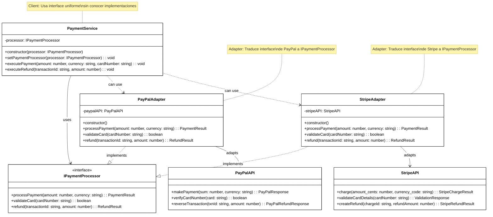

# Patrón Adapter

[🇺🇸 English Version](./README.md) | 🇪🇸 Versión en Español

## Diagrama UML



## ¿Qué es el Patrón Adapter?

El patrón **Adapter** es un patrón de diseño estructural que permite que interfaces incompatibles trabajen juntas. Actúa como un "traductor" entre dos clases que no pueden comunicarse directamente debido a interfaces diferentes.

## Problema que Resuelve

### ❌ Sin Adapter: APIs Incompatibles
```typescript
// Tu código espera esta interfaz
interface PaymentProcessor {
    processPayment(amount: number, currency: string): PaymentResult;
}

// Pero PayPal tiene esta interfaz diferente
class PayPalAPI {
    makePayment(sum: number, currency: string): PayPalResponse { }
}

// Y Stripe tiene esta otra interfaz
class StripeAPI {
    charge(amount_cents: number, currency_code: string): StripeResult { }
}

// ¡Incompatibles! No puedes usar ninguna sin reescribir código 😱
```

### ✅ Con Adapter: Unificación de Interfaces
```typescript
// Adapters que traducen las interfaces
class PayPalAdapter implements PaymentProcessor {
    private paypal = new PayPalAPI();
    
    processPayment(amount: number, currency: string): PaymentResult {
        // Traduce: amount → sum, llama makePayment
        const response = this.paypal.makePayment(amount, currency);
        // Traduce: PayPalResponse → PaymentResult
        return this.convertResponse(response);
    }
}

class StripeAdapter implements PaymentProcessor {
    private stripe = new StripeAPI();
    
    processPayment(amount: number, currency: string): PaymentResult {
        // Traduce: amount → amount_cents, currency → currency_code
        const response = this.stripe.charge(amount * 100, currency);
        // Traduce: StripeResult → PaymentResult
        return this.convertResponse(response);
    }
}

// ¡Ahora tu código funciona con cualquier proveedor! ⚡
```

## Componentes del Patrón

### 1. **Target** (`IPaymentProcessor`)
- La interfaz que espera el cliente
- Define el "contrato" que debe cumplir el adapter
- Representa la interfaz unificada

### 2. **Adaptee** (`PayPalAPI`, `StripeAPI`)
- La clase existente con interfaz incompatible
- Generalmente código de terceros que no puedes modificar
- Contiene la funcionalidad que necesitas usar

### 3. **Adapter** (`PayPalAdapter`, `StripeAdapter`)
- Implementa la interfaz **Target**
- Contiene una instancia del **Adaptee**
- Traduce las llamadas entre **Target** y **Adaptee**

### 4. **Client** (`PaymentService`)
- Usa la interfaz **Target**
- No conoce los detalles de los **Adaptees**
- Puede trabajar con cualquier implementación de **Target**

## Cuándo Usar Adapter

✅ **Úsalo cuando:**
- Quieres usar una clase existente con interfaz incompatible
- Necesitas integrar bibliotecas de terceros
- Quieres reutilizar código legacy en nuevos sistemas
- Debes hacer compatible código que no puedes modificar
- Necesitas crear una interfaz unificada para múltiples APIs similares

❌ **No lo uses cuando:**
- Puedes modificar las clases originales
- Las interfaces ya son compatibles
- La traducción es más compleja que reescribir
- Solo necesitas una funcionalidad muy específica

## Ventajas

🔌 **Reutilización**: Permite usar código existente sin modificarlo
🔄 **Intercambiabilidad**: Fácil cambio entre diferentes implementaciones
🎯 **Interfaz Unificada**: Cliente usa una sola interfaz para múltiples APIs
🧩 **Integración**: Facilita integración de sistemas heterogéneos
🛡️ **Aislamiento**: Protege el cliente de cambios en APIs externas

## Desventajas

📈 **Complejidad**: Aumenta el número de clases en el sistema
🐌 **Performance**: Pequeño overhead por la traducción adicional
🔧 **Mantenimiento**: Cambios en Adaptee pueden requerir actualizar Adapter
🧠 **Complejidad Lógica**: Traducciones complejas pueden ser difíciles de mantener

## Tipos de Adapter

### 1. **Object Adapter** (Nuestra implementación)
```typescript
class PayPalAdapter implements IPaymentProcessor {
    private paypalAPI: PayPalAPI; // Composición
    
    constructor() {
        this.paypalAPI = new PayPalAPI();
    }
    
    processPayment(amount: number, currency: string): PaymentResult {
        return this.paypalAPI.makePayment(amount, currency);
    }
}
```

### 2. **Class Adapter** (Usando herencia múltiple)
```typescript
// No disponible en TypeScript/JavaScript
// Solo en lenguajes que soportan herencia múltiple como C++
class PayPalAdapter extends PayPalAPI implements IPaymentProcessor {
    processPayment(amount: number, currency: string): PaymentResult {
        return super.makePayment(amount, currency);
    }
}
```

## Ejemplo Práctico: Sistema de Pagos

### Escenario Real
Una tienda online necesita aceptar pagos de múltiples proveedores:

**Requisitos:**
- Interfaz unificada para procesar pagos
- Soporte para PayPal, Stripe, y futuros proveedores
- Capacidad de cambiar proveedor sin afectar código cliente
- Validación de tarjetas y manejo de reembolsos

### Flujo de Trabajo
```typescript
// 1. Crear adapters para cada proveedor
const paypalAdapter = new PayPalAdapter();
const stripeAdapter = new StripeAdapter();

// 2. Crear servicio con adapter inicial
const paymentService = new PaymentService(paypalAdapter);

// 3. Procesar pago (usando PayPal internamente)
paymentService.executePayment(99.99, "USD", "4111111111111111");

// 4. Cambiar proveedor dinámicamente
paymentService.setPaymentProcessor(stripeAdapter);

// 5. Procesar otro pago (usando Stripe internamente)
paymentService.executePayment(149.99, "EUR", "4242424242424242");
```

### Traducción de Interfaces

**PayPal → IPaymentProcessor:**
```typescript
// PayPal: makePayment(sum, currency) → PayPalResponse
// Target: processPayment(amount, currency) → PaymentResult

const paypalResponse = this.paypalAPI.makePayment(amount, currency);
return {
    success: paypalResponse.status === "SUCCESS",
    transactionId: paypalResponse.paypal_transaction_id,
    message: paypalResponse.response_message
};
```

**Stripe → IPaymentProcessor:**
```typescript
// Stripe: charge(amount_cents, currency_code) → StripeChargeResult  
// Target: processPayment(amount, currency) → PaymentResult

const stripeResponse = this.stripeAPI.charge(amount * 100, currency);
return {
    success: stripeResponse.status === "succeeded",
    transactionId: stripeResponse.id,
    message: stripeResponse.description
};
```

## Casos de Uso Reales

### 💳 **Pasarelas de Pago**
```typescript
// Diferentes proveedores con APIs diferentes
const adapters = [
    new PayPalAdapter(),
    new StripeAdapter(), 
    new SquareAdapter(),
    new AuthorizeNetAdapter()
];
```

### 📧 **Servicios de Email**
```typescript
// Unificar diferentes APIs de email
interface EmailService {
    sendEmail(to: string, subject: string, body: string): void;
}

class SendGridAdapter implements EmailService { }
class MailChimpAdapter implements EmailService { }
class AmazonSESAdapter implements EmailService { }
```

### 🗄️ **Bases de Datos**
```typescript
// Diferentes drivers de DB con interfaz común
interface DatabaseConnection {
    query(sql: string): Result[];
    insert(table: string, data: object): boolean;
}

class MySQLAdapter implements DatabaseConnection { }
class PostgreSQLAdapter implements DatabaseConnection { }
class MongoDBAdapter implements DatabaseConnection { }
```

### 📊 **APIs de Analytics**
```typescript
// Diferentes proveedores de analytics
interface AnalyticsService {
    trackEvent(event: string, properties: object): void;
    trackPageView(page: string): void;
}

class GoogleAnalyticsAdapter implements AnalyticsService { }
class MixpanelAdapter implements AnalyticsService { }
class SegmentAdapter implements AnalyticsService { }
```

## Adapter vs Otros Patrones

### **Adapter vs Bridge**
- **Adapter**: Hace compatibles interfaces existentes incompatibles
- **Bridge**: Diseñado desde el inicio para separar abstracción e implementación

### **Adapter vs Decorator**
- **Adapter**: Cambia la interfaz de un objeto
- **Decorator**: Mantiene la interfaz pero añade funcionalidad

### **Adapter vs Facade**
- **Adapter**: Hace compatible una interfaz específica
- **Facade**: Simplifica una interfaz compleja

### **Adapter vs Proxy**
- **Adapter**: Traduce interfaces diferentes
- **Proxy**: Controla acceso a un objeto con la misma interfaz

## Relación con Otros Patrones

- **Strategy**: Adapters pueden ser strategies intercambiables
- **Factory**: Factory puede crear adapters apropiados
- **Bridge**: Adapter puede ser usado en el lado de implementación de Bridge
- **Composite**: Adapters pueden adaptar objetos en estructuras Composite