# Adapter Pattern

[🇪🇸 Versión en Español](./README.es.md) | 🇺🇸 English Version

## UML Diagram

```mermaid
classDiagram
    %% Target Interface (what client expects)
    class IPaymentProcessor {
        <<interface>>
        +processPayment(amount: number, currency: string): PaymentResult
        +validateCard(cardNumber: string): boolean
        +refund(transactionId: string, amount: number): RefundResult
    }

    %% Client
    class PaymentService {
        -processor: IPaymentProcessor
        +constructor(processor: IPaymentProcessor)
        +setPaymentProcessor(processor: IPaymentProcessor): void
        +executePayment(amount: number, currency: string, cardNumber: string): void
        +executeRefund(transactionId: string, amount: number): void
    }

    %% Adapters
    class PayPalAdapter {
        -paypalAPI: PayPalAPI
        +constructor()
        +processPayment(amount: number, currency: string): PaymentResult
        +validateCard(cardNumber: string): boolean
        +refund(transactionId: string, amount: number): RefundResult
    }

    class StripeAdapter {
        -stripeAPI: StripeAPI
        +constructor()
        +processPayment(amount: number, currency: string): PaymentResult
        +validateCard(cardNumber: string): boolean
        +refund(transactionId: string, amount: number): RefundResult
    }

    %% Adaptees (External APIs)
    class PayPalAPI {
        +makePayment(sum: number, currency: string): PayPalResponse
        +verifyCardNumber(card: string): boolean
        +reverseTransaction(txnId: string, amount: number): PayPalRefundResponse
    }

    class StripeAPI {
        +charge(amount_cents: number, currency_code: string): StripeChargeResult
        +validateCardDetails(cardNumber: string): ValidationResponse
        +createRefund(chargeId: string, refundAmount: number): StripeRefundResult
    }

    %% Relationships
    PaymentService --> IPaymentProcessor : uses
    PayPalAdapter ..|> IPaymentProcessor : implements
    StripeAdapter ..|> IPaymentProcessor : implements
    PayPalAdapter --> PayPalAPI : adapts
    StripeAdapter --> StripeAPI : adapts

    note for PayPalAdapter "Adapter: Converts PayPal API\nto common interface"
    note for StripeAdapter "Adapter: Converts Stripe API\nto common interface"
    note for IPaymentProcessor "Target: Common interface\nexpected by client"
```



## What is the Adapter Pattern?

The **Adapter** pattern is a structural design pattern that allows **incompatible interfaces to work together**. It acts as a wrapper that translates the interface of one class into another interface that clients expect.

## Problem it Solves

### ❌ Without Adapter: Incompatible APIs
```typescript
class PaymentService {
    processPayPalPayment(amount: number): void {
        // PayPal has its own interface
        const paypal = new PayPalAPI();
        const result = paypal.makePayment(amount, "USD");
        if (result.status === "SUCCESS") {
            console.log(`PayPal payment successful: ${result.paypal_transaction_id}`);
        }
    }
    
    processStripePayment(amount: number): void {
        // Stripe has a different interface
        const stripe = new StripeAPI();
        const result = stripe.charge(amount * 100, "usd"); // Stripe uses cents
        if (result.status === "succeeded") {
            console.log(`Stripe payment successful: ${result.id}`);
        }
    }
}

// Problems:
// 1. Different method names and parameters
// 2. Different response formats
// 3. Client must know about each API
// 4. Code duplication and tight coupling
```

### ✅ With Adapter: Unified Interface
```typescript
// Common interface that client expects
interface IPaymentProcessor {
    processPayment(amount: number, currency: string): PaymentResult;
}

// Adapters translate between interfaces
class PayPalAdapter implements IPaymentProcessor {
    private paypalAPI = new PayPalAPI();
    
    processPayment(amount: number, currency: string): PaymentResult {
        // Translate to PayPal's interface
        const paypalResult = this.paypalAPI.makePayment(amount, currency);
        
        // Translate response to common format
        return {
            success: paypalResult.status === "SUCCESS",
            transactionId: paypalResult.paypal_transaction_id,
            message: paypalResult.response_message
        };
    }
}

class StripeAdapter implements IPaymentProcessor {
    private stripeAPI = new StripeAPI();
    
    processPayment(amount: number, currency: string): PaymentResult {
        // Translate to Stripe's interface (convert to cents)
        const stripeResult = this.stripeAPI.charge(amount * 100, currency);
        
        // Translate response to common format
        return {
            success: stripeResult.status === "succeeded",
            transactionId: stripeResult.id,
            message: stripeResult.description
        };
    }
}

// Now client code is simple and unified
class PaymentService {
    constructor(private processor: IPaymentProcessor) {}
    
    processPayment(amount: number): void {
        const result = this.processor.processPayment(amount, "USD");
        if (result.success) {
            console.log(`Payment successful: ${result.transactionId}`);
        }
    }
}

// Benefits:
// 1. Unified interface for all payment providers
// 2. Easy to switch between providers
// 3. Client code doesn't change when adding new providers
// 4. Encapsulates API differences
```

## Pattern Components

### 1. **Target Interface** (`IPaymentProcessor`)
- Defines the domain-specific interface that clients use
- Represents the expected interface
- Usually matches the client's needs

### 2. **Adapter** (`PayPalAdapter`, `StripeAdapter`)
- Implements the target interface
- Wraps the adaptee (external API)
- Translates requests and responses between formats

### 3. **Adaptee** (`PayPalAPI`, `StripeAPI`)
- The existing class with incompatible interface
- Usually from external libraries or legacy code
- Contains useful functionality but wrong interface

### 4. **Client** (`PaymentService`)
- Uses objects through the target interface
- Doesn't know about adapters or adaptees
- Benefits from unified interface

## When to Use Adapter

✅ **Use it when:**
- You want to use an existing class with incompatible interface
- You need to integrate third-party libraries with different APIs
- You're working with legacy code that can't be changed
- You want to create a unified interface for multiple similar services
- Different implementations have different signatures

❌ **Don't use it when:**
- Interfaces are already compatible
- You can modify the original classes
- The adaptation logic is too complex
- Performance overhead is unacceptable

## Advantages

🔌 **Integration**: Enables incompatible code to work together
🔄 **Reusability**: Reuses existing functionality without modification
🎯 **Separation**: Keeps business logic separate from interface conversion
🔗 **Decoupling**: Client doesn't depend on specific implementations
📈 **Extensibility**: Easy to add new adapters for new services

## Disadvantages

📈 **Code Complexity**: Additional layer of abstraction
🐌 **Performance**: Extra method calls and object creation
🧩 **Maintenance**: More classes to maintain
⚠️ **Error Handling**: Complex error translation between formats

## Real-world Use Cases

### 🗄️ **Database Adapter**
```typescript
interface IDatabase {
    connect(): Promise<void>;
    query(sql: string, params: any[]): Promise<any[]>;
    disconnect(): Promise<void>;
}

class MySQLAdapter implements IDatabase {
    private mysql = new MySQLDriver();
    
    async connect(): Promise<void> {
        await this.mysql.createConnection(connectionConfig);
    }
    
    async query(sql: string, params: any[]): Promise<any[]> {
        const result = await this.mysql.execute(sql, params);
        return result.rows; // Adapt response format
    }
}

class MongoAdapter implements IDatabase {
    private mongo = new MongoClient();
    
    async query(sql: string, params: any[]): Promise<any[]> {
        // Translate SQL to MongoDB query
        const mongoQuery = this.translateSQLToMongo(sql, params);
        const result = await this.mongo.find(mongoQuery);
        return result.toArray(); // Adapt response format
    }
}
```

### 📧 **Email Service Adapter**
```typescript
interface IEmailService {
    sendEmail(to: string, subject: string, body: string): Promise<boolean>;
}

class SendGridAdapter implements IEmailService {
    private sendGrid = new SendGridAPI();
    
    async sendEmail(to: string, subject: string, body: string): Promise<boolean> {
        const email = {
            personalizations: [{ to: [{ email: to }] }],
            subject: subject,
            content: [{ type: "text/plain", value: body }]
        };
        
        const result = await this.sendGrid.send(email);
        return result.statusCode === 202;
    }
}

class MailgunAdapter implements IEmailService {
    private mailgun = new MailgunAPI();
    
    async sendEmail(to: string, subject: string, body: string): Promise<boolean> {
        const result = await this.mailgun.messages.create({
            to: to,
            subject: subject,
            text: body
        });
        
        return result.status === "success";
    }
}
```

### 🎵 **Audio Format Adapter**
```typescript
interface IAudioPlayer {
    play(filename: string): void;
    stop(): void;
    setVolume(volume: number): void;
}

class MP3Adapter implements IAudioPlayer {
    private mp3Player = new MP3Engine();
    
    play(filename: string): void {
        this.mp3Player.loadFile(filename);
        this.mp3Player.startPlayback();
    }
    
    setVolume(volume: number): void {
        // Convert 0-100 to 0.0-1.0
        this.mp3Player.setGain(volume / 100);
    }
}

class WAVAdapter implements IAudioPlayer {
    private wavPlayer = new WAVEngine();
    
    play(filename: string): void {
        this.wavPlayer.open(filename);
        this.wavPlayer.begin();
    }
    
    setVolume(volume: number): void {
        // Convert 0-100 to -60dB to 0dB
        const db = (volume / 100) * 60 - 60;
        this.wavPlayer.setDecibels(db);
    }
}
```

## Adapter vs Other Patterns

### **Adapter vs Bridge**
- **Adapter**: Applied after classes are designed to make incompatible interfaces work
- **Bridge**: Designed upfront to separate abstraction from implementation

### **Adapter vs Facade**
- **Adapter**: Changes interface of existing class
- **Facade**: Provides simplified interface to complex subsystem

### **Adapter vs Decorator**
- **Adapter**: Changes interface
- **Decorator**: Keeps same interface but adds functionality

### **Adapter vs Proxy**
- **Adapter**: Provides different interface
- **Proxy**: Provides same interface with additional control

## Implementation Variants

### **Object Adapter (Composition)**
```typescript
class PayPalAdapter implements IPaymentProcessor {
    private paypalAPI: PayPalAPI; // Composition
    
    constructor() {
        this.paypalAPI = new PayPalAPI();
    }
    
    processPayment(amount: number, currency: string): PaymentResult {
        return this.adaptPayPalResponse(
            this.paypalAPI.makePayment(amount, currency)
        );
    }
}
```

### **Class Adapter (Inheritance)**
```typescript
// Not common in TypeScript due to single inheritance
class PayPalAdapter extends PayPalAPI implements IPaymentProcessor {
    processPayment(amount: number, currency: string): PaymentResult {
        const paypalResult = this.makePayment(amount, currency); // Inherited method
        return this.adaptResponse(paypalResult);
    }
}
```

### **Two-Way Adapter**
```typescript
class TwoWayAdapter implements IPaymentProcessor, PayPalAPI {
    private paypal: PayPalAPI;
    private processor: IPaymentProcessor;
    
    // IPaymentProcessor methods
    processPayment(amount: number, currency: string): PaymentResult {
        return this.adaptPayPalResponse(this.paypal.makePayment(amount, currency));
    }
    
    // PayPalAPI methods
    makePayment(sum: number, currency: string): PayPalResponse {
        const result = this.processor.processPayment(sum, currency);
        return this.adaptToPayPalResponse(result);
    }
}
```

## Best Practices

### **Keep Adapters Simple**
```typescript
// Good: Simple translation
class SimpleAdapter implements ITarget {
    constructor(private adaptee: Adaptee) {}
    
    targetMethod(): string {
        return this.adaptee.differentMethod();
    }
}

// Avoid: Complex business logic in adapter
class ComplexAdapter implements ITarget {
    targetMethod(): string {
        // Avoid putting business logic here
        const result = this.adaptee.differentMethod();
        const processed = this.complexBusinessLogic(result);
        return this.moreBusinessLogic(processed);
    }
}
```

### **Handle Error Translation**
```typescript
class PaymentAdapter implements IPaymentProcessor {
    processPayment(amount: number, currency: string): PaymentResult {
        try {
            const result = this.paypalAPI.makePayment(amount, currency);
            
            if (result.status === "FAILED") {
                return {
                    success: false,
                    error: this.translatePayPalError(result.error_code)
                };
            }
            
            return { success: true, transactionId: result.paypal_transaction_id };
        } catch (paypalError) {
            return {
                success: false,
                error: this.handlePayPalException(paypalError)
            };
        }
    }
    
    private translatePayPalError(errorCode: string): string {
        const errorMap = {
            "INSUFFICIENT_FUNDS": "Insufficient funds in account",
            "INVALID_CARD": "Invalid card number",
            "EXPIRED_CARD": "Card has expired"
        };
        return errorMap[errorCode] || "Unknown payment error";
    }
}
```

The Adapter pattern is essential for integrating third-party libraries, legacy systems, and services with incompatible interfaces, providing a clean separation between your application and external dependencies.