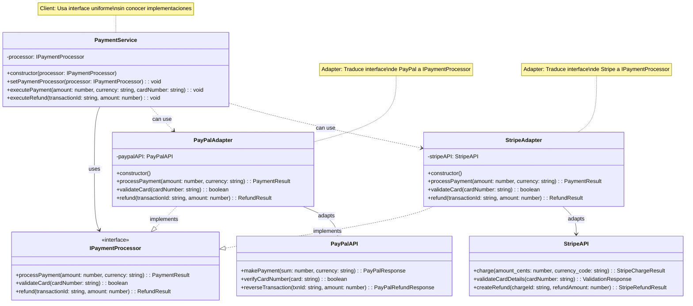

# Patrón Adapter - Diagrama UML

## Estructura del Patrón Adapter

**Componentes principales:**
- `IPaymentProcessor` (Target) - Interface que espera el cliente
- `PayPalAdapter`, `StripeAdapter` (Adapters) - Traducen entre Target y Adaptee
- `PayPalAPI`, `StripeAPI` (Adaptees) - APIs externas incompatibles
- `PaymentService` (Client) - Usa la interface uniforme

**Problema resuelto:**
Integrar APIs de terceros con interfaces diferentes sin modificar el código cliente existente.

**Ventajas:**
- 🔌 Reutilización de código existente
- 🔄 Intercambio fácil de proveedores
- 🎯 Interface uniforme para el cliente
- 🧩 Integración sin modificar APIs existentes