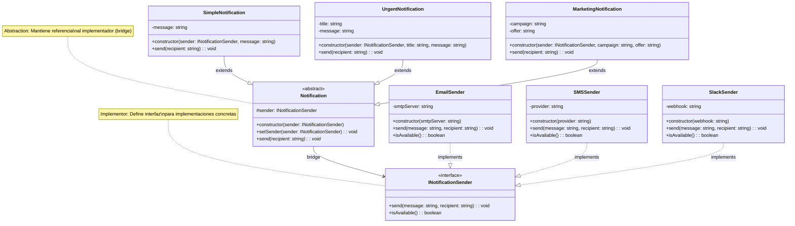

# Patrón Bridge

[🇺🇸 English Version](./README.md) | 🇪🇸 Versión en Español

## Diagrama UML



## ¿Qué es el Patrón Bridge?

El patrón **Bridge** es un patrón de diseño estructural que separa una abstracción de su implementación, permitiendo que ambas varíen independientemente. Es como construir un puente que conecta dos mundos diferentes que pueden evolucionar por separado.

## Problema que Resuelve

### ❌ Sin Bridge: Explosión Combinatoria
```typescript
// Necesitamos todas las combinaciones posibles
class EmailSimpleNotification { }
class EmailUrgentNotification { }
class EmailMarketingNotification { }
class SMSSimpleNotification { }
class SMSUrgentNotification { }
class SMSMarketingNotification { }
class SlackSimpleNotification { }
class SlackUrgentNotification { }
class SlackMarketingNotification { }

// 3 tipos × 3 canales = 9 clases 😱
// Agregar 1 tipo nuevo = +3 clases
// Agregar 1 canal nuevo = +3 clases
```

### ✅ Con Bridge: Escalabilidad Lineal
```typescript
// Lado izquierdo: 3 tipos de notificación
class SimpleNotification extends Notification { }
class UrgentNotification extends Notification { }
class MarketingNotification extends Notification { }

// Lado derecho: 3 canales de envío
class EmailSender implements INotificationSender { }
class SMSSender implements INotificationSender { }
class SlackSender implements INotificationSender { }

// 3 + 3 = 6 clases ⚡
// Agregar 1 tipo nuevo = +1 clase
// Agregar 1 canal nuevo = +1 clase
```

## Componentes del Patrón

### 1. **Abstraction** (`Notification`)
- Define la interfaz de alto nivel para el cliente
- Mantiene una referencia al **Implementor**
- Delega el trabajo real al **Implementor**

### 2. **Refined Abstraction** (`SimpleNotification`, `UrgentNotification`, `MarketingNotification`)
- Extiende la interfaz definida por **Abstraction**
- Implementa variantes específicas de la funcionalidad
- Cada una representa un "tipo" diferente de notificación

### 3. **Implementor** (`INotificationSender`)
- Define la interfaz para las clases de implementación
- No tiene que coincidir con la interfaz de **Abstraction**
- Típicamente proporciona operaciones primitivas

### 4. **Concrete Implementor** (`EmailSender`, `SMSSender`, `SlackSender`)
- Contienen implementaciones específicas de la interfaz **Implementor**
- Cada una representa un "canal" diferente de envío

## El "Puente" 🌉

La línea `Notification --> INotificationSender` es el **puente** que:
- **Conecta** dos jerarquías independientes
- **Permite** que abstracciones e implementaciones varíen por separado
- **Facilita** el cambio de implementación en tiempo de ejecución

## Cuándo Usar Bridge

✅ **Úsalo cuando:**
- Quieres evitar acoplamiento permanente entre abstracción e implementación
- Tanto abstracciones como implementaciones deben ser extensibles por herencia
- Cambios en la implementación no deben afectar a los clientes
- Necesitas cambiar implementaciones en tiempo de ejecución
- Quieres compartir implementaciones entre múltiples objetos

❌ **No lo uses cuando:**
- Solo tienes una implementación
- La relación entre abstracción e implementación nunca cambiará
- La simplicidad es más importante que la flexibilidad

## Ventajas

🌉 **Desacoplamiento**: Abstracción e implementación independientes
🔄 **Runtime Switching**: Cambiar implementación dinámicamente
➕ **Extensibilidad**: Agregar nuevos tipos o canales sin modificar código existente
🎯 **Single Responsibility**: Cada clase tiene una responsabilidad específica
📈 **Escalabilidad**: Evita explosión combinatoria (N + M en lugar de N × M)

## Desventajas

🧠 **Complejidad**: Aumenta la complejidad del código
🔍 **Indirección**: Más niveles de abstracción pueden dificultar el debugging
⚖️ **Overhead**: Pequeño overhead por la delegación adicional

## Ejemplo Práctico: Sistema de Notificaciones

### Escenario Real
Imagina una aplicación que necesita enviar diferentes tipos de notificaciones por múltiples canales:

**Tipos de Notificaciones:**
- Simples: Confirmaciones, recordatorios
- Urgentes: Alertas del sistema, errores críticos  
- Marketing: Promociones, newsletters

**Canales de Envío:**
- Email: Para comunicación formal
- SMS: Para alertas inmediatas
- Slack: Para equipos internos

### Flujo de Trabajo
```typescript
// 1. Crear implementaciones (canales)
const emailSender = new EmailSender("smtp.company.com");
const smsSender = new SMSSender("Twilio");

// 2. Crear abstracción con implementación inicial
const urgentAlert = new UrgentNotification(emailSender, "Sistema Caído", "Error crítico");

// 3. Enviar por email
urgentAlert.send("admin@company.com");

// 4. Cambiar implementación dinámicamente  
urgentAlert.setSender(smsSender);

// 5. Enviar por SMS
urgentAlert.send("+1234567890");
```

## Bridge vs Otros Patrones

### **Bridge vs Adapter**
- **Bridge**: Diseñado desde el inicio para separar abstracción e implementación
- **Adapter**: Hace trabajar juntas interfaces incompatibles existentes

### **Bridge vs Strategy**
- **Bridge**: Separa abstracción completa de implementación
- **Strategy**: Encapsula algoritmos intercambiables

### **Bridge vs State**
- **Bridge**: Implementaciones independientes del contexto
- **State**: Estados que pueden cambiar el comportamiento del contexto

## Casos de Uso Reales

### 🖥️ **Drivers de Dispositivos**
```typescript
// Abstracción
abstract class GraphicsRenderer {
    constructor(protected api: GraphicsAPI) {}
    abstract renderShape(shape: Shape): void;
}

// Implementaciones
class DirectXAPI implements GraphicsAPI { }
class OpenGLAPI implements GraphicsAPI { }
class VulkanAPI implements GraphicsAPI { }
```

### 🌐 **Clientes de APIs**
```typescript
// Abstracción  
abstract class PaymentProcessor {
    constructor(protected gateway: PaymentGateway) {}
    abstract processPayment(amount: number): void;
}

// Implementaciones
class PayPalGateway implements PaymentGateway { }
class StripeGateway implements PaymentGateway { }
class SquareGateway implements PaymentGateway { }
```

### 📱 **UIs Multiplataforma**
```typescript
// Abstracción
abstract class Window {
    constructor(protected impl: WindowImpl) {}
    abstract open(): void;
    abstract close(): void;
}

// Implementaciones
class WindowsWindowImpl implements WindowImpl { }
class MacWindowImpl implements WindowImpl { }
class LinuxWindowImpl implements WindowImpl { }
```

## Relación con Otros Patrones

- **Abstract Factory**: Puede crear familias de implementaciones para Bridge
- **Builder**: Puede construir objetos complejos que usan Bridge
- **Composite**: Puede usar Bridge para separar abstracción de implementación en árboles
- **Decorator**: Puede decorar tanto abstracciones como implementaciones