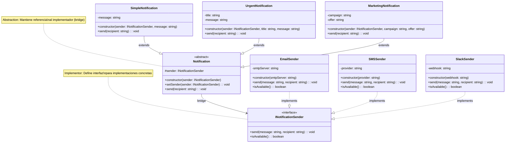

# Patrón Bridge - Diagrama UML

## Estructura del Patrón Bridge

**El "Puente":**
La relación `Notification --> INotificationSender` es el puente que separa:
- **Abstracciones** (qué tipo de notificación)
- **Implementaciones** (cómo se envía)

**Lado Izquierdo - Abstracciones:**
- `Notification` - Abstracción base que mantiene referencia al implementador
- `SimpleNotification`, `UrgentNotification`, `MarketingNotification` - Abstracciones refinadas

**Lado Derecho - Implementaciones:**
- `INotificationSender` - Interface implementador
- `EmailSender`, `SMSSender`, `SlackSender` - Implementadores concretos

**Ventajas clave:**
- 🌉 Abstracciones e implementaciones varían independientemente
- 🔄 Cambio de implementación en tiempo de ejecución
- ➕ Fácil agregar nuevos tipos y canales sin modificar código existente
- 🎯 Evita explosión combinatoria de clases (N × M → N + M)