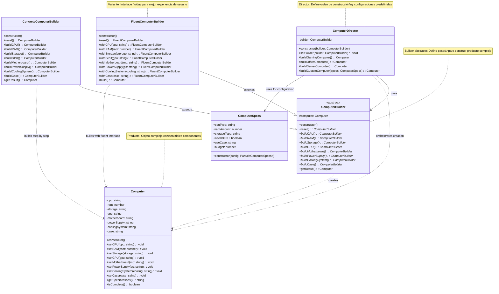

# Patrón Builder

🇪🇸 Versión en Español | [🇺🇸 English Version](./README.md)

## Diagrama UML



## ¿Qué es el Patrón Builder?

El patrón **Builder** es un patrón de diseño creacional que permite construir objetos complejos **paso a paso**. Te permite crear diferentes representaciones del mismo objeto usando el mismo proceso de construcción.

## Problema que Resuelve

### ❌ Sin Builder: Constructor Telescópico y Complejidad
```typescript
class Computer {
    constructor(
        cpu: string,
        ram: number,
        storage: string,
        gpu?: string,          // Opcional
        motherboard?: string,  // Opcional
        powerSupply?: string,  // Opcional
        coolingSystem?: string, // Opcional
        case?: string,         // Opcional
        bluRayDrive?: boolean, // Opcional
        wifiCard?: boolean,    // Opcional
        soundCard?: string     // Opcional
    ) {
        // 11 parámetros! 😱
    }
}

// Problemas del uso:
// 1. Constructor imposible de recordar
const computer1 = new Computer(
    "Intel i7", 16, "SSD 1TB", 
    undefined, undefined, undefined, undefined, undefined,
    false, true, undefined
); // ¿Qué significan todos esos undefined?

// 2. Múltiples constructores (telescópico)
class Computer {
    constructor(cpu: string, ram: number, storage: string) {}
    constructor(cpu: string, ram: number, storage: string, gpu: string) {}
    constructor(cpu: string, ram: number, storage: string, gpu: string, motherboard: string) {}
    // ... ¡Explosión combinatoria!
}

// 3. Objeto inconsistente durante construcción
const computer = new Computer("Intel i7", 16, "SSD 1TB");
computer.gpu = "RTX 4080"; // Objeto mutable, estado inconsistente
```

### ✅ Con Builder: Construcción Clara y Flexible
```typescript
// 1. Construcción paso a paso con claridad
const gamingComputer = new ComputerBuilder()
    .reset()
    .buildCPU()        // Intel i9 para gaming
    .buildRAM()        // 32GB para gaming
    .buildStorage()    // NVMe SSD rápido
    .buildGPU()        // RTX 4090
    .buildCoolingSystem() // Liquid cooling
    .getResult();

// 2. Interface fluida más legible
const officeComputer = new FluentComputerBuilder()
    .withCPU("Intel i5-13600K")
    .withRAM(16)
    .withStorage("SSD 512GB")
    .withCase("Mid Tower")
    .build(); // No necesita GPU para oficina

// 3. Director para configuraciones predefinidas
const director = new ComputerDirector(new ConcreteComputerBuilder());
const serverComputer = director.buildServerComputer();

// Beneficios:
// 1. Construcción clara y expresiva
// 2. Diferentes representaciones del mismo proceso
// 3. Control total sobre el proceso de construcción
// 4. Objeto inmutable una vez construido
```

## Componentes del Patrón

### 1. **Product** (`Computer`)
- El objeto complejo que se está construyendo
- Puede tener diferentes representaciones
- Una vez construido, es típicamente inmutable

### 2. **Builder** (`ComputerBuilder`)
- Define interfaz abstracta para construir partes del Product
- Declara pasos comunes para todas las implementaciones
- Mantiene referencia al producto en construcción

### 3. **Concrete Builder** (`ConcreteComputerBuilder`, `FluentComputerBuilder`)
- Implementa interfaz Builder para construir y ensamblar partes
- Define y mantiene la representación que crea
- Proporciona interfaz para recuperar el producto

### 4. **Director** (`ComputerDirector`)
- Define el orden en que ejecutar los pasos de construcción
- Puede tener varios métodos para diferentes configuraciones
- Trabaja con Builder a través de su interfaz común

## Variantes del Patrón

### 1. **Builder Clásico con Director**
```typescript
class ComputerDirector {
    private builder: ComputerBuilder;
    
    constructor(builder: ComputerBuilder) {
        this.builder = builder;
    }
    
    buildGamingComputer(): Computer {
        return this.builder
            .reset()
            .buildCPU()      // High-end CPU
            .buildRAM()      // 32GB RAM
            .buildGPU()      // Gaming GPU
            .buildStorage()  // Fast SSD
            .getResult();
    }
    
    buildOfficeComputer(): Computer {
        return this.builder
            .reset()
            .buildCPU()      // Mid-range CPU
            .buildRAM()      // 16GB RAM
            .buildStorage()  // Standard SSD
            .getResult();    // No GPU needed
    }
}
```

### 2. **Fluent Builder (Sin Director)**
```typescript
class FluentComputerBuilder {
    private computer: Computer;
    
    constructor() {
        this.computer = new Computer();
    }
    
    withCPU(cpu: string): FluentComputerBuilder {
        this.computer.setCPU(cpu);
        return this; // ¡Clave! Retorna this para encadenar
    }
    
    withRAM(ram: number): FluentComputerBuilder {
        this.computer.setRAM(ram);
        return this;
    }
    
    build(): Computer {
        // Validaciones opcionales
        if (!this.computer.isComplete()) {
            throw new Error("Computer incompleto");
        }
        return this.computer;
    }
}

// Uso encadenado
const computer = new FluentComputerBuilder()
    .withCPU("Intel i7")
    .withRAM(16)
    .withStorage("SSD 1TB")
    .build();
```

### 3. **Builder con Validación**
```typescript
class ValidatedComputerBuilder extends ComputerBuilder {
    buildCPU(): ComputerBuilder {
        // Validación: CPU compatible con motherboard
        if (this.computer.motherboard && !this.isCompatible(cpu, this.computer.motherboard)) {
            throw new Error("CPU incompatible con motherboard");
        }
        this.computer.setCPU("Intel i7-13700K");
        return this;
    }
    
    private isCompatible(cpu: string, motherboard: string): boolean {
        // Lógica de compatibilidad
        return true;
    }
}
```

### 4. **Builder con Configuración**
```typescript
interface ComputerConfiguration {
    useCase: 'gaming' | 'office' | 'server' | 'workstation';
    budget: number;
    preferences: {
        brand?: 'intel' | 'amd';
        priority?: 'performance' | 'efficiency' | 'quiet';
    };
}

class ConfigurableComputerBuilder extends ComputerBuilder {
    constructor(private config: ComputerConfiguration) {
        super();
    }
    
    buildCPU(): ComputerBuilder {
        const cpu = this.selectCPUBasedOnConfig();
        this.computer.setCPU(cpu);
        return this;
    }
    
    private selectCPUBasedOnConfig(): string {
        if (this.config.useCase === 'gaming') {
            return this.config.preferences.brand === 'amd' 
                ? "AMD Ryzen 7 7800X3D" 
                : "Intel i7-13700K";
        }
        // ... más lógica
    }
}
```

## Cuándo Usar Builder

✅ **Úsalo cuando:**
- Necesitas crear objetos complejos con muchos pasos
- El proceso de construcción debe permitir diferentes representaciones
- Quieres evitar constructores con muchos parámetros
- El objeto debe construirse paso a paso
- Necesitas construir árboles de objetos complejos o estructuras compuestas

❌ **No lo uses cuando:**
- El objeto es simple y no justifica la complejidad adicional
- El objeto no tiene múltiples representaciones
- El proceso de construcción no varía

## Ventajas

🎯 **Single Responsibility**: Separa construcción compleja de representación
🔓 **Código Reutilizable**: Puedes usar el mismo código para crear diferentes representaciones
📖 **Legibilidad**: Hace el código más legible y expresivo
🛡️ **Control**: Control fino sobre el proceso de construcción
🔄 **Flexibilidad**: Diferentes builders para diferentes representaciones

## Desventajas

📈 **Complejidad**: Aumenta complejidad general del código
🏗️ **Más Código**: Requiere crear múltiples clases nuevas
⚡ **Overhead**: Puede ser excesivo para objetos simples

## Ejemplo Práctico: Sistema de Computadoras

### Escenario Real
Una tienda de computadoras personalizada necesita ensamblar diferentes tipos de sistemas:

**Tipos de Sistemas:**
- **Gaming**: Alto rendimiento, GPU potente, enfriamiento líquido
- **Oficina**: Eficiencia energética, sin GPU, componentes estándar
- **Servidor**: Múltiples CPUs, RAM masiva, almacenamiento redundante
- **Workstation**: Balance entre potencia y estabilidad

### Flujo Completo
```typescript
// 1. Configuración de directores especializados
const director = new ComputerDirector(new ConcreteComputerBuilder());

// 2. Crear diferentes configuraciones
const gamingPC = director.buildGamingComputer();
console.log("🎮 Gaming PC:");
console.log(gamingPC.getSpecifications());

const officePC = director.buildOfficeComputer();
console.log("💼 Office PC:");
console.log(officePC.getSpecifications());

// 3. Construcción personalizada
const customPC = new FluentComputerBuilder()
    .withCPU("AMD Ryzen 9 7950X")
    .withRAM(64)
    .withStorage("NVMe SSD 2TB")
    .withGPU("RTX 4090")
    .withCoolingSystem("Custom Loop")
    .build();

console.log("🔧 Custom PC:");
console.log(customPC.getSpecifications());

// 4. Configuración basada en presupuesto
const budgetSpecs = new ComputerSpecs({
    useCase: 'gaming',
    budget: 1500,
    cpuType: 'mid-range',
    needsGPU: true
});

const budgetPC = director.buildCustomComputer(budgetSpecs);
```

### Validación y Compatibilidad
```typescript
class SmartComputerBuilder extends ComputerBuilder {
    private compatibility = new CompatibilityChecker();
    
    buildGPU(): ComputerBuilder {
        const gpu = "RTX 4080";
        
        // Verificar compatibilidad con PSU
        if (!this.compatibility.checkPowerRequirements(gpu, this.computer.powerSupply)) {
            throw new Error("GPU requiere fuente de poder más potente");
        }
        
        // Verificar compatibilidad con case
        if (!this.compatibility.checkPhysicalFit(gpu, this.computer.case)) {
            throw new Error("GPU no cabe en el case seleccionado");
        }
        
        this.computer.setGPU(gpu);
        return this;
    }
}
```

## Casos de Uso Reales

### 🌐 **Constructor de Consultas SQL**
```typescript
class SQLQueryBuilder {
    private query: string[] = [];
    
    select(columns: string[]): SQLQueryBuilder {
        this.query.push(`SELECT ${columns.join(', ')}`);
        return this;
    }
    
    from(table: string): SQLQueryBuilder {
        this.query.push(`FROM ${table}`);
        return this;
    }
    
    where(condition: string): SQLQueryBuilder {
        this.query.push(`WHERE ${condition}`);
        return this;
    }
    
    orderBy(column: string, direction: 'ASC' | 'DESC' = 'ASC'): SQLQueryBuilder {
        this.query.push(`ORDER BY ${column} ${direction}`);
        return this;
    }
    
    build(): string {
        return this.query.join(' ');
    }
}

// Uso
const query = new SQLQueryBuilder()
    .select(['name', 'email', 'age'])
    .from('users')
    .where('age > 18')
    .orderBy('name')
    .build();

console.log(query); // "SELECT name, email, age FROM users WHERE age > 18 ORDER BY name ASC"
```

### 🏠 **Constructor de Formularios HTML**
```typescript
class FormBuilder {
    private form: HTMLFormElement;
    
    constructor() {
        this.form = document.createElement('form');
    }
    
    withAction(action: string): FormBuilder {
        this.form.action = action;
        return this;
    }
    
    withMethod(method: 'GET' | 'POST'): FormBuilder {
        this.form.method = method;
        return this;
    }
    
    addTextField(name: string, placeholder?: string): FormBuilder {
        const input = document.createElement('input');
        input.type = 'text';
        input.name = name;
        if (placeholder) input.placeholder = placeholder;
        this.form.appendChild(input);
        return this;
    }
    
    addSubmitButton(text: string): FormBuilder {
        const button = document.createElement('button');
        button.type = 'submit';
        button.textContent = text;
        this.form.appendChild(button);
        return this;
    }
    
    build(): HTMLFormElement {
        return this.form;
    }
}

// Uso
const loginForm = new FormBuilder()
    .withAction('/login')
    .withMethod('POST')
    .addTextField('username', 'Usuario')
    .addTextField('password', 'Contraseña')
    .addSubmitButton('Iniciar Sesión')
    .build();
```

### 📧 **Constructor de Emails**
```typescript
class EmailBuilder {
    private email: Email = new Email();
    
    to(recipients: string[]): EmailBuilder {
        this.email.setRecipients(recipients);
        return this;
    }
    
    from(sender: string): EmailBuilder {
        this.email.setSender(sender);
        return this;
    }
    
    subject(subject: string): EmailBuilder {
        this.email.setSubject(subject);
        return this;
    }
    
    body(content: string): EmailBuilder {
        this.email.setBody(content);
        return this;
    }
    
    withAttachment(file: File): EmailBuilder {
        this.email.addAttachment(file);
        return this;
    }
    
    withPriority(priority: 'low' | 'normal' | 'high'): EmailBuilder {
        this.email.setPriority(priority);
        return this;
    }
    
    asHTML(): EmailBuilder {
        this.email.setContentType('text/html');
        return this;
    }
    
    send(): Promise<void> {
        return this.email.send();
    }
}

// Uso
await new EmailBuilder()
    .to(['user@example.com'])
    .from('system@company.com')
    .subject('Bienvenido al sistema')
    .body('<h1>¡Hola!</h1><p>Gracias por registrarte.</p>')
    .asHTML()
    .withPriority('high')
    .send();
```

### 🧪 **Constructor de Tests**
```typescript
class TestSuiteBuilder {
    private suite: TestSuite = new TestSuite();
    
    withName(name: string): TestSuiteBuilder {
        this.suite.setName(name);
        return this;
    }
    
    addTest(name: string, testFn: () => void): TestSuiteBuilder {
        this.suite.addTest(new Test(name, testFn));
        return this;
    }
    
    withSetup(setupFn: () => void): TestSuiteBuilder {
        this.suite.setSetup(setupFn);
        return this;
    }
    
    withTeardown(teardownFn: () => void): TestSuiteBuilder {
        this.suite.setTeardown(teardownFn);
        return this;
    }
    
    withTimeout(ms: number): TestSuiteBuilder {
        this.suite.setTimeout(ms);
        return this;
    }
    
    build(): TestSuite {
        return this.suite;
    }
}

// Uso
const userTests = new TestSuiteBuilder()
    .withName('User Management Tests')
    .withSetup(() => createTestDatabase())
    .withTeardown(() => cleanupTestDatabase())
    .addTest('should create user', () => {
        const user = createUser('John');
        expect(user.name).toBe('John');
    })
    .addTest('should delete user', () => {
        const user = createUser('Jane');
        deleteUser(user.id);
        expect(findUser(user.id)).toBeNull();
    })
    .withTimeout(5000)
    .build();
```

### 🎮 **Constructor de Personajes de Videojuego**
```typescript
class CharacterBuilder {
    private character: GameCharacter = new GameCharacter();
    
    withName(name: string): CharacterBuilder {
        this.character.setName(name);
        return this;
    }
    
    withClass(characterClass: CharacterClass): CharacterBuilder {
        this.character.setClass(characterClass);
        return this;
    }
    
    withStats(stats: CharacterStats): CharacterBuilder {
        this.character.setStats(stats);
        return this;
    }
    
    withSkill(skill: Skill): CharacterBuilder {
        this.character.addSkill(skill);
        return this;
    }
    
    withEquipment(equipment: Equipment): CharacterBuilder {
        this.character.addEquipment(equipment);
        return this;
    }
    
    withLevel(level: number): CharacterBuilder {
        this.character.setLevel(level);
        return this;
    }
    
    build(): GameCharacter {
        this.character.calculateFinalStats();
        return this.character;
    }
}

// Uso
const warrior = new CharacterBuilder()
    .withName("Sir Lancelot")
    .withClass(CharacterClass.WARRIOR)
    .withStats({ strength: 18, agility: 12, intelligence: 8 })
    .withSkill(new Skill("Sword Mastery", 5))
    .withSkill(new Skill("Shield Block", 3))
    .withEquipment(new Weapon("Excalibur", WeaponType.SWORD))
    .withEquipment(new Armor("Plate Mail", ArmorType.HEAVY))
    .withLevel(10)
    .build();
```

## Builder vs Otros Patrones

### **Builder vs Abstract Factory**
- **Builder**: Construye objetos complejos paso a paso
- **Abstract Factory**: Crea familias de objetos relacionados de una vez

### **Builder vs Factory Method**
- **Builder**: Se enfoca en construcción paso a paso
- **Factory Method**: Se enfoca en creación de diferentes tipos

### **Builder vs Prototype**
- **Builder**: Construye objetos desde cero
- **Prototype**: Crea objetos clonando prototipos existentes

## Relación con Otros Patrones

- **Abstract Factory**: Puede usar Builder para construir productos complejos
- **Composite**: Builder puede construir árboles Composite
- **Strategy**: Builder puede usar Strategy para diferentes algoritmos de construcción
- **Template Method**: La construcción puede seguir Template Method

## Consideraciones de Implementación

### **Inmutabilidad**
```typescript
class ImmutableComputerBuilder {
    private readonly computer: Computer;
    
    constructor(computer?: Computer) {
        this.computer = computer || new Computer();
    }
    
    withCPU(cpu: string): ImmutableComputerBuilder {
        const newComputer = this.computer.clone();
        newComputer.setCPU(cpu);
        return new ImmutableComputerBuilder(newComputer);
    }
    
    // Cada operación retorna un nuevo builder
}
```

### **Validación Progresiva**
```typescript
class ValidatingComputerBuilder {
    private errors: string[] = [];
    
    buildCPU(): ComputerBuilder {
        if (!this.isValidCPU(this.selectedCPU)) {
            this.errors.push("CPU inválido");
        }
        return this;
    }
    
    getResult(): Computer {
        if (this.errors.length > 0) {
            throw new ValidationError(`Errores de construcción: ${this.errors.join(', ')}`);
        }
        return this.computer;
    }
}
```

### **Builder Genérico**
```typescript
class GenericBuilder<T> {
    private instance: T;
    
    constructor(constructor: new () => T) {
        this.instance = new constructor();
    }
    
    with<K extends keyof T>(property: K, value: T[K]): GenericBuilder<T> {
        this.instance[property] = value;
        return this;
    }
    
    build(): T {
        return this.instance;
    }
}

// Uso
const user = new GenericBuilder(User)
    .with('name', 'John')
    .with('email', 'john@example.com')
    .with('age', 30)
    .build();
```

El patrón Builder es especialmente útil cuando necesitas crear objetos complejos con múltiples configuraciones posibles, ofreciendo una interfaz clara y flexible para la construcción paso a paso.