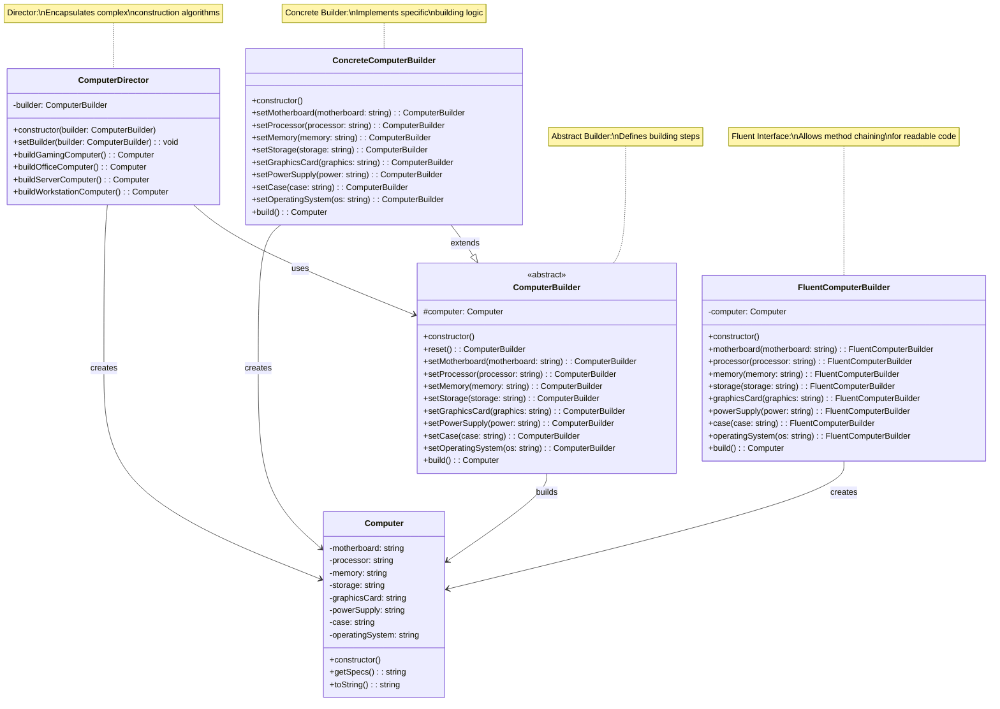

# Builder Pattern

🇺🇸 English Version | [🇪🇸 Versión en Español](./README.es.md)

## UML Diagram



## What is the Builder Pattern?

The **Builder** pattern is a creational design pattern that allows you to **construct complex objects step by step**. It lets you create different types and representations of an object using the same construction code.

## Problem it Solves

### ❌ Without Builder: Telescoping Constructor Problem
```typescript
class Computer {
    constructor(
        motherboard?: string,
        processor?: string,
        memory?: string,
        storage?: string,
        graphicsCard?: string,
        powerSupply?: string,
        computerCase?: string,
        operatingSystem?: string
    ) {
        this.motherboard = motherboard || "";
        this.processor = processor || "";
        this.memory = memory || "";
        this.storage = storage || "";
        this.graphicsCard = graphicsCard || "";
        this.powerSupply = powerSupply || "";
        this.case = computerCase || "";
        this.operatingSystem = operatingSystem || "";
    }
    
    // Problems with this approach:
    // 1. Too many constructor parameters
    // 2. Parameter order matters and is confusing
    // 3. Optional parameters lead to many constructor overloads
    // 4. Hard to remember parameter positions
    // 5. Easy to pass parameters in wrong order
}

// Confusing usage
const computer1 = new Computer("ATX", "Intel i7", "16GB", "1TB SSD");
const computer2 = new Computer("ATX", "Intel i7", "16GB", "1TB SSD", "RTX 3080");
const computer3 = new Computer("ATX", "Intel i7", "16GB", "1TB SSD", "RTX 3080", "750W", "Mid Tower");

// What was the 5th parameter again? Graphics card or power supply?
const computer4 = new Computer("ATX", "Intel i7", "16GB", "1TB SSD", "750W"); // Wrong!
```

### ✅ With Builder: Step-by-Step Construction
```typescript
class ComputerBuilder {
    private computer = new Computer();
    
    setMotherboard(motherboard: string): ComputerBuilder {
        this.computer.motherboard = motherboard;
        return this;
    }
    
    setProcessor(processor: string): ComputerBuilder {
        this.computer.processor = processor;
        return this;
    }
    
    setMemory(memory: string): ComputerBuilder {
        this.computer.memory = memory;
        return this;
    }
    
    setStorage(storage: string): ComputerBuilder {
        this.computer.storage = storage;
        return this;
    }
    
    setGraphicsCard(graphics: string): ComputerBuilder {
        this.computer.graphicsCard = graphics;
        return this;
    }
    
    build(): Computer {
        return this.computer;
    }
}

// Clear, readable usage
const computer = new ComputerBuilder()
    .setMotherboard("ASUS ROG Strix X570-E")
    .setProcessor("AMD Ryzen 9 5900X")
    .setMemory("32GB DDR4-3600")
    .setStorage("2TB NVMe SSD")
    .setGraphicsCard("NVIDIA RTX 4080")
    .build();

// Benefits:
// 1. Clear, readable construction
// 2. Optional parameters easy to handle
// 3. Parameter order doesn't matter
// 4. Self-documenting code
// 5. Can validate during construction
```

## Pattern Components

### 1. **Product** (`Computer`)
- Complex object being constructed
- Contains multiple parts/properties
- Usually has many optional or required components

### 2. **Abstract Builder** (`ComputerBuilder`)
- Defines interface for creating product parts
- Declares building steps common to all builders
- Usually returns builder for method chaining

### 3. **Concrete Builder** (`ConcreteComputerBuilder`)
- Implements abstract builder interface
- Constructs and assembles product parts
- Provides method to retrieve final result

### 4. **Director** (`ComputerDirector`)
- Knows how to construct products using builder
- Encapsulates complex construction algorithms
- Can create different product configurations

### 5. **Fluent Interface** (Optional)
- Allows method chaining for readable code
- Each method returns the builder instance
- Makes client code more expressive

## When to Use Builder

✅ **Use it when:**
- Creating complex objects with many optional parameters
- You want to avoid telescoping constructors
- Object construction requires multiple steps
- You need different representations of the same object
- Construction process should be independent of parts

❌ **Don't use it when:**
- Object is simple with few parameters
- Construction is straightforward
- You don't need different representations
- The overhead isn't justified

## Advantages

🏗️ **Clear Construction**: Step-by-step object building
📖 **Readability**: Self-documenting construction process
🔧 **Flexibility**: Easy to add/remove construction steps
🎯 **Reusability**: Same builder for different product variations
✅ **Validation**: Can validate during construction

## Disadvantages

📈 **Code Complexity**: More classes and interfaces
🧩 **Overhead**: May be overkill for simple objects
🔄 **Maintenance**: More code to maintain
💾 **Memory**: Additional objects in memory

## Real-world Use Cases

### 🏠 **SQL Query Builder**
```typescript
interface SQLQuery {
    toString(): string;
    getParameters(): any[];
}

class SelectQueryBuilder {
    private query = {
        select: [] as string[],
        from: "",
        joins: [] as string[],
        where: [] as string[],
        groupBy: [] as string[],
        having: [] as string[],
        orderBy: [] as string[],
        limit: 0,
        offset: 0,
        parameters: [] as any[]
    };
    
    select(...columns: string[]): SelectQueryBuilder {
        this.query.select.push(...columns);
        return this;
    }
    
    from(table: string): SelectQueryBuilder {
        this.query.from = table;
        return this;
    }
    
    join(table: string, condition: string): SelectQueryBuilder {
        this.query.joins.push(`JOIN ${table} ON ${condition}`);
        return this;
    }
    
    leftJoin(table: string, condition: string): SelectQueryBuilder {
        this.query.joins.push(`LEFT JOIN ${table} ON ${condition}`);
        return this;
    }
    
    where(condition: string, ...params: any[]): SelectQueryBuilder {
        this.query.where.push(condition);
        this.query.parameters.push(...params);
        return this;
    }
    
    groupBy(...columns: string[]): SelectQueryBuilder {
        this.query.groupBy.push(...columns);
        return this;
    }
    
    orderBy(column: string, direction: "ASC" | "DESC" = "ASC"): SelectQueryBuilder {
        this.query.orderBy.push(`${column} ${direction}`);
        return this;
    }
    
    limit(count: number): SelectQueryBuilder {
        this.query.limit = count;
        return this;
    }
    
    offset(count: number): SelectQueryBuilder {
        this.query.offset = count;
        return this;
    }
    
    build(): SQLQuery {
        let sql = `SELECT ${this.query.select.join(", ")}`;
        sql += ` FROM ${this.query.from}`;
        
        if (this.query.joins.length > 0) {
            sql += ` ${this.query.joins.join(" ")}`;
        }
        
        if (this.query.where.length > 0) {
            sql += ` WHERE ${this.query.where.join(" AND ")}`;
        }
        
        if (this.query.groupBy.length > 0) {
            sql += ` GROUP BY ${this.query.groupBy.join(", ")}`;
        }
        
        if (this.query.orderBy.length > 0) {
            sql += ` ORDER BY ${this.query.orderBy.join(", ")}`;
        }
        
        if (this.query.limit > 0) {
            sql += ` LIMIT ${this.query.limit}`;
        }
        
        if (this.query.offset > 0) {
            sql += ` OFFSET ${this.query.offset}`;
        }
        
        return {
            toString: () => sql,
            getParameters: () => [...this.query.parameters]
        };
    }
}

// Usage
const query = new SelectQueryBuilder()
    .select("u.name", "u.email", "p.title")
    .from("users u")
    .leftJoin("posts p", "p.user_id = u.id")
    .where("u.active = ?", true)
    .where("u.created_at > ?", new Date("2023-01-01"))
    .groupBy("u.id")
    .orderBy("u.name", "ASC")
    .limit(50)
    .build();

console.log(query.toString());
// SELECT u.name, u.email, p.title FROM users u 
// LEFT JOIN posts p ON p.user_id = u.id 
// WHERE u.active = ? AND u.created_at > ? 
// GROUP BY u.id ORDER BY u.name ASC LIMIT 50
```

### 🌐 **HTTP Request Builder**
```typescript
interface HttpRequest {
    url: string;
    method: string;
    headers: Record<string, string>;
    body?: any;
    timeout: number;
    retries: number;
}

class HttpRequestBuilder {
    private request: Partial<HttpRequest> = {
        method: "GET",
        headers: {},
        timeout: 5000,
        retries: 0
    };
    
    url(url: string): HttpRequestBuilder {
        this.request.url = url;
        return this;
    }
    
    method(method: "GET" | "POST" | "PUT" | "DELETE" | "PATCH"): HttpRequestBuilder {
        this.request.method = method;
        return this;
    }
    
    header(name: string, value: string): HttpRequestBuilder {
        this.request.headers![name] = value;
        return this;
    }
    
    headers(headers: Record<string, string>): HttpRequestBuilder {
        Object.assign(this.request.headers!, headers);
        return this;
    }
    
    json(data: any): HttpRequestBuilder {
        this.request.body = JSON.stringify(data);
        this.request.headers!["Content-Type"] = "application/json";
        return this;
    }
    
    form(data: Record<string, any>): HttpRequestBuilder {
        const formData = new URLSearchParams(data);
        this.request.body = formData.toString();
        this.request.headers!["Content-Type"] = "application/x-www-form-urlencoded";
        return this;
    }
    
    timeout(ms: number): HttpRequestBuilder {
        this.request.timeout = ms;
        return this;
    }
    
    retries(count: number): HttpRequestBuilder {
        this.request.retries = count;
        return this;
    }
    
    auth(token: string): HttpRequestBuilder {
        this.request.headers!["Authorization"] = `Bearer ${token}`;
        return this;
    }
    
    basicAuth(username: string, password: string): HttpRequestBuilder {
        const encoded = btoa(`${username}:${password}`);
        this.request.headers!["Authorization"] = `Basic ${encoded}`;
        return this;
    }
    
    build(): HttpRequest {
        if (!this.request.url) {
            throw new Error("URL is required");
        }
        
        return this.request as HttpRequest;
    }
}

// Usage
const request = new HttpRequestBuilder()
    .url("https://api.example.com/users")
    .method("POST")
    .auth("your-jwt-token")
    .json({ name: "John Doe", email: "john@example.com" })
    .timeout(10000)
    .retries(3)
    .build();

// Usage for different scenarios
const getRequest = new HttpRequestBuilder()
    .url("https://api.example.com/data")
    .header("Accept", "application/json")
    .timeout(5000)
    .build();

const formRequest = new HttpRequestBuilder()
    .url("https://api.example.com/contact")
    .method("POST")
    .form({ name: "John", message: "Hello" })
    .build();
```

### 🏗️ **Document Builder**
```typescript
interface Document {
    title: string;
    content: Section[];
    metadata: DocumentMetadata;
    toHTML(): string;
    toPDF(): Buffer;
    toMarkdown(): string;
}

interface Section {
    type: "heading" | "paragraph" | "list" | "table" | "image";
    content: any;
    level?: number;
}

interface DocumentMetadata {
    author: string;
    created: Date;
    tags: string[];
    template: string;
}

class DocumentBuilder {
    private document: Partial<Document> = {
        content: [],
        metadata: {
            author: "",
            created: new Date(),
            tags: [],
            template: "default"
        }
    };
    
    title(title: string): DocumentBuilder {
        this.document.title = title;
        return this;
    }
    
    author(author: string): DocumentBuilder {
        this.document.metadata!.author = author;
        return this;
    }
    
    tags(...tags: string[]): DocumentBuilder {
        this.document.metadata!.tags.push(...tags);
        return this;
    }
    
    template(template: string): DocumentBuilder {
        this.document.metadata!.template = template;
        return this;
    }
    
    heading(text: string, level: number = 1): DocumentBuilder {
        this.document.content!.push({
            type: "heading",
            content: text,
            level
        });
        return this;
    }
    
    paragraph(text: string): DocumentBuilder {
        this.document.content!.push({
            type: "paragraph",
            content: text
        });
        return this;
    }
    
    list(items: string[], ordered: boolean = false): DocumentBuilder {
        this.document.content!.push({
            type: "list",
            content: { items, ordered }
        });
        return this;
    }
    
    table(headers: string[], rows: string[][]): DocumentBuilder {
        this.document.content!.push({
            type: "table",
            content: { headers, rows }
        });
        return this;
    }
    
    image(url: string, alt: string, caption?: string): DocumentBuilder {
        this.document.content!.push({
            type: "image",
            content: { url, alt, caption }
        });
        return this;
    }
    
    build(): Document {
        if (!this.document.title) {
            throw new Error("Document title is required");
        }
        
        return {
            ...this.document,
            toHTML: () => this.generateHTML(),
            toPDF: () => this.generatePDF(),
            toMarkdown: () => this.generateMarkdown()
        } as Document;
    }
    
    private generateHTML(): string {
        // Implementation for HTML generation
        return "<html>...</html>";
    }
    
    private generatePDF(): Buffer {
        // Implementation for PDF generation
        return Buffer.from("PDF content");
    }
    
    private generateMarkdown(): string {
        // Implementation for Markdown generation
        return "# Markdown content";
    }
}

// Usage
const report = new DocumentBuilder()
    .title("Quarterly Sales Report")
    .author("John Smith")
    .tags("sales", "quarterly", "2024")
    .template("corporate")
    .heading("Executive Summary")
    .paragraph("This quarter showed remarkable growth...")
    .heading("Sales Data", 2)
    .table(
        ["Month", "Revenue", "Growth"],
        [
            ["January", "$100k", "5%"],
            ["February", "$120k", "8%"],
            ["March", "$140k", "12%"]
        ]
    )
    .heading("Conclusion", 2)
    .paragraph("Based on the data presented...")
    .build();

const htmlOutput = report.toHTML();
const pdfOutput = report.toPDF();
```

## Builder Variants

### **Classic Builder with Director**
```typescript
class ComputerDirector {
    constructor(private builder: ComputerBuilder) {}
    
    buildGamingComputer(): Computer {
        return this.builder
            .reset()
            .setMotherboard("ASUS ROG Strix X570-E")
            .setProcessor("AMD Ryzen 9 5900X")
            .setMemory("32GB DDR4-3600")
            .setStorage("1TB NVMe SSD")
            .setGraphicsCard("NVIDIA RTX 4080")
            .setPowerSupply("850W Gold")
            .setCase("NZXT H710")
            .setOperatingSystem("Windows 11 Pro")
            .build();
    }
    
    buildOfficeComputer(): Computer {
        return this.builder
            .reset()
            .setMotherboard("MSI B450M Pro")
            .setProcessor("AMD Ryzen 5 3600")
            .setMemory("16GB DDR4-3200")
            .setStorage("512GB SSD")
            .setPowerSupply("500W Bronze")
            .setCase("Corsair MicroATX")
            .setOperatingSystem("Windows 11")
            .build();
    }
}

// Usage with director
const builder = new ConcreteComputerBuilder();
const director = new ComputerDirector(builder);

const gamingPC = director.buildGamingComputer();
const officePC = director.buildOfficeComputer();
```

### **Fluent Interface Builder**
```typescript
class FluentComputerBuilder {
    private computer = new Computer();
    
    motherboard(motherboard: string): FluentComputerBuilder {
        this.computer.motherboard = motherboard;
        return this;
    }
    
    processor(processor: string): FluentComputerBuilder {
        this.computer.processor = processor;
        return this;
    }
    
    memory(memory: string): FluentComputerBuilder {
        this.computer.memory = memory;
        return this;
    }
    
    build(): Computer {
        return this.computer;
    }
}

// Fluent usage
const computer = new FluentComputerBuilder()
    .motherboard("ASUS Prime X570-P")
    .processor("AMD Ryzen 7 5800X")
    .memory("16GB DDR4")
    .build();
```

### **Step Builder (Enforced Order)**
```typescript
interface MotherboardStep {
    motherboard(motherboard: string): ProcessorStep;
}

interface ProcessorStep {
    processor(processor: string): MemoryStep;
}

interface MemoryStep {
    memory(memory: string): OptionalStep;
}

interface OptionalStep {
    storage(storage: string): OptionalStep;
    graphicsCard(graphics: string): OptionalStep;
    powerSupply(power: string): OptionalStep;
    build(): Computer;
}

class StepComputerBuilder implements MotherboardStep, ProcessorStep, MemoryStep, OptionalStep {
    private computer = new Computer();
    
    motherboard(motherboard: string): ProcessorStep {
        this.computer.motherboard = motherboard;
        return this;
    }
    
    processor(processor: string): MemoryStep {
        this.computer.processor = processor;
        return this;
    }
    
    memory(memory: string): OptionalStep {
        this.computer.memory = memory;
        return this;
    }
    
    storage(storage: string): OptionalStep {
        this.computer.storage = storage;
        return this;
    }
    
    graphicsCard(graphics: string): OptionalStep {
        this.computer.graphicsCard = graphics;
        return this;
    }
    
    powerSupply(power: string): OptionalStep {
        this.computer.powerSupply = power;
        return this;
    }
    
    build(): Computer {
        return this.computer;
    }
    
    static start(): MotherboardStep {
        return new StepComputerBuilder();
    }
}

// Enforced step order
const computer = StepComputerBuilder
    .start()
    .motherboard("ASUS Prime") // Required first
    .processor("Intel i7")     // Required second
    .memory("16GB")            // Required third
    .storage("1TB SSD")        // Optional
    .graphicsCard("RTX 4070")  // Optional
    .build();
```

## Builder vs Other Patterns

### **Builder vs Factory Method**
- **Builder**: Constructs complex objects step by step
- **Factory Method**: Creates objects in one step

### **Builder vs Abstract Factory**
- **Builder**: Focuses on constructing single complex objects
- **Abstract Factory**: Creates families of related simple objects

### **Builder vs Composite**
- **Builder**: Constructs objects that may have composite structure
- **Composite**: Represents tree structures of objects

### **Builder vs Strategy**
- **Builder**: Different ways to construct objects
- **Strategy**: Different algorithms for same operation

## Best Practices

### **Validate Required Fields**
```typescript
class ValidatedComputerBuilder {
    private computer = new Computer();
    private requiredFields = new Set(["motherboard", "processor", "memory"]);
    private setFields = new Set<string>();
    
    setMotherboard(motherboard: string): ValidatedComputerBuilder {
        if (!motherboard.trim()) {
            throw new Error("Motherboard cannot be empty");
        }
        this.computer.motherboard = motherboard;
        this.setFields.add("motherboard");
        return this;
    }
    
    setProcessor(processor: string): ValidatedComputerBuilder {
        if (!processor.trim()) {
            throw new Error("Processor cannot be empty");
        }
        this.computer.processor = processor;
        this.setFields.add("processor");
        return this;
    }
    
    setMemory(memory: string): ValidatedComputerBuilder {
        if (!memory.trim()) {
            throw new Error("Memory cannot be empty");
        }
        this.computer.memory = memory;
        this.setFields.add("memory");
        return this;
    }
    
    build(): Computer {
        // Validate required fields
        const missingFields = Array.from(this.requiredFields)
            .filter(field => !this.setFields.has(field));
        
        if (missingFields.length > 0) {
            throw new Error(`Missing required fields: ${missingFields.join(", ")}`);
        }
        
        return this.computer;
    }
}
```

### **Use Method Overloading for Flexibility**
```typescript
class FlexibleComputerBuilder {
    private computer = new Computer();
    
    // Method overloading for different parameter types
    storage(capacity: number, type: "HDD" | "SSD" = "SSD"): FlexibleComputerBuilder;
    storage(description: string): FlexibleComputerBuilder;
    storage(capacityOrDescription: number | string, type?: "HDD" | "SSD"): FlexibleComputerBuilder {
        if (typeof capacityOrDescription === "number") {
            this.computer.storage = `${capacityOrDescription}GB ${type}`;
        } else {
            this.computer.storage = capacityOrDescription;
        }
        return this;
    }
    
    // Convenience methods
    ssdStorage(capacity: number): FlexibleComputerBuilder {
        return this.storage(capacity, "SSD");
    }
    
    hddStorage(capacity: number): FlexibleComputerBuilder {
        return this.storage(capacity, "HDD");
    }
    
    build(): Computer {
        return this.computer;
    }
}

// Usage
const computer1 = new FlexibleComputerBuilder()
    .ssdStorage(1000)  // 1000GB SSD
    .build();

const computer2 = new FlexibleComputerBuilder()
    .storage("2TB NVMe SSD")  // Custom description
    .build();
```

### **Implement Reset for Reusability**
```typescript
class ReusableComputerBuilder {
    private computer = new Computer();
    
    reset(): ReusableComputerBuilder {
        this.computer = new Computer();
        return this;
    }
    
    setMotherboard(motherboard: string): ReusableComputerBuilder {
        this.computer.motherboard = motherboard;
        return this;
    }
    
    // ... other methods
    
    build(): Computer {
        const result = this.computer;
        this.reset(); // Auto-reset after build
        return result;
    }
}

// Reusable builder
const builder = new ReusableComputerBuilder();

const computer1 = builder
    .setMotherboard("ASUS")
    .setProcessor("Intel i7")
    .build();

// Builder is automatically reset
const computer2 = builder
    .setMotherboard("MSI")
    .setProcessor("AMD Ryzen")
    .build();
```

The Builder pattern is essential for creating complex objects with many optional parameters, providing a clear and flexible construction process that's easy to read and maintain.