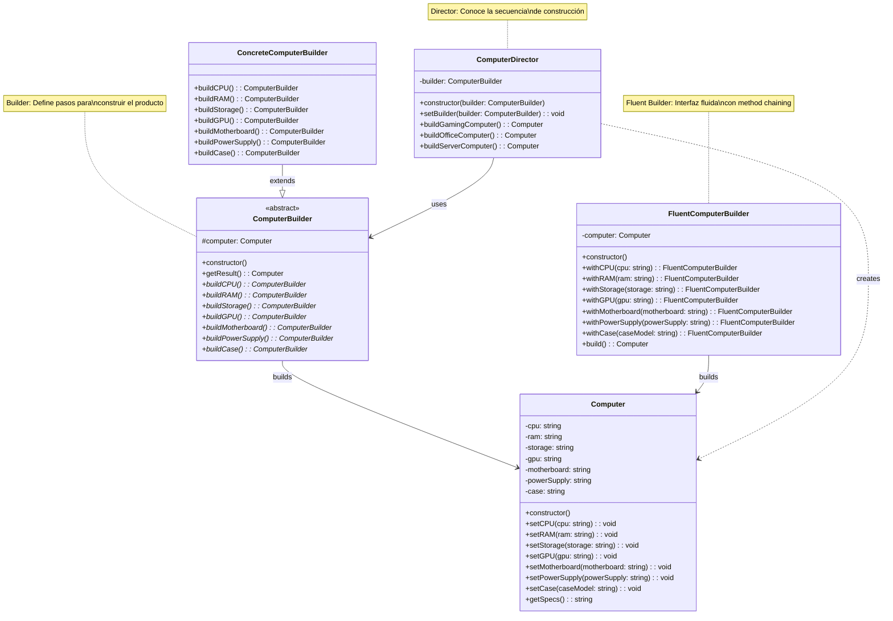

# Patrón Builder - Diagrama UML

## Estructura del Patrón Builder

**Propósito:**
Construye objetos complejos paso a paso, permitiendo crear diferentes representaciones del mismo objeto.

**Dos variantes implementadas:**

### 1. Builder Clásico con Director
- `ComputerBuilder` - Builder abstracto que define pasos
- `ConcreteComputerBuilder` - Builder concreto que implementa construcción
- `ComputerDirector` - Conoce las secuencias de construcción específicas
- Separación clara entre construcción y representación

### 2. Fluent Builder
- `FluentComputerBuilder` - Builder con interfaz fluida
- Method chaining para construcción intuitiva
- Más simple, sin necesidad de Director

**Producto:**
- `Computer` - Objeto complejo con múltiples componentes opcionales

**Ventajas:**
- 🔧 Construcción paso a paso de objetos complejos
- 🎛️ Control fino sobre el proceso de construcción
- 🔄 Diferentes representaciones del mismo objeto
- 📝 Código más legible (especialmente con Fluent Interface)
- ✅ Objetos inmutables una vez construidos