# Patrón Composite

[🇺🇸 English Version](./README.md) | 🇪🇸 Versión en Español

## Diagrama UML

```mermaid
%%{init: {"theme": "base", "themeVariables": {"primaryColor": "#ffffff", "primaryTextColor": "#000000", "primaryBorderColor": "#333333", "lineColor": "#333333", "secondaryColor": "#f8f8f8", "tertiaryColor": "#ffffff"}}}%%
classDiagram
    %% Interfaz Component
    class Component {
        <<interface>>
        +operation(): string
        +add(component: Component): void
        +remove(component: Component): void
        +getChild(index: number): Component
        +getName(): string
    }

    %% Leaf - Elemento simple
    class Leaf {
        -name: string
        +constructor(name: string)
        +operation(): string
        +getName(): string
        +add(component: Component): void
        +remove(component: Component): void
        +getChild(index: number): Component
    }

    %% Composite - Elemento complejo
    class Composite {
        -children: Component[]
        -name: string
        +constructor(name: string)
        +add(component: Component): void
        +remove(component: Component): void
        +getChild(index: number): Component
        +operation(): string
        +getName(): string
        +getChildrenCount(): number
        +getChildren(): Component[]
        +isEmpty(): boolean
        +clear(): void
    }

    %% Ejemplo específico: Sistema de archivos
    class File {
        -name: string
        -size: number
        +constructor(name: string, size: number)
        +operation(): string
        +getName(): string
        +getSize(): number
        +add(component: Component): void
        +remove(component: Component): void
        +getChild(index: number): Component
    }

    class Directory {
        -name: string
        -children: Component[]
        +constructor(name: string)
        +add(component: Component): void
        +remove(component: Component): void
        +getChild(index: number): Component
        +operation(): string
        +getName(): string
        +getTotalSize(): number
        +getChildrenCount(): number
        +listFiles(): File[]
        +listDirectories(): Directory[]
        +findByName(name: string): Component
        +isEmpty(): boolean
    }

    %% Relaciones
    Leaf ..|> Component : implements
    Composite ..|> Component : implements
    File ..|> Component : implements
    Directory ..|> Component : implements
    
    Composite --> Component : contains
    Directory --> Component : contains

    note for Leaf "Hoja: Objeto simple\nsin hijos"
    note for Composite "Composite: Objeto complejo\nque contiene otros objetos"
    note for Component "Interfaz común para\ntodos los elementos"
```



## ¿Qué es el Patrón Composite?

El patrón **Composite** es un patrón de diseño estructural que te permite **componer objetos en estructuras de árbol** para representar jerarquías parte-todo. Permite tratar objetos individuales y composiciones de objetos de manera uniforme.

## Problema que Resuelve

### ❌ Sin Composite: Tratamiento Diferente de Objetos
```typescript
// Problema: Necesitas tratar archivos y directorios de manera diferente
class FileSystemManager {
    calculateSize(items: (File | Directory)[]): number {
        let totalSize = 0;
        
        for (const item of items) {
            if (item instanceof File) {
                // Tratamiento específico para archivos
                totalSize += item.getSize();
            } else if (item instanceof Directory) {
                // Tratamiento específico para directorios
                const files = item.getFiles();
                for (const file of files) {
                    totalSize += file.getSize();
                }
                
                // Recursión manual para subdirectorios
                const subdirs = item.getSubdirectories();
                for (const subdir of subdirs) {
                    totalSize += this.calculateDirectorySize(subdir);
                }
            }
        }
        
        return totalSize;
    }
    
    // Problemas:
    // 1. Código duplicado para manejar diferentes tipos
    // 2. Lógica compleja para estructuras anidadas
    // 3. Dificultad para agregar nuevos tipos
    // 4. Violación del principio abierto/cerrado
}
```

### ✅ Con Composite: Tratamiento Uniforme
```typescript
// Interfaz común para todos los elementos
interface FileSystemComponent {
    operation(): string;
    getSize(): number;
}

class File implements FileSystemComponent {
    constructor(private name: string, private size: number) {}
    
    operation(): string {
        return `File: ${this.name}`;
    }
    
    getSize(): number {
        return this.size;
    }
}

class Directory implements FileSystemComponent {
    private children: FileSystemComponent[] = [];
    
    constructor(private name: string) {}
    
    add(component: FileSystemComponent): void {
        this.children.push(component);
    }
    
    operation(): string {
        const results = [`Directory: ${this.name}`];
        for (const child of this.children) {
            results.push(`  ${child.operation()}`);
        }
        return results.join('\n');
    }
    
    getSize(): number {
        // Composición: delega a los hijos
        return this.children.reduce((total, child) => total + child.getSize(), 0);
    }
}

// Cliente simple que trata todo igual
class SimpleFileSystemManager {
    calculateSize(component: FileSystemComponent): number {
        return component.getSize(); // ¡Mismo código para archivos y directorios!
    }
    
    displayStructure(component: FileSystemComponent): void {
        console.log(component.operation()); // ¡Mismo código para todo!
    }
}

// Beneficios:
// 1. Código cliente simple y uniforme
// 2. Fácil agregar nuevos tipos de componentes
// 3. Estructuras complejas manejadas automáticamente
// 4. Respeta el principio abierto/cerrado
```

## Componentes del Patrón

### 1. **Component** (`Component`)
- Define la interfaz común para objetos simples y complejos
- Declara operaciones comunes como `operation()`, `add()`, `remove()`
- Puede incluir implementaciones por defecto

### 2. **Leaf** (`Leaf`, `File`)
- Representa objetos terminales (sin hijos)
- Implementa operaciones básicas del Component
- No puede tener elementos hijos

### 3. **Composite** (`Composite`, `Directory`)
- Define comportamiento para componentes con hijos
- Almacena componentes hijos
- Implementa operaciones relacionadas con hijos
- Delega trabajo a los hijos y combina resultados

### 4. **Cliente**
- Manipula objetos a través de la interfaz Component
- No distingue entre hojas y composites

## Cuándo Usar Composite

✅ **Úsalo cuando:**
- Necesites representar jerarquías parte-todo de objetos
- Quieras que el cliente trate objetos simples y complejos uniformemente
- Tengas estructuras de árbol complejas
- Las operaciones deben aplicarse recursivamente en la estructura

❌ **No lo uses cuando:**
- La estructura es simple y no jerárquica
- No necesitas tratar objetos simples y complejos uniformemente
- Las operaciones son muy diferentes entre hojas y composites
- La complejidad adicional no se justifica

## Ventajas

🌳 **Estructuras Complejas**: Facilita el trabajo con estructuras de árbol
🔄 **Uniformidad**: Trata objetos simples y complejos por igual
📈 **Extensibilidad**: Fácil agregar nuevos tipos de componentes
🔄 **Recursión**: Operaciones recursivas manejadas automáticamente
🎯 **Principio Abierto/Cerrado**: Abierto para extensión, cerrado para modificación

## Desventajas

📈 **Complejidad**: Puede hacer el diseño demasiado general
🔍 **Restricciones**: Difícil restringir componentes de un composite
🧩 **Sobrecarga**: Interfaz común puede incluir métodos no relevantes
⚠️ **Verificación de Tipos**: Puede complicar la verificación de tipos en tiempo de ejecución

## Casos de Uso del Mundo Real

### 🗂️ **Sistema de Archivos**
```typescript
interface FileSystemItem {
    getName(): string;
    getSize(): number;
    display(indent: string): void;
}

class RegularFile implements FileSystemItem {
    constructor(private name: string, private size: number) {}
    
    getName(): string { return this.name; }
    getSize(): number { return this.size; }
    
    display(indent: string = ""): void {
        console.log(`${indent}📄 ${this.name} (${this.size} bytes)`);
    }
}

class Folder implements FileSystemItem {
    private items: FileSystemItem[] = [];
    
    constructor(private name: string) {}
    
    add(item: FileSystemItem): void {
        this.items.push(item);
    }
    
    getName(): string { return this.name; }
    
    getSize(): number {
        return this.items.reduce((total, item) => total + item.getSize(), 0);
    }
    
    display(indent: string = ""): void {
        console.log(`${indent}📁 ${this.name}/`);
        for (const item of this.items) {
            item.display(indent + "  ");
        }
    }
}

// Uso
const root = new Folder("proyecto");
const src = new Folder("src");
const docs = new Folder("docs");

src.add(new RegularFile("main.ts", 2048));
src.add(new RegularFile("utils.ts", 1024));
docs.add(new RegularFile("readme.md", 512));

root.add(src);
root.add(docs);
root.add(new RegularFile("package.json", 256));

root.display();
console.log(`Tamaño total: ${root.getSize()} bytes`);
```

### 🏢 **Estructura Organizacional**
```typescript
interface OrganizationUnit {
    getName(): string;
    getSalary(): number;
    getEmployeeCount(): number;
    displayStructure(level: number): void;
}

class Employee implements OrganizationUnit {
    constructor(
        private name: string,
        private position: string,
        private salary: number
    ) {}
    
    getName(): string { return this.name; }
    getSalary(): number { return this.salary; }
    getEmployeeCount(): number { return 1; }
    
    displayStructure(level: number = 0): void {
        const indent = "  ".repeat(level);
        console.log(`${indent}👤 ${this.name} - ${this.position} ($${this.salary})`);
    }
}

class Department implements OrganizationUnit {
    private units: OrganizationUnit[] = [];
    
    constructor(private name: string) {}
    
    add(unit: OrganizationUnit): void {
        this.units.push(unit);
    }
    
    getName(): string { return this.name; }
    
    getSalary(): number {
        return this.units.reduce((total, unit) => total + unit.getSalary(), 0);
    }
    
    getEmployeeCount(): number {
        return this.units.reduce((total, unit) => total + unit.getEmployeeCount(), 0);
    }
    
    displayStructure(level: number = 0): void {
        const indent = "  ".repeat(level);
        console.log(`${indent}🏢 ${this.name}`);
        for (const unit of this.units) {
            unit.displayStructure(level + 1);
        }
    }
}

// Construcción de la organización
const company = new Department("TechCorp");
const engineering = new Department("Ingeniería");
const marketing = new Department("Marketing");

engineering.add(new Employee("Ana García", "Desarrolladora Senior", 75000));
engineering.add(new Employee("Carlos López", "Desarrollador", 60000));
marketing.add(new Employee("María Rodríguez", "Manager de Marketing", 70000));

company.add(engineering);
company.add(marketing);
company.add(new Employee("Juan Pérez", "CEO", 120000));

company.displayStructure();
console.log(`Empleados totales: ${company.getEmployeeCount()}`);
console.log(`Nómina total: $${company.getSalary()}`);
```

### 🎨 **Interfaz Gráfica (UI Components)**
```typescript
interface UIComponent {
    render(): string;
    getWidth(): number;
    getHeight(): number;
}

class Button implements UIComponent {
    constructor(
        private text: string,
        private width: number,
        private height: number
    ) {}
    
    render(): string {
        return `<button style="width:${this.width}px;height:${this.height}px">${this.text}</button>`;
    }
    
    getWidth(): number { return this.width; }
    getHeight(): number { return this.height; }
}

class TextInput implements UIComponent {
    constructor(
        private placeholder: string,
        private width: number,
        private height: number
    ) {}
    
    render(): string {
        return `<input placeholder="${this.placeholder}" style="width:${this.width}px;height:${this.height}px">`;
    }
    
    getWidth(): number { return this.width; }
    getHeight(): number { return this.height; }
}

class Panel implements UIComponent {
    private components: UIComponent[] = [];
    private layout: "horizontal" | "vertical";
    
    constructor(layout: "horizontal" | "vertical" = "vertical") {
        this.layout = layout;
    }
    
    add(component: UIComponent): void {
        this.components.push(component);
    }
    
    render(): string {
        const direction = this.layout === "horizontal" ? "row" : "column";
        const childrenHTML = this.components.map(c => c.render()).join("");
        return `<div style="display:flex;flex-direction:${direction}">${childrenHTML}</div>`;
    }
    
    getWidth(): number {
        if (this.layout === "horizontal") {
            return this.components.reduce((total, c) => total + c.getWidth(), 0);
        } else {
            return Math.max(...this.components.map(c => c.getWidth()), 0);
        }
    }
    
    getHeight(): number {
        if (this.layout === "vertical") {
            return this.components.reduce((total, c) => total + c.getHeight(), 0);
        } else {
            return Math.max(...this.components.map(c => c.getHeight()), 0);
        }
    }
}

// Construcción de UI compleja
const loginForm = new Panel("vertical");
const buttonRow = new Panel("horizontal");

loginForm.add(new TextInput("Usuario", 200, 30));
loginForm.add(new TextInput("Contraseña", 200, 30));

buttonRow.add(new Button("Cancelar", 80, 30));
buttonRow.add(new Button("Iniciar Sesión", 120, 30));

loginForm.add(buttonRow);

console.log(loginForm.render());
console.log(`Dimensiones: ${loginForm.getWidth()}x${loginForm.getHeight()}`);
```

### 📊 **Expresiones Matemáticas**
```typescript
interface Expression {
    evaluate(): number;
    toString(): string;
}

class Number implements Expression {
    constructor(private value: number) {}
    
    evaluate(): number {
        return this.value;
    }
    
    toString(): string {
        return this.value.toString();
    }
}

class BinaryOperation implements Expression {
    constructor(
        private left: Expression,
        private operator: "+" | "-" | "*" | "/",
        private right: Expression
    ) {}
    
    evaluate(): number {
        const leftVal = this.left.evaluate();
        const rightVal = this.right.evaluate();
        
        switch (this.operator) {
            case "+": return leftVal + rightVal;
            case "-": return leftVal - rightVal;
            case "*": return leftVal * rightVal;
            case "/": return leftVal / rightVal;
            default: throw new Error(`Operador desconocido: ${this.operator}`);
        }
    }
    
    toString(): string {
        return `(${this.left.toString()} ${this.operator} ${this.right.toString()})`;
    }
}

// Construcción de expresión: ((2 + 3) * (4 - 1))
const expr = new BinaryOperation(
    new BinaryOperation(new Number(2), "+", new Number(3)),
    "*",
    new BinaryOperation(new Number(4), "-", new Number(1))
);

console.log(`Expresión: ${expr.toString()}`);
console.log(`Resultado: ${expr.evaluate()}`);
```

## Variantes del Patrón

### **Composite con Navegación Padre**
```typescript
interface ComponentWithParent {
    operation(): string;
    getParent(): ComponentWithParent | null;
    setParent(parent: ComponentWithParent | null): void;
}

class CompositeWithParent implements ComponentWithParent {
    private children: ComponentWithParent[] = [];
    private parent: ComponentWithParent | null = null;
    
    constructor(private name: string) {}
    
    add(component: ComponentWithParent): void {
        this.children.push(component);
        component.setParent(this);
    }
    
    remove(component: ComponentWithParent): void {
        const index = this.children.indexOf(component);
        if (index !== -1) {
            this.children.splice(index, 1);
            component.setParent(null);
        }
    }
    
    getParent(): ComponentWithParent | null {
        return this.parent;
    }
    
    setParent(parent: ComponentWithParent | null): void {
        this.parent = parent;
    }
    
    operation(): string {
        return `Composite ${this.name}`;
    }
    
    // Navegación hacia arriba en la jerarquía
    getRoot(): ComponentWithParent {
        let current: ComponentWithParent = this;
        while (current.getParent() !== null) {
            current = current.getParent()!;
        }
        return current;
    }
}
```

### **Composite con Cache de Resultados**
```typescript
class CachedComposite implements Component {
    private children: Component[] = [];
    private cache: Map<string, any> = new Map();
    private cacheValid = false;
    
    constructor(private name: string) {}
    
    add(component: Component): void {
        this.children.push(component);
        this.invalidateCache();
    }
    
    remove(component: Component): void {
        const index = this.children.indexOf(component);
        if (index !== -1) {
            this.children.splice(index, 1);
            this.invalidateCache();
        }
    }
    
    operation(): string {
        const cacheKey = "operation";
        if (this.cacheValid && this.cache.has(cacheKey)) {
            return this.cache.get(cacheKey);
        }
        
        const result = this.computeOperation();
        this.cache.set(cacheKey, result);
        this.cacheValid = true;
        return result;
    }
    
    private computeOperation(): string {
        // Cálculo costoso aquí
        const results = [`Cached Composite ${this.name}`];
        for (const child of this.children) {
            results.push(`  ${child.operation()}`);
        }
        return results.join('\n');
    }
    
    private invalidateCache(): void {
        this.cacheValid = false;
        this.cache.clear();
    }
    
    getName(): string {
        return this.name;
    }
}
```

## Composite vs Otros Patrones

### **Composite vs Decorator**
- **Composite**: Representa estructuras parte-todo
- **Decorator**: Añade responsabilidades a objetos dinámicamente

### **Composite vs Chain of Responsibility**
- **Composite**: Estructura de árbol, todos los nodos procesan
- **Chain of Responsibility**: Estructura lineal, solo uno procesa

### **Composite vs Iterator**
- **Composite**: Define la estructura
- **Iterator**: Proporciona forma de recorrer la estructura

### **Composite vs Visitor**
- **Composite**: Estructura de objetos
- **Visitor**: Operaciones sobre la estructura sin modificarla

## Mejores Prácticas

### **Manejo Seguro de Tipos**
```typescript
// Usar type guards para verificaciones seguras
function isComposite(component: Component): component is Composite {
    return 'getChildrenCount' in component;
}

function processComponent(component: Component): void {
    console.log(component.operation());
    
    if (isComposite(component)) {
        console.log(`Tiene ${component.getChildrenCount()} hijos`);
    }
}
```

### **Implementación de Equals y Clone**
```typescript
interface CloneableComponent extends Component {
    clone(): CloneableComponent;
    equals(other: CloneableComponent): boolean;
}

class CloneableLeaf implements CloneableComponent {
    constructor(private name: string) {}
    
    operation(): string {
        return `Leaf ${this.name}`;
    }
    
    getName(): string {
        return this.name;
    }
    
    clone(): CloneableLeaf {
        return new CloneableLeaf(this.name);
    }
    
    equals(other: CloneableComponent): boolean {
        return other instanceof CloneableLeaf && other.name === this.name;
    }
}

class CloneableComposite implements CloneableComponent {
    private children: CloneableComponent[] = [];
    
    constructor(private name: string) {}
    
    add(component: CloneableComponent): void {
        this.children.push(component);
    }
    
    operation(): string {
        const results = [`Composite ${this.name}`];
        for (const child of this.children) {
            results.push(`  ${child.operation()}`);
        }
        return results.join('\n');
    }
    
    getName(): string {
        return this.name;
    }
    
    clone(): CloneableComposite {
        const cloned = new CloneableComposite(this.name);
        for (const child of this.children) {
            cloned.add(child.clone());
        }
        return cloned;
    }
    
    equals(other: CloneableComponent): boolean {
        if (!(other instanceof CloneableComposite) || other.name !== this.name) {
            return false;
        }
        
        if (other.children.length !== this.children.length) {
            return false;
        }
        
        return this.children.every((child, index) => 
            child.equals(other.children[index])
        );
    }
}
```

### **Visitor Pattern con Composite**
```typescript
interface ComponentVisitor {
    visitLeaf(leaf: Leaf): void;
    visitComposite(composite: Composite): void;
}

interface VisitableComponent extends Component {
    accept(visitor: ComponentVisitor): void;
}

class VisitableLeaf extends Leaf implements VisitableComponent {
    accept(visitor: ComponentVisitor): void {
        visitor.visitLeaf(this);
    }
}

class VisitableComposite extends Composite implements VisitableComponent {
    accept(visitor: ComponentVisitor): void {
        visitor.visitComposite(this);
        
        // Visitar todos los hijos
        for (const child of this.getChildren()) {
            if ('accept' in child) {
                (child as VisitableComponent).accept(visitor);
            }
        }
    }
}

// Visitor para contar nodos
class NodeCounterVisitor implements ComponentVisitor {
    private leafCount = 0;
    private compositeCount = 0;
    
    visitLeaf(leaf: Leaf): void {
        this.leafCount++;
    }
    
    visitComposite(composite: Composite): void {
        this.compositeCount++;
    }
    
    getResults(): { leaves: number; composites: number; total: number } {
        return {
            leaves: this.leafCount,
            composites: this.compositeCount,
            total: this.leafCount + this.compositeCount
        };
    }
}
```

El patrón Composite es especialmente útil cuando trabajas con estructuras jerárquicas donde necesitas tratar objetos individuales y colecciones de objetos de manera uniforme.