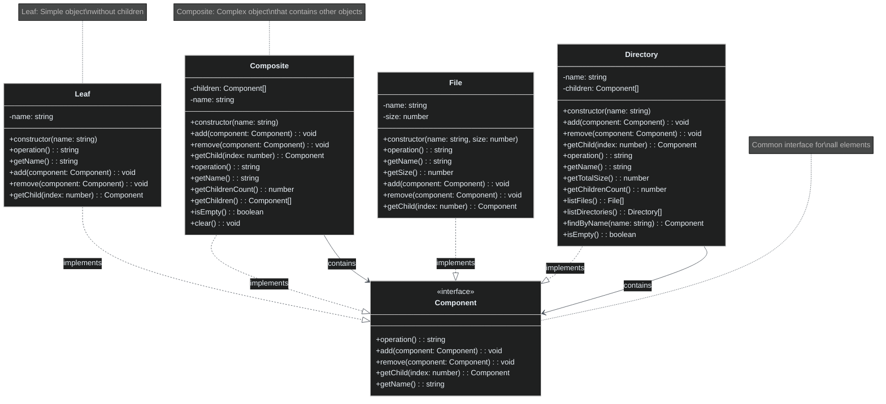

# Composite Pattern

🇺🇸 English Version | [🇪🇸 Versión en Español](./README.es.md)

## UML Diagram



## What is the Composite Pattern?

The **Composite** pattern is a structural design pattern that lets you **compose objects into tree structures** to represent part-whole hierarchies. It allows clients to treat individual objects and compositions of objects uniformly.

## Problem it Solves

### ❌ Without Composite: Different Treatment of Objects
```typescript
// Problem: You need to treat files and directories differently
class FileSystemManager {
    calculateSize(items: (File | Directory)[]): number {
        let totalSize = 0;
        
        for (const item of items) {
            if (item instanceof File) {
                // Specific treatment for files
                totalSize += item.getSize();
            } else if (item instanceof Directory) {
                // Specific treatment for directories
                const files = item.getFiles();
                for (const file of files) {
                    totalSize += file.getSize();
                }
                
                // Manual recursion for subdirectories
                const subdirs = item.getSubdirectories();
                for (const subdir of subdirs) {
                    totalSize += this.calculateDirectorySize(subdir);
                }
            }
        }
        
        return totalSize;
    }
    
    // Problems:
    // 1. Duplicate code for handling different types
    // 2. Complex logic for nested structures
    // 3. Difficult to add new types
    // 4. Violates Open/Closed Principle
}
```

### ✅ With Composite: Uniform Treatment
```typescript
// Common interface for all elements
interface FileSystemComponent {
    operation(): string;
    getSize(): number;
}

class File implements FileSystemComponent {
    constructor(private name: string, private size: number) {}
    
    operation(): string {
        return `File: ${this.name}`;
    }
    
    getSize(): number {
        return this.size;
    }
}

class Directory implements FileSystemComponent {
    private children: FileSystemComponent[] = [];
    
    constructor(private name: string) {}
    
    add(component: FileSystemComponent): void {
        this.children.push(component);
    }
    
    operation(): string {
        const results = [`Directory: ${this.name}`];
        for (const child of this.children) {
            results.push(`  ${child.operation()}`);
        }
        return results.join('\n');
    }
    
    getSize(): number {
        // Composition: delegates to children
        return this.children.reduce((total, child) => total + child.getSize(), 0);
    }
}

// Simple client that treats everything the same
class SimpleFileSystemManager {
    calculateSize(component: FileSystemComponent): number {
        return component.getSize(); // Same code for files and directories!
    }
    
    displayStructure(component: FileSystemComponent): void {
        console.log(component.operation()); // Same code for everything!
    }
}

// Benefits:
// 1. Simple and uniform client code
// 2. Easy to add new component types
// 3. Complex structures handled automatically
// 4. Respects Open/Closed Principle
```

## Pattern Components

### 1. **Component** (`Component`)
- Defines common interface for simple and complex objects
- Declares common operations like `operation()`, `add()`, `remove()`
- May include default implementations

### 2. **Leaf** (`Leaf`, `File`)
- Represents terminal objects (no children)
- Implements basic Component operations
- Cannot have child elements

### 3. **Composite** (`Composite`, `Directory`)
- Defines behavior for components with children
- Stores child components
- Implements child-related operations
- Delegates work to children and combines results

### 4. **Client**
- Manipulates objects through the Component interface
- Doesn't distinguish between leaves and composites

## When to Use Composite

✅ **Use it when:**
- You need to represent part-whole hierarchies of objects
- You want clients to treat simple and complex objects uniformly
- You have complex tree structures
- Operations should be applied recursively to the structure

❌ **Don't use it when:**
- The structure is simple and not hierarchical
- You don't need to treat simple and complex objects uniformly
- Operations are very different between leaves and composites
- The additional complexity isn't justified

## Advantages

🌳 **Complex Structures**: Facilitates working with tree structures
🔄 **Uniformity**: Treats simple and complex objects equally
📈 **Extensibility**: Easy to add new component types
🔄 **Recursion**: Recursive operations handled automatically
🎯 **Open/Closed Principle**: Open for extension, closed for modification

## Disadvantages

📈 **Complexity**: Can make design overly general
🔍 **Restrictions**: Difficult to restrict components of a composite
🧩 **Overhead**: Common interface may include irrelevant methods
⚠️ **Type Checking**: Can complicate runtime type checking

## Real-world Use Cases

### 🗂️ **File System**
```typescript
interface FileSystemItem {
    getName(): string;
    getSize(): number;
    display(indent: string): void;
}

class RegularFile implements FileSystemItem {
    constructor(private name: string, private size: number) {}
    
    getName(): string { return this.name; }
    getSize(): number { return this.size; }
    
    display(indent: string = ""): void {
        console.log(`${indent}📄 ${this.name} (${this.size} bytes)`);
    }
}

class Folder implements FileSystemItem {
    private items: FileSystemItem[] = [];
    
    constructor(private name: string) {}
    
    add(item: FileSystemItem): void {
        this.items.push(item);
    }
    
    getName(): string { return this.name; }
    
    getSize(): number {
        return this.items.reduce((total, item) => total + item.getSize(), 0);
    }
    
    display(indent: string = ""): void {
        console.log(`${indent}📁 ${this.name}/`);
        for (const item of this.items) {
            item.display(indent + "  ");
        }
    }
}

// Usage
const root = new Folder("project");
const src = new Folder("src");
const docs = new Folder("docs");

src.add(new RegularFile("main.ts", 2048));
src.add(new RegularFile("utils.ts", 1024));
docs.add(new RegularFile("readme.md", 512));

root.add(src);
root.add(docs);
root.add(new RegularFile("package.json", 256));

root.display();
console.log(`Total size: ${root.getSize()} bytes`);
```

### 🏢 **Organizational Structure**
```typescript
interface OrganizationUnit {
    getName(): string;
    getSalary(): number;
    getEmployeeCount(): number;
    displayStructure(level: number): void;
}

class Employee implements OrganizationUnit {
    constructor(
        private name: string,
        private position: string,
        private salary: number
    ) {}
    
    getName(): string { return this.name; }
    getSalary(): number { return this.salary; }
    getEmployeeCount(): number { return 1; }
    
    displayStructure(level: number = 0): void {
        const indent = "  ".repeat(level);
        console.log(`${indent}👤 ${this.name} - ${this.position} ($${this.salary})`);
    }
}

class Department implements OrganizationUnit {
    private units: OrganizationUnit[] = [];
    
    constructor(private name: string) {}
    
    add(unit: OrganizationUnit): void {
        this.units.push(unit);
    }
    
    getName(): string { return this.name; }
    
    getSalary(): number {
        return this.units.reduce((total, unit) => total + unit.getSalary(), 0);
    }
    
    getEmployeeCount(): number {
        return this.units.reduce((total, unit) => total + unit.getEmployeeCount(), 0);
    }
    
    displayStructure(level: number = 0): void {
        const indent = "  ".repeat(level);
        console.log(`${indent}🏢 ${this.name}`);
        for (const unit of this.units) {
            unit.displayStructure(level + 1);
        }
    }
}

// Building the organization
const company = new Department("TechCorp");
const engineering = new Department("Engineering");
const marketing = new Department("Marketing");

engineering.add(new Employee("Ana Garcia", "Senior Developer", 75000));
engineering.add(new Employee("Carlos Lopez", "Developer", 60000));
marketing.add(new Employee("Maria Rodriguez", "Marketing Manager", 70000));

company.add(engineering);
company.add(marketing);
company.add(new Employee("Juan Perez", "CEO", 120000));

company.displayStructure();
console.log(`Total employees: ${company.getEmployeeCount()}`);
console.log(`Total payroll: $${company.getSalary()}`);
```

### 🎨 **Graphical User Interface (UI Components)**
```typescript
interface UIComponent {
    render(): string;
    getWidth(): number;
    getHeight(): number;
}

class Button implements UIComponent {
    constructor(
        private text: string,
        private width: number,
        private height: number
    ) {}
    
    render(): string {
        return `<button style="width:${this.width}px;height:${this.height}px">${this.text}</button>`;
    }
    
    getWidth(): number { return this.width; }
    getHeight(): number { return this.height; }
}

class TextInput implements UIComponent {
    constructor(
        private placeholder: string,
        private width: number,
        private height: number
    ) {}
    
    render(): string {
        return `<input placeholder="${this.placeholder}" style="width:${this.width}px;height:${this.height}px">`;
    }
    
    getWidth(): number { return this.width; }
    getHeight(): number { return this.height; }
}

class Panel implements UIComponent {
    private components: UIComponent[] = [];
    private layout: "horizontal" | "vertical";
    
    constructor(layout: "horizontal" | "vertical" = "vertical") {
        this.layout = layout;
    }
    
    add(component: UIComponent): void {
        this.components.push(component);
    }
    
    render(): string {
        const direction = this.layout === "horizontal" ? "row" : "column";
        const childrenHTML = this.components.map(c => c.render()).join("");
        return `<div style="display:flex;flex-direction:${direction}">${childrenHTML}</div>`;
    }
    
    getWidth(): number {
        if (this.layout === "horizontal") {
            return this.components.reduce((total, c) => total + c.getWidth(), 0);
        } else {
            return Math.max(...this.components.map(c => c.getWidth()), 0);
        }
    }
    
    getHeight(): number {
        if (this.layout === "vertical") {
            return this.components.reduce((total, c) => total + c.getHeight(), 0);
        } else {
            return Math.max(...this.components.map(c => c.getHeight()), 0);
        }
    }
}

// Building complex UI
const loginForm = new Panel("vertical");
const buttonRow = new Panel("horizontal");

loginForm.add(new TextInput("Username", 200, 30));
loginForm.add(new TextInput("Password", 200, 30));

buttonRow.add(new Button("Cancel", 80, 30));
buttonRow.add(new Button("Login", 120, 30));

loginForm.add(buttonRow);

console.log(loginForm.render());
console.log(`Dimensions: ${loginForm.getWidth()}x${loginForm.getHeight()}`);
```

### 📊 **Mathematical Expressions**
```typescript
interface Expression {
    evaluate(): number;
    toString(): string;
}

class Number implements Expression {
    constructor(private value: number) {}
    
    evaluate(): number {
        return this.value;
    }
    
    toString(): string {
        return this.value.toString();
    }
}

class BinaryOperation implements Expression {
    constructor(
        private left: Expression,
        private operator: "+" | "-" | "*" | "/",
        private right: Expression
    ) {}
    
    evaluate(): number {
        const leftVal = this.left.evaluate();
        const rightVal = this.right.evaluate();
        
        switch (this.operator) {
            case "+": return leftVal + rightVal;
            case "-": return leftVal - rightVal;
            case "*": return leftVal * rightVal;
            case "/": return leftVal / rightVal;
            default: throw new Error(`Unknown operator: ${this.operator}`);
        }
    }
    
    toString(): string {
        return `(${this.left.toString()} ${this.operator} ${this.right.toString()})`;
    }
}

// Building expression: ((2 + 3) * (4 - 1))
const expr = new BinaryOperation(
    new BinaryOperation(new Number(2), "+", new Number(3)),
    "*",
    new BinaryOperation(new Number(4), "-", new Number(1))
);

console.log(`Expression: ${expr.toString()}`);
console.log(`Result: ${expr.evaluate()}`);
```

### 🛍️ **E-commerce Product Categories**
```typescript
interface ProductItem {
    getName(): string;
    getPrice(): number;
    display(indent: string): void;
}

class Product implements ProductItem {
    constructor(
        private name: string,
        private price: number,
        private description: string
    ) {}
    
    getName(): string { return this.name; }
    getPrice(): number { return this.price; }
    
    display(indent: string = ""): void {
        console.log(`${indent}🛍️ ${this.name} - $${this.price}`);
        console.log(`${indent}   ${this.description}`);
    }
}

class Category implements ProductItem {
    private items: ProductItem[] = [];
    
    constructor(private name: string) {}
    
    add(item: ProductItem): void {
        this.items.push(item);
    }
    
    getName(): string { return this.name; }
    
    getPrice(): number {
        // Average price of all items in category
        const total = this.items.reduce((sum, item) => sum + item.getPrice(), 0);
        return this.items.length > 0 ? total / this.items.length : 0;
    }
    
    getTotalValue(): number {
        return this.items.reduce((sum, item) => sum + item.getPrice(), 0);
    }
    
    display(indent: string = ""): void {
        console.log(`${indent}📁 ${this.name} (${this.items.length} items)`);
        for (const item of this.items) {
            item.display(indent + "  ");
        }
    }
}

// Building product catalog
const electronics = new Category("Electronics");
const computers = new Category("Computers");
const smartphones = new Category("Smartphones");

computers.add(new Product("MacBook Pro", 2499, "High-performance laptop"));
computers.add(new Product("Dell XPS 13", 1299, "Ultrabook for professionals"));

smartphones.add(new Product("iPhone 15", 999, "Latest Apple smartphone"));
smartphones.add(new Product("Samsung Galaxy S24", 899, "Android flagship"));

electronics.add(computers);
electronics.add(smartphones);
electronics.add(new Product("Wireless Headphones", 299, "Noise-canceling headphones"));

electronics.display();
console.log(`Total catalog value: $${electronics.getTotalValue()}`);
```

## Pattern Variants

### **Composite with Parent Navigation**
```typescript
interface ComponentWithParent {
    operation(): string;
    getParent(): ComponentWithParent | null;
    setParent(parent: ComponentWithParent | null): void;
}

class CompositeWithParent implements ComponentWithParent {
    private children: ComponentWithParent[] = [];
    private parent: ComponentWithParent | null = null;
    
    constructor(private name: string) {}
    
    add(component: ComponentWithParent): void {
        this.children.push(component);
        component.setParent(this);
    }
    
    remove(component: ComponentWithParent): void {
        const index = this.children.indexOf(component);
        if (index !== -1) {
            this.children.splice(index, 1);
            component.setParent(null);
        }
    }
    
    getParent(): ComponentWithParent | null {
        return this.parent;
    }
    
    setParent(parent: ComponentWithParent | null): void {
        this.parent = parent;
    }
    
    operation(): string {
        return `Composite ${this.name}`;
    }
    
    // Navigate up the hierarchy
    getRoot(): ComponentWithParent {
        let current: ComponentWithParent = this;
        while (current.getParent() !== null) {
            current = current.getParent()!;
        }
        return current;
    }
}
```

### **Composite with Result Caching**
```typescript
class CachedComposite implements Component {
    private children: Component[] = [];
    private cache: Map<string, any> = new Map();
    private cacheValid = false;
    
    constructor(private name: string) {}
    
    add(component: Component): void {
        this.children.push(component);
        this.invalidateCache();
    }
    
    remove(component: Component): void {
        const index = this.children.indexOf(component);
        if (index !== -1) {
            this.children.splice(index, 1);
            this.invalidateCache();
        }
    }
    
    operation(): string {
        const cacheKey = "operation";
        if (this.cacheValid && this.cache.has(cacheKey)) {
            return this.cache.get(cacheKey);
        }
        
        const result = this.computeOperation();
        this.cache.set(cacheKey, result);
        this.cacheValid = true;
        return result;
    }
    
    private computeOperation(): string {
        // Expensive computation here
        const results = [`Cached Composite ${this.name}`];
        for (const child of this.children) {
            results.push(`  ${child.operation()}`);
        }
        return results.join('\n');
    }
    
    private invalidateCache(): void {
        this.cacheValid = false;
        this.cache.clear();
    }
    
    getName(): string {
        return this.name;
    }
}
```

### **Thread-Safe Composite**
```typescript
class ThreadSafeComposite implements Component {
    private children: Component[] = [];
    private readonly lock = {}; // Mutex simulation
    
    constructor(private name: string) {}
    
    add(component: Component): void {
        // In real implementation, use actual mutex/lock
        synchronized(this.lock, () => {
            this.children.push(component);
        });
    }
    
    remove(component: Component): void {
        synchronized(this.lock, () => {
            const index = this.children.indexOf(component);
            if (index !== -1) {
                this.children.splice(index, 1);
            }
        });
    }
    
    operation(): string {
        return synchronized(this.lock, () => {
            const results = [`Thread-Safe Composite ${this.name}`];
            // Create snapshot to avoid concurrent modification
            const childrenSnapshot = [...this.children];
            
            for (const child of childrenSnapshot) {
                results.push(`  ${child.operation()}`);
            }
            return results.join('\n');
        });
    }
    
    getName(): string {
        return this.name;
    }
}

// Simplified synchronization helper (actual implementation would use real locks)
function synchronized<T>(lock: object, action: () => T): T {
    // In real implementation, acquire lock, execute action, release lock
    return action();
}
```

## Composite vs Other Patterns

### **Composite vs Decorator**
- **Composite**: Represents part-whole structures
- **Decorator**: Adds responsibilities to objects dynamically

### **Composite vs Chain of Responsibility**
- **Composite**: Tree structure, all nodes process
- **Chain of Responsibility**: Linear structure, only one processes

### **Composite vs Iterator**
- **Composite**: Defines the structure
- **Iterator**: Provides way to traverse the structure

### **Composite vs Visitor**
- **Composite**: Object structure
- **Visitor**: Operations on the structure without modifying it

## Best Practices

### **Safe Type Handling**
```typescript
// Use type guards for safe checks
function isComposite(component: Component): component is Composite {
    return 'getChildrenCount' in component;
}

function processComponent(component: Component): void {
    console.log(component.operation());
    
    if (isComposite(component)) {
        console.log(`Has ${component.getChildrenCount()} children`);
    }
}
```

### **Implementing Equals and Clone**
```typescript
interface CloneableComponent extends Component {
    clone(): CloneableComponent;
    equals(other: CloneableComponent): boolean;
}

class CloneableLeaf implements CloneableComponent {
    constructor(private name: string) {}
    
    operation(): string {
        return `Leaf ${this.name}`;
    }
    
    getName(): string {
        return this.name;
    }
    
    clone(): CloneableLeaf {
        return new CloneableLeaf(this.name);
    }
    
    equals(other: CloneableComponent): boolean {
        return other instanceof CloneableLeaf && other.name === this.name;
    }
}

class CloneableComposite implements CloneableComponent {
    private children: CloneableComponent[] = [];
    
    constructor(private name: string) {}
    
    add(component: CloneableComponent): void {
        this.children.push(component);
    }
    
    operation(): string {
        const results = [`Composite ${this.name}`];
        for (const child of this.children) {
            results.push(`  ${child.operation()}`);
        }
        return results.join('\n');
    }
    
    getName(): string {
        return this.name;
    }
    
    clone(): CloneableComposite {
        const cloned = new CloneableComposite(this.name);
        for (const child of this.children) {
            cloned.add(child.clone());
        }
        return cloned;
    }
    
    equals(other: CloneableComponent): boolean {
        if (!(other instanceof CloneableComposite) || other.name !== this.name) {
            return false;
        }
        
        if (other.children.length !== this.children.length) {
            return false;
        }
        
        return this.children.every((child, index) => 
            child.equals(other.children[index])
        );
    }
}
```

### **Visitor Pattern with Composite**
```typescript
interface ComponentVisitor {
    visitLeaf(leaf: Leaf): void;
    visitComposite(composite: Composite): void;
}

interface VisitableComponent extends Component {
    accept(visitor: ComponentVisitor): void;
}

class VisitableLeaf extends Leaf implements VisitableComponent {
    accept(visitor: ComponentVisitor): void {
        visitor.visitLeaf(this);
    }
}

class VisitableComposite extends Composite implements VisitableComponent {
    accept(visitor: ComponentVisitor): void {
        visitor.visitComposite(this);
        
        // Visit all children
        for (const child of this.getChildren()) {
            if ('accept' in child) {
                (child as VisitableComponent).accept(visitor);
            }
        }
    }
}

// Visitor to count nodes
class NodeCounterVisitor implements ComponentVisitor {
    private leafCount = 0;
    private compositeCount = 0;
    
    visitLeaf(leaf: Leaf): void {
        this.leafCount++;
    }
    
    visitComposite(composite: Composite): void {
        this.compositeCount++;
    }
    
    getResults(): { leaves: number; composites: number; total: number } {
        return {
            leaves: this.leafCount,
            composites: this.compositeCount,
            total: this.leafCount + this.compositeCount
        };
    }
}
```

### **Error Handling and Validation**
```typescript
class ValidatedComposite implements Component {
    private children: Component[] = [];
    private maxChildren: number;
    
    constructor(private name: string, maxChildren: number = Infinity) {
        this.maxChildren = maxChildren;
    }
    
    add(component: Component): void {
        if (this.children.length >= this.maxChildren) {
            throw new Error(`Cannot add more than ${this.maxChildren} children`);
        }
        
        if (this.children.includes(component)) {
            throw new Error("Component already exists in this composite");
        }
        
        // Prevent circular references
        if (this.wouldCreateCycle(component)) {
            throw new Error("Adding component would create a circular reference");
        }
        
        this.children.push(component);
    }
    
    private wouldCreateCycle(component: Component): boolean {
        // Simple cycle detection - in real implementation would be more sophisticated
        if (component === this) {
            return true;
        }
        
        if (isComposite(component)) {
            for (const child of component.getChildren()) {
                if (this.wouldCreateCycle(child)) {
                    return true;
                }
            }
        }
        
        return false;
    }
    
    remove(component: Component): void {
        const index = this.children.indexOf(component);
        if (index === -1) {
            throw new Error("Component not found in this composite");
        }
        
        this.children.splice(index, 1);
    }
    
    operation(): string {
        const results = [`Validated Composite ${this.name}`];
        for (const child of this.children) {
            results.push(`  ${child.operation()}`);
        }
        return results.join('\n');
    }
    
    getName(): string {
        return this.name;
    }
    
    getChild(index: number): Component | null {
        if (index < 0 || index >= this.children.length) {
            return null;
        }
        return this.children[index];
    }
}
```

The Composite pattern is especially useful when working with hierarchical structures where you need to treat individual objects and collections of objects uniformly.