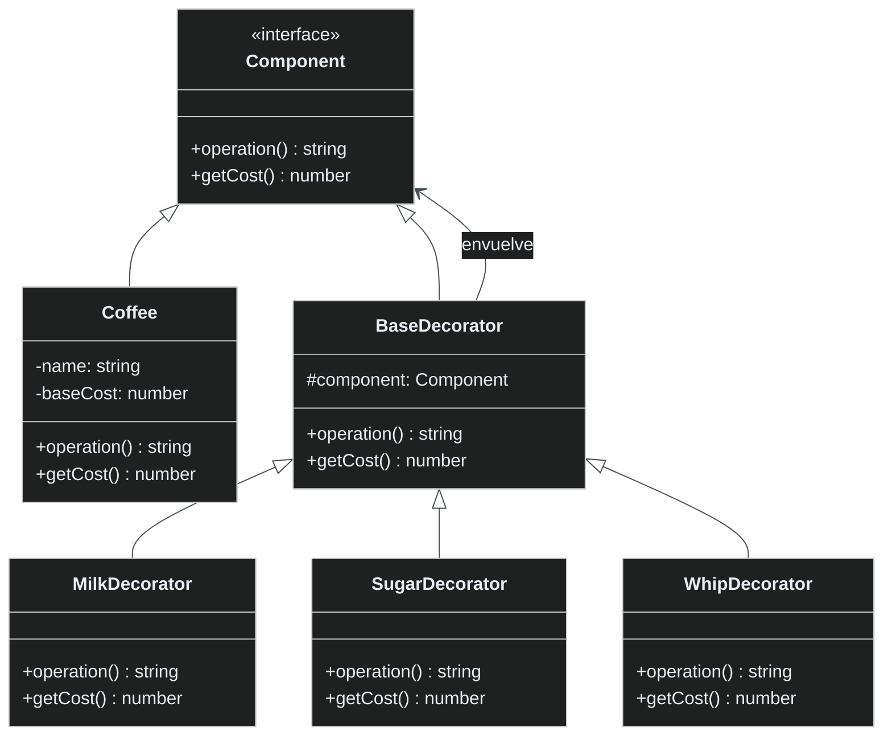

# Patrón Decorator

🇪🇸 Español | [🇺🇸 English](README.md)

## Descripción

El **Patrón Decorator** permite añadir comportamiento a objetos dinámicamente sin alterar su estructura. Proporciona una alternativa flexible a la herencia para extender funcionalidad.

## Problema

Imagina que necesitas añadir varias características a objetos (como agregar leche, azúcar o crema batida al café) pero:
- Crear subclases para cada combinación resultaría en una explosión de clases
- Quieres añadir/quitar características en tiempo de ejecución
- Las combinaciones pueden variar dinámicamente

## Solución

El patrón Decorator envuelve objetos en clases decoradoras que:
- Implementan la misma interfaz que el objeto original
- Añaden nuevo comportamiento antes/después de delegar al objeto envuelto
- Se pueden apilar para combinar múltiples decoraciones

## Estructura



## Implementación

### Componentes Principales

1. **Interfaz Component**: Define operaciones que pueden ser decoradas
2. **Componente Concreto**: Implementación básica (Coffee)
3. **Decorador Base**: Mantiene referencia al componente y delega llamadas
4. **Decoradores Concretos**: Añaden comportamiento específico (Milk, Sugar, Whip)

### Ejemplo de Uso

```typescript
// Café básico
let beverage: Component = new Coffee("Espresso", 2.0);

// Añadir decoraciones
beverage = new MilkDecorator(beverage);        // +$0.50
beverage = new SugarDecorator(beverage);       // +$0.20
beverage = new WhipDecorator(beverage);        // +$0.70

console.log(beverage.operation()); // "Espresso + Milk + Sugar + Whipped Cream"
console.log(beverage.getCost());   // 3.40
```

## Beneficios Clave

- **Principio Abierto/Cerrado**: Abierto para extensión, cerrado para modificación
- **Responsabilidad Única**: Cada decorador tiene una responsabilidad
- **Composición en Tiempo de Ejecución**: Añadir/quitar comportamiento dinámicamente
- **Combinaciones Flexibles**: Mezclar y combinar decoradores según sea necesario

## Cuándo Usar

✅ **Bueno para:**
- Añadir responsabilidades a objetos dinámicamente
- Evitar explosión de subclases
- Composición de características en tiempo de ejecución
- Funcionalidad en capas (middleware, filtros)

❌ **Evitar cuando:**
- La herencia simple es suficiente
- Se necesitan pocas combinaciones
- El orden de decoración no importa

## Ejemplos del Mundo Real

- **Java I/O Streams**: `BufferedReader(FileReader(file))`
- **Middleware**: Cadenas de middleware en Express.js
- **Componentes UI**: Añadir bordes, barras de desplazamiento, sombras
- **Caché**: Añadir capas de caché al acceso de datos

## Ejecutar el Ejemplo

```bash
cd decorator
npx ts-node Main.ts
```

Esto demuestra:
- Decoración básica
- Combinaciones de múltiples decoradores
- Escenarios de decoración dinámica
- Cálculo de costos a través de la cadena de decoradores