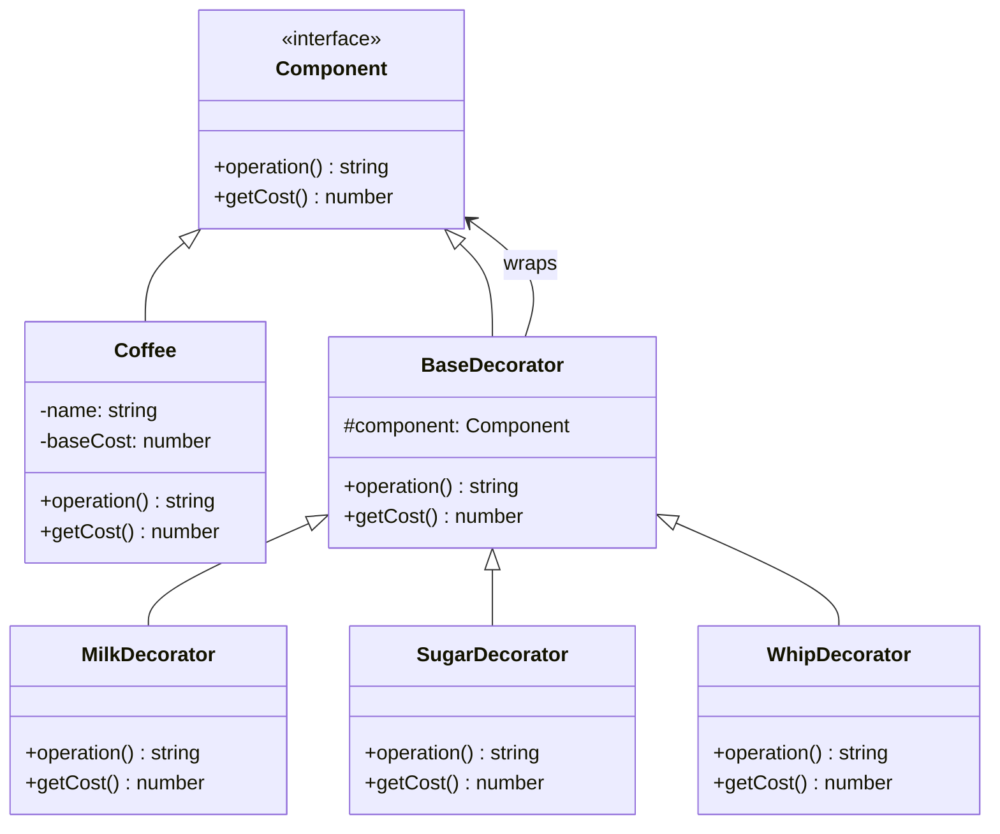

# Decorator Pattern

[🇪🇸 Español](README.es.md) | 🇺🇸 English

## Overview

The **Decorator Pattern** allows behavior to be added to objects dynamically without altering their structure. It provides a flexible alternative to subclassing for extending functionality.

## Problem

Imagine you need to add various features to objects (like adding milk, sugar, or whipped cream to coffee) but:
- Creating subclasses for every combination would lead to an explosion of classes
- You want to add/remove features at runtime
- The combinations can vary dynamically

## Solution

The Decorator pattern wraps objects in decorator classes that:
- Implement the same interface as the original object
- Add new behavior before/after delegating to the wrapped object
- Can be stacked to combine multiple decorations

## Structure



## Implementation

### Core Components

1. **Component Interface**: Defines operations that can be decorated
2. **Concrete Component**: Basic implementation (Coffee)
3. **Base Decorator**: Maintains reference to component and delegates calls
4. **Concrete Decorators**: Add specific behavior (Milk, Sugar, Whip)

### Example Usage

```typescript
// Basic coffee
let beverage: Component = new Coffee("Espresso", 2.0);

// Add decorations
beverage = new MilkDecorator(beverage);        // +$0.50
beverage = new SugarDecorator(beverage);       // +$0.20
beverage = new WhipDecorator(beverage);        // +$0.70

console.log(beverage.operation()); // "Espresso + Milk + Sugar + Whipped Cream"
console.log(beverage.getCost());   // 3.40
```

## Key Benefits

- **Open/Closed Principle**: Open for extension, closed for modification
- **Single Responsibility**: Each decorator has one responsibility
- **Runtime Composition**: Add/remove behavior dynamically
- **Flexible Combinations**: Mix and match decorators as needed

## When to Use

✅ **Good for:**
- Adding responsibilities to objects dynamically
- Avoiding explosion of subclasses
- Runtime feature composition
- Layered functionality (middleware, filters)

❌ **Avoid when:**
- Simple inheritance is sufficient
- Few combinations are needed
- Order of decoration doesn't matter

## Real-World Examples

- **Java I/O Streams**: `BufferedReader(FileReader(file))`
- **Middleware**: Express.js middleware chains
- **UI Components**: Adding borders, scrollbars, shadows
- **Caching**: Adding cache layers to data access

## Running the Example

```bash
cd decorator
npx ts-node Main.ts
```

This demonstrates:
- Basic decoration
- Multiple decorator combinations
- Dynamic decoration scenarios
- Cost calculation through decorator chain