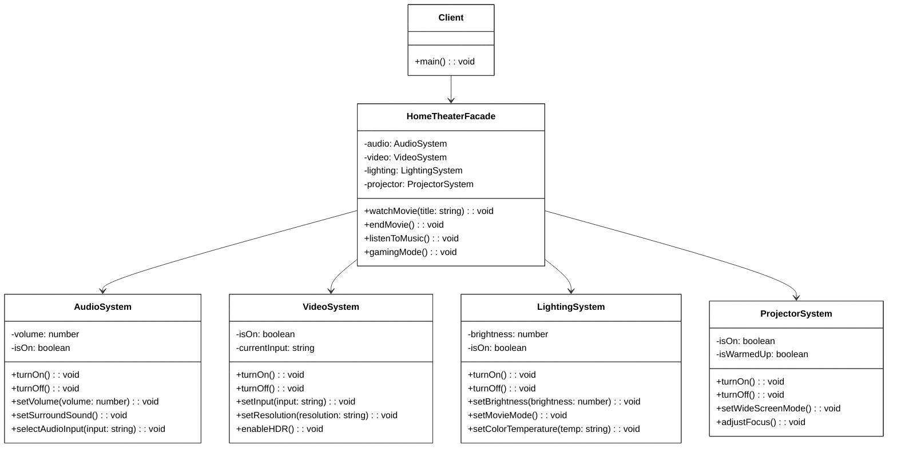

# Patrón Facade

🇪🇸 Español | [🇺🇸 English](README.md)

## Descripción

El **Patrón Facade** proporciona una interfaz simplificada a un subsistema complejo. Oculta la complejidad de múltiples clases y proporciona un punto único de entrada para operaciones comunes.

## Problema

Al trabajar con sistemas complejos a menudo enfrentas:
- Múltiples clases interconectadas que deben usarse juntas
- Secuencias de inicialización complejas
- Conocimiento detallado requerido sobre el funcionamiento interno
- Riesgo de olvidar pasos o usar configuraciones incorrectas

## Solución

El patrón Facade crea una interfaz simplificada que:
- Envuelve llamadas complejas del subsistema en métodos simples
- Proporciona valores predeterminados sensatos para operaciones comunes
- Reduce dependencias entre cliente y subsistema
- Aún permite acceso directo cuando es necesario

## Estructura



## Implementación

### Subsistemas Complejos

El ejemplo incluye cuatro subsistemas complejos:
- **AudioSystem**: Volumen, sonido envolvente, selección de entrada
- **VideoSystem**: Resolución, HDR, cambio de entrada
- **LightingSystem**: Brillo, temperatura de color, modos
- **ProjectorSystem**: Energía, enfoque, modos de pantalla

### Facade Simplificado

El `HomeTheaterFacade` proporciona métodos simples:
- `watchMovie()`: Coordina todos los subsistemas para ver películas
- `endMovie()`: Apaga apropiadamente todos los sistemas
- `listenToMusic()`: Configura una configuración centrada en audio
- `gamingMode()`: Optimiza para experiencia de juego

### Ejemplo de Uso

```typescript
// Sin Facade - Configuración compleja
const audio = new AudioSystem();
const video = new VideoSystem();
const lighting = new LightingSystem();

lighting.setMovieMode();
video.turnOn();
video.setInput("Blu-ray");
video.setResolution("4K");
audio.turnOn();
audio.setVolume(75);
// ... muchas más llamadas

// Con Facade - Configuración simple
const homeTheater = new HomeTheaterFacade();
homeTheater.watchMovie("The Matrix"); // ¡Una llamada lo hace todo!
```

## Beneficios Clave

- **Interfaz Simplificada**: Reduce complejidad para operaciones comunes
- **Bajo Acoplamiento**: Los clientes no dependen de detalles del subsistema
- **Flexibilidad**: Aún permite acceso directo al subsistema cuando es necesario
- **Mantenibilidad**: Los cambios en subsistemas no afectan a los clientes
- **Consistencia**: Asegura secuencias de inicialización apropiadas

## Cuándo Usar

✅ **Bueno para:**
- Subsistemas complejos con muchas clases interdependientes
- Proporcionar interfaz simple a sistemas heredados
- Reducir curva de aprendizaje para nuevos desarrolladores
- Crear arquitectura en capas
- Envolver librerías de terceros

❌ **Evitar cuando:**
- El subsistema ya es simple
- Necesitas acceso a todas las características del subsistema
- El rendimiento es crítico (añade pequeña sobrecarga)
- Los subsistemas cambian frecuentemente

## Comparación con Otros Patrones

| Patrón | Propósito | Diferencia Clave |
|--------|-----------|------------------|
| **Facade** | Simplificar interfaz | Proporciona conveniencia, no añade funcionalidad |
| **Adapter** | Compatibilidad de interfaz | Hace que interfaces incompatibles trabajen juntas |
| **Proxy** | Controlar acceso | Añade comportamiento (caché, seguridad, carga perezosa) |
| **Decorator** | Añadir comportamiento | Añade dinámicamente nuevas capacidades |

## Ejemplos del Mundo Real

- **API Gateways**: Simplifican acceso a microservicios
- **Capas de Base de Datos**: Ocultan operaciones complejas de SQL o ORM
- **Librerías de UI**: Componentes simples que envuelven manipulación compleja del DOM
- **SDKs de Nube**: Interfaces simplificadas a servicios complejos de nube
- **Sistemas Operativos**: Comandos de shell que envuelven llamadas del sistema

## Ejecutar el Ejemplo

```bash
cd facade
npx ts-node Main.ts
```

Esto demuestra:
- Configuración manual compleja vs. facade simplificado
- Múltiples operaciones de facade (película, música, gaming)
- Uso avanzado combinando facade con acceso directo
- Beneficios de reducción de complejidad