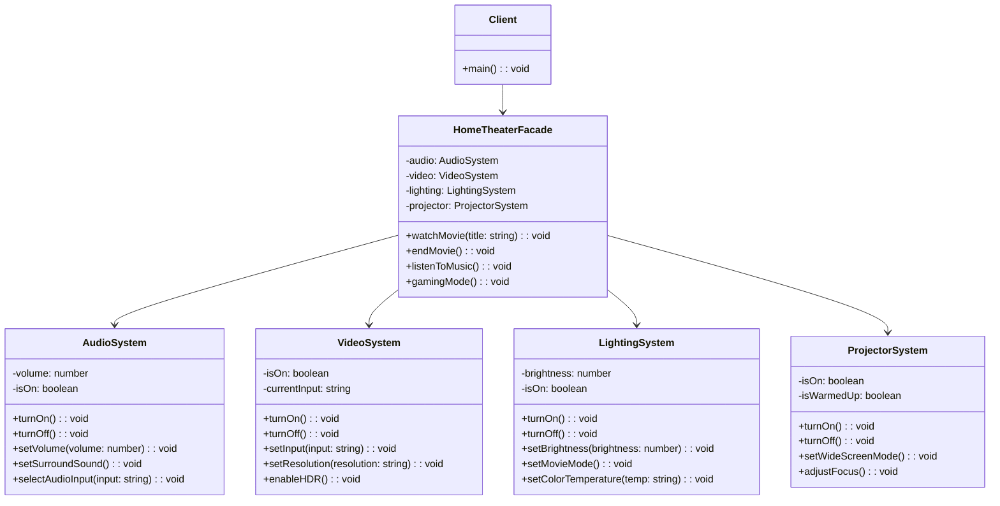

# Facade Pattern

[🇪🇸 Español](README.es.md) | 🇺🇸 English

## Overview

The **Facade Pattern** provides a simplified interface to a complex subsystem. It hides the complexity of multiple classes and provides a single point of entry for common operations.

## Problem

When working with complex systems you often face:
- Multiple interconnected classes that must be used together
- Complex initialization sequences
- Detailed knowledge required about internal workings
- Risk of forgetting steps or using wrong configurations

## Solution

The Facade pattern creates a simplified interface that:
- Wraps complex subsystem calls into simple methods
- Provides sensible defaults for common operations
- Reduces dependencies between client and subsystem
- Still allows direct access when needed

## Structure



## Implementation

### Complex Subsystems

The example includes four complex subsystems:
- **AudioSystem**: Volume, surround sound, input selection
- **VideoSystem**: Resolution, HDR, input switching
- **LightingSystem**: Brightness, color temperature, modes
- **ProjectorSystem**: Power, focus, screen modes

### Simplified Facade

The `HomeTheaterFacade` provides simple methods:
- `watchMovie()`: Coordinates all subsystems for movie viewing
- `endMovie()`: Properly shuts down all systems
- `listenToMusic()`: Sets up audio-focused configuration
- `gamingMode()`: Optimizes for gaming experience

### Example Usage

```typescript
// Without Facade - Complex setup
const audio = new AudioSystem();
const video = new VideoSystem();
const lighting = new LightingSystem();

lighting.setMovieMode();
video.turnOn();
video.setInput("Blu-ray");
video.setResolution("4K");
audio.turnOn();
audio.setVolume(75);
// ... many more calls

// With Facade - Simple setup
const homeTheater = new HomeTheaterFacade();
homeTheater.watchMovie("The Matrix"); // One call does it all!
```

## Key Benefits

- **Simplified Interface**: Reduces complexity for common operations
- **Loose Coupling**: Clients don't depend on subsystem details
- **Flexibility**: Still allows direct subsystem access when needed
- **Maintainability**: Changes to subsystems don't affect clients
- **Consistency**: Ensures proper initialization sequences

## When to Use

✅ **Good for:**
- Complex subsystems with many interdependent classes
- Providing simple interface to legacy systems
- Reducing learning curve for new developers
- Creating layered architecture
- Wrapping third-party libraries

❌ **Avoid when:**
- Subsystem is already simple
- You need access to all subsystem features
- Performance is critical (adds small overhead)
- Subsystems are frequently changing

## Comparison with Other Patterns

| Pattern | Purpose | Key Difference |
|---------|---------|----------------|
| **Facade** | Simplify interface | Provides convenience, doesn't add functionality |
| **Adapter** | Interface compatibility | Makes incompatible interfaces work together |
| **Proxy** | Control access | Adds behavior (caching, security, lazy loading) |
| **Decorator** | Add behavior | Dynamically adds new capabilities |

## Real-World Examples

- **API Gateways**: Simplify access to microservices
- **Database Layers**: Hide complex SQL or ORM operations
- **UI Libraries**: Simple components wrapping complex DOM manipulation
- **Cloud SDKs**: Simplified interfaces to complex cloud services
- **Operating Systems**: Shell commands wrapping system calls

## Running the Example

```bash
cd facade
npx ts-node Main.ts
```

This demonstrates:
- Complex manual setup vs. simplified facade
- Multiple facade operations (movie, music, gaming)
- Advanced usage combining facade with direct access
- Complexity reduction benefits