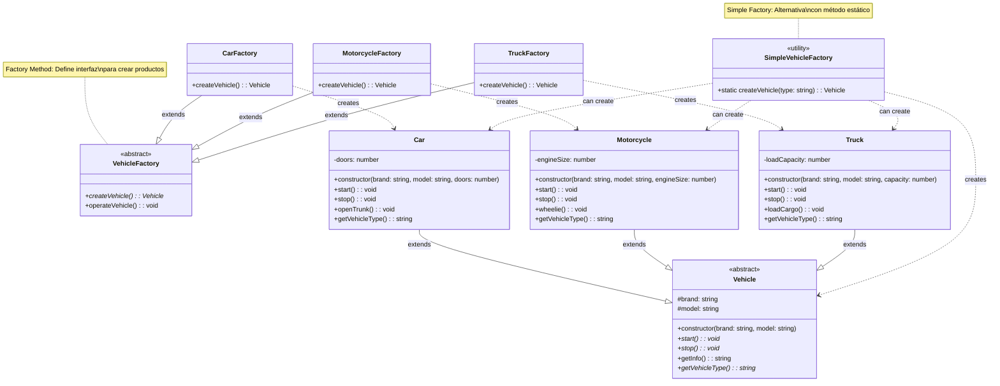

# Patrón Factory Method

🇪🇸 Versión en Español | [🇺🇸 English Version](./README.md)

## Diagrama UML



## ¿Qué es el Patrón Factory Method?

El patrón **Factory Method** es un patrón de diseño creacional que define una interfaz para crear objetos, pero permite a las subclases decidir qué clase instanciar. Básicamente, delega la creación de objetos a las subclases.

## Problema que Resuelve

### ❌ Sin Factory Method: Acoplamiento Fuerte
```typescript
class TransportManager {
    createTransport(type: string): Vehicle {
        // Código acoplado fuertemente a clases concretas
        if (type === "car") {
            return new Car("Toyota", "Camry", 4);
        } else if (type === "motorcycle") {
            return new Motorcycle("Honda", "CBR", 600);
        } else if (type === "truck") {
            return new Truck("Volvo", "FH16", 40000);
        }
        throw new Error("Tipo desconocido");
    }
}

// Problemas:
// 1. Violación del principio Abierto/Cerrado
// 2. Código difícil de mantener
// 3. Agregar nuevo tipo = modificar TransportManager
```

### ✅ Con Factory Method: Desacoplamiento
```typescript
// Cada factory se especializa en crear un tipo
class CarFactory extends VehicleFactory {
    createVehicle(): Vehicle {
        return new Car("Toyota", "Camry", 4);
    }
}

class MotorcycleFactory extends VehicleFactory {
    createVehicle(): Vehicle {
        return new Motorcycle("Honda", "CBR", 600);
    }
}

// Beneficios:
// 1. Cada factory tiene una responsabilidad específica
// 2. Fácil agregar nuevos tipos sin modificar código existente
// 3. Cliente desacoplado de clases concretas
```

## Componentes del Patrón

### 1. **Creator** (`VehicleFactory`)
- Declara el factory method que retorna objetos **Product**
- Puede contener lógica de negocio que depende de los productos
- No conoce las clases concretas de productos

### 2. **Concrete Creator** (`CarFactory`, `MotorcycleFactory`, `TruckFactory`)
- Sobrescribe el factory method para crear productos específicos
- Cada uno se especializa en crear un tipo de producto
- Implementa la lógica de creación específica

### 3. **Product** (`Vehicle`)
- Define la interfaz común para todos los productos
- Declara operaciones que pueden realizar todos los productos concretos

### 4. **Concrete Product** (`Car`, `Motorcycle`, `Truck`)
- Implementaciones específicas de la interfaz **Product**
- Cada uno representa un tipo diferente de objeto creado

## Variantes del Patrón

### 1. **Factory Method Clásico**
```typescript
abstract class VehicleFactory {
    // Factory method abstracto
    abstract createVehicle(): Vehicle;
    
    // Lógica de negocio que usa el factory method
    operateVehicle(): void {
        const vehicle = this.createVehicle();
        vehicle.start();
        // ... lógica adicional
        vehicle.stop();
    }
}
```

### 2. **Simple Factory** (No es un patrón GoF)
```typescript
class SimpleVehicleFactory {
    static createVehicle(type: string): Vehicle {
        switch(type) {
            case "car": return new Car("Toyota", "Camry", 4);
            case "motorcycle": return new Motorcycle("Honda", "CBR", 600);
            case "truck": return new Truck("Volvo", "FH16", 40000);
            default: throw new Error("Tipo desconocido");
        }
    }
}
```

### 3. **Parametrized Factory Method**
```typescript
abstract class VehicleFactory {
    abstract createVehicle(config: VehicleConfig): Vehicle;
}

class CarFactory extends VehicleFactory {
    createVehicle(config: VehicleConfig): Vehicle {
        return new Car(config.brand, config.model, config.doors);
    }
}
```

## Cuándo Usar Factory Method

✅ **Úsalo cuando:**
- No conoces de antemano las clases exactas de objetos que debes crear
- Quieres que los usuarios extiendan componentes internos de tu biblioteca
- Quieres ahorrar recursos del sistema reutilizando objetos existentes
- Necesitas delegar la responsabilidad de creación a subclases

❌ **No lo uses cuando:**
- Solo tienes una implementación de producto
- La creación del objeto es simple y no va a cambiar
- El costo de mantener jerarquías es mayor que el beneficio

## Ventajas

🔓 **Principio Abierto/Cerrado**: Fácil agregar nuevos productos sin modificar código existente
🎯 **Single Responsibility**: Separa creación de uso de productos
🔗 **Bajo Acoplamiento**: Cliente no depende de clases concretas
🔄 **Reutilización**: Código de creación centralizado y reutilizable

## Desventajas

📈 **Complejidad**: Puede hacer el código más complejo
🏗️ **Jerarquías**: Requiere crear muchas subclases
⚡ **Overhead**: Puede ser excesivo para casos simples

## Ejemplo Práctico: Sistema de Vehículos

### Escenario Real
Una aplicación de gestión de flotas necesita crear diferentes tipos de vehículos:

**Tipos de Vehículos:**
- **Cars**: Para transporte personal, tienen puertas y maletero
- **Motorcycles**: Para delivery rápido, tienen tamaño de motor
- **Trucks**: Para carga pesada, tienen capacidad de carga

### Flujo de Trabajo
```typescript
// 1. Crear factories específicas
const carFactory = new CarFactory();
const motorcycleFactory = new MotorcycleFactory();
const truckFactory = new TruckFactory();

// 2. Usar el factory method (polimorfismo)
const factories: VehicleFactory[] = [carFactory, motorcycleFactory, truckFactory];

factories.forEach(factory => {
    factory.operateVehicle(); // Cada factory crea su tipo específico
});

// 3. O usar Simple Factory para casos simples
const vehicle = SimpleVehicleFactory.createVehicle("car");
vehicle.start();
```

### Extensibilidad
```typescript
// Agregar nuevo tipo es fácil - no modificas código existente
class ElectricCarFactory extends VehicleFactory {
    createVehicle(): Vehicle {
        return new ElectricCar("Tesla", "Model 3", 500); // 500km autonomía
    }
}

class ElectricCar extends Vehicle {
    constructor(brand: string, model: string, private range: number) {
        super(brand, model);
    }
    
    start(): void {
        console.log("🔋 Coche eléctrico iniciado silenciosamente");
    }
    
    getVehicleType(): string {
        return "Electric Car";
    }
}
```

## Casos de Uso Reales

### 🎮 **Creación de Personajes en Videojuegos**
```typescript
abstract class CharacterFactory {
    abstract createCharacter(): Character;
}

class WarriorFactory extends CharacterFactory {
    createCharacter(): Character {
        return new Warrior(100, 80, 60); // HP, Attack, Defense
    }
}

class MageFactory extends CharacterFactory {
    createCharacter(): Character {
        return new Mage(70, 120, 40); // Menos HP, más ataque mágico
    }
}
```

### 🌐 **Parsers de Documentos**
```typescript
abstract class DocumentParserFactory {
    abstract createParser(): DocumentParser;
}

class PDFParserFactory extends DocumentParserFactory {
    createParser(): DocumentParser {
        return new PDFParser();
    }
}

class XMLParserFactory extends DocumentParserFactory {
    createParser(): DocumentParser {
        return new XMLParser();
    }
}
```

### 🔌 **Conectores de Base de Datos**
```typescript
abstract class DatabaseConnectorFactory {
    abstract createConnector(): DatabaseConnector;
}

class MySQLConnectorFactory extends DatabaseConnectorFactory {
    createConnector(): DatabaseConnector {
        return new MySQLConnector("localhost", 3306);
    }
}

class PostgreSQLConnectorFactory extends DatabaseConnectorFactory {
    createConnector(): DatabaseConnector {
        return new PostgreSQLConnector("localhost", 5432);
    }
}
```

### 🖥️ **Elementos de UI Multiplataforma**
```typescript
abstract class UIElementFactory {
    abstract createButton(): Button;
    abstract createWindow(): Window;
}

class WindowsUIFactory extends UIElementFactory {
    createButton(): Button { return new WindowsButton(); }
    createWindow(): Window { return new WindowsWindow(); }
}

class MacUIFactory extends UIElementFactory {
    createButton(): Button { return new MacButton(); }
    createWindow(): Window { return new MacWindow(); }
}
```

## Factory Method vs Otros Patrones

### **Factory Method vs Abstract Factory**
- **Factory Method**: Crea un tipo de producto
- **Abstract Factory**: Crea familias completas de productos relacionados

### **Factory Method vs Builder**
- **Factory Method**: Crea productos de una vez
- **Builder**: Construye productos paso a paso

### **Factory Method vs Prototype**
- **Factory Method**: Crea productos desde cero
- **Prototype**: Crea productos clonando prototipos existentes

### **Factory Method vs Singleton**
- **Factory Method**: Puede crear múltiples instancias
- **Singleton**: Garantiza una sola instancia

## Relación con Otros Patrones

- **Abstract Factory**: Usa Factory Methods para crear productos
- **Template Method**: Factory Method es un caso especial de Template Method
- **Prototype**: Factory Method puede devolver prototipos clonados
- **Iterator**: Factory Method puede crear iteradores