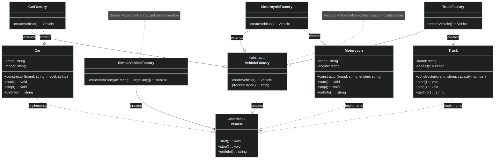

# Factory Pattern

🇺🇸 English Version | [🇪🇸 Versión en Español](./README.es.md)

## UML Diagram



## What is the Factory Pattern?

The **Factory** pattern is a creational design pattern that provides an interface for **creating objects without specifying their exact classes**. Instead of calling constructors directly, client code calls factory methods that return objects.

## Pattern Variants

### 1. **Simple Factory** (Not a GoF pattern)
A single class responsible for creating objects based on parameters.

### 2. **Factory Method** (GoF pattern)
Defines an interface for creating objects, but lets subclasses decide which class to instantiate.

### 3. **Abstract Factory** (GoF pattern)
Creates families of related objects without specifying their concrete classes.

## Problem it Solves

### ❌ Without Factory: Direct Construction
```typescript
class VehicleRentalService {
    rentVehicle(type: string, customerType: string): void {
        let vehicle: Vehicle;
        
        // Complex creation logic scattered throughout code
        if (type === "car") {
            if (customerType === "premium") {
                vehicle = new Car("BMW", "X5");
            } else {
                vehicle = new Car("Toyota", "Corolla");
            }
        } else if (type === "motorcycle") {
            if (customerType === "premium") {
                vehicle = new Motorcycle("Harley Davidson", "V-Twin");
            } else {
                vehicle = new Motorcycle("Honda", "Single Cylinder");
            }
        } else if (type === "truck") {
            vehicle = new Truck("Ford", 1000);
        } else {
            throw new Error("Unknown vehicle type");
        }
        
        // Problems:
        // 1. Tight coupling with concrete classes
        // 2. Creation logic repeated everywhere
        // 3. Hard to add new vehicle types
        // 4. Violates Open/Closed Principle
        
        vehicle.start();
        console.log(`Rented: ${vehicle.getInfo()}`);
    }
}
```

### ✅ With Factory: Centralized Creation
```typescript
// Simple Factory approach
class SimpleVehicleFactory {
    static createVehicle(type: string, customerType: string = "standard"): Vehicle {
        switch (type.toLowerCase()) {
            case "car":
                return customerType === "premium" 
                    ? new Car("BMW", "X5")
                    : new Car("Toyota", "Corolla");
            case "motorcycle":
                return customerType === "premium"
                    ? new Motorcycle("Harley Davidson", "V-Twin")
                    : new Motorcycle("Honda", "Single Cylinder");
            case "truck":
                return new Truck("Ford", 1000);
            default:
                throw new Error(`Unknown vehicle type: ${type}`);
        }
    }
}

// Now client code is simple and clean
class VehicleRentalService {
    rentVehicle(type: string, customerType: string): void {
        const vehicle = SimpleVehicleFactory.createVehicle(type, customerType);
        vehicle.start();
        console.log(`Rented: ${vehicle.getInfo()}`);
    }
}

// Benefits:
// 1. Centralized object creation
// 2. Client doesn't know about concrete classes
// 3. Easy to maintain creation logic
// 4. Consistent object initialization
```

## Factory Method Pattern

### ✅ Factory Method: Extensible Creation
```typescript
// Abstract creator
abstract class VehicleFactory {
    // Factory method - subclasses implement this
    abstract createVehicle(): Vehicle;
    
    // Template method using factory method
    processOrder(): string {
        const vehicle = this.createVehicle();
        vehicle.start();
        
        return `Order processed for: ${vehicle.getInfo()}`;
    }
}

// Concrete creators
class CarFactory extends VehicleFactory {
    createVehicle(): Vehicle {
        return new Car("Toyota", "Camry");
    }
}

class MotorcycleFactory extends VehicleFactory {
    createVehicle(): Vehicle {
        return new Motorcycle("Yamaha", "600cc");
    }
}

class TruckFactory extends VehicleFactory {
    createVehicle(): Vehicle {
        return new Truck("Mercedes", 2000);
    }
}

// Usage
function processVehicleOrder(factory: VehicleFactory): void {
    const result = factory.processOrder();
    console.log(result);
}

// Easy to extend - just add new factory
class ElectricCarFactory extends VehicleFactory {
    createVehicle(): Vehicle {
        return new ElectricCar("Tesla", "Model 3", 400); // new product type
    }
}

// Benefits:
// 1. Open/Closed Principle - open for extension, closed for modification
// 2. Single Responsibility - each factory creates one type
// 3. Loose coupling between client and products
// 4. Code reuse through template methods
```

## Pattern Components

### 1. **Product Interface** (`Vehicle`)
- Defines the interface of objects the factory creates
- All concrete products implement this interface
- Client works with this interface, not concrete classes

### 2. **Concrete Products** (`Car`, `Motorcycle`, `Truck`)
- Different implementations of the product interface
- Created by corresponding factories
- Contain specific business logic

### 3. **Creator/Factory** (`VehicleFactory`)
- Declares the factory method
- May contain default implementation or template methods
- Uses the product interface, not concrete products

### 4. **Concrete Creators** (`CarFactory`, `MotorcycleFactory`)
- Override factory method to create specific products
- Each creator typically creates one type of product
- Can have additional configuration logic

## When to Use Factory

✅ **Use it when:**
- You don't know beforehand the exact types and dependencies of objects
- You want to provide users with a way to extend internal components
- You want to save system resources by reusing existing objects
- Object creation is complex and you want to centralize the logic
- You need to support multiple product families

❌ **Don't use it when:**
- Object creation is simple and doesn't vary
- You only have one concrete product
- The complexity overhead isn't justified
- Direct instantiation is more readable

## Advantages

🏭 **Centralization**: All creation logic in one place
🔌 **Loose Coupling**: Client doesn't depend on concrete classes
📈 **Extensibility**: Easy to add new product types
🔄 **Consistency**: Standardized object creation process
🎯 **Single Responsibility**: Each factory has one job

## Disadvantages

📈 **Code Complexity**: More classes and interfaces
🧩 **Indirection**: Extra abstraction layer
⚠️ **Over-engineering**: Can be overkill for simple cases
📚 **Learning Curve**: More patterns to understand

## Real-world Use Cases

### 🗄️ **Database Connection Factory**
```typescript
interface IDatabase {
    connect(): Promise<void>;
    query(sql: string): Promise<any[]>;
    disconnect(): Promise<void>;
}

abstract class DatabaseFactory {
    abstract createDatabase(): IDatabase;
    
    async executeQuery(sql: string): Promise<any[]> {
        const db = this.createDatabase();
        await db.connect();
        const results = await db.query(sql);
        await db.disconnect();
        return results;
    }
}

class MySQLFactory extends DatabaseFactory {
    createDatabase(): IDatabase {
        return new MySQLDatabase({
            host: process.env.MYSQL_HOST,
            port: parseInt(process.env.MYSQL_PORT || "3306"),
            username: process.env.MYSQL_USER,
            password: process.env.MYSQL_PASSWORD
        });
    }
}

class PostgreSQLFactory extends DatabaseFactory {
    createDatabase(): IDatabase {
        return new PostgreSQLDatabase({
            connectionString: process.env.POSTGRES_URL
        });
    }
}

class MongoDBFactory extends DatabaseFactory {
    createDatabase(): IDatabase {
        return new MongoDBAdapter({
            uri: process.env.MONGODB_URI,
            dbName: process.env.MONGODB_DATABASE
        });
    }
}
```

### 🌐 **HTTP Client Factory**
```typescript
interface IHttpClient {
    get(url: string, config?: RequestConfig): Promise<HttpResponse>;
    post(url: string, data: any, config?: RequestConfig): Promise<HttpResponse>;
    setDefaultHeaders(headers: Record<string, string>): void;
}

class HttpClientFactory {
    static createClient(type: "axios" | "fetch" | "node", config?: any): IHttpClient {
        switch (type) {
            case "axios":
                return new AxiosHttpClient(config);
            case "fetch":
                return new FetchHttpClient(config);
            case "node":
                return new NodeHttpClient(config);
            default:
                throw new Error(`Unsupported HTTP client type: ${type}`);
        }
    }
    
    static createDefaultClient(): IHttpClient {
        // Choose based on environment
        if (typeof window !== "undefined") {
            return this.createClient("fetch");
        } else {
            return this.createClient("node");
        }
    }
}

// Usage
const httpClient = HttpClientFactory.createDefaultClient();
const response = await httpClient.get("https://api.example.com/data");
```

### 🎮 **Game Character Factory**
```typescript
interface ICharacter {
    attack(): number;
    defend(): number;
    getStats(): CharacterStats;
}

abstract class CharacterFactory {
    abstract createCharacter(level: number): ICharacter;
    
    createParty(size: number, level: number): ICharacter[] {
        const party: ICharacter[] = [];
        for (let i = 0; i < size; i++) {
            party.push(this.createCharacter(level));
        }
        return party;
    }
}

class WarriorFactory extends CharacterFactory {
    createCharacter(level: number): ICharacter {
        return new Warrior({
            health: 100 + (level * 20),
            strength: 15 + (level * 3),
            defense: 12 + (level * 2),
            agility: 8 + level
        });
    }
}

class MageFactory extends CharacterFactory {
    createCharacter(level: number): ICharacter {
        return new Mage({
            health: 70 + (level * 15),
            mana: 100 + (level * 25),
            intelligence: 18 + (level * 4),
            wisdom: 15 + (level * 3)
        });
    }
}

class RogueFactory extends CharacterFactory {
    createCharacter(level: number): ICharacter {
        return new Rogue({
            health: 80 + (level * 18),
            agility: 20 + (level * 4),
            stealth: 15 + (level * 3),
            criticalChance: 0.1 + (level * 0.02)
        });
    }
}
```

### 📧 **Email Service Factory**
```typescript
interface IEmailService {
    sendEmail(to: string, subject: string, body: string): Promise<boolean>;
    sendBulkEmail(recipients: string[], subject: string, body: string): Promise<number>;
}

class EmailServiceFactory {
    static createService(provider: string, config: any): IEmailService {
        switch (provider.toLowerCase()) {
            case "sendgrid":
                return new SendGridService(config.apiKey);
            case "mailgun":
                return new MailgunService(config.domain, config.apiKey);
            case "ses":
                return new SESService(config.region, config.credentials);
            case "smtp":
                return new SMTPService(config.host, config.port, config.auth);
            default:
                throw new Error(`Unsupported email provider: ${provider}`);
        }
    }
    
    static createFromEnvironment(): IEmailService {
        const provider = process.env.EMAIL_PROVIDER || "smtp";
        
        const configs = {
            sendgrid: { apiKey: process.env.SENDGRID_API_KEY },
            mailgun: { 
                domain: process.env.MAILGUN_DOMAIN, 
                apiKey: process.env.MAILGUN_API_KEY 
            },
            ses: { 
                region: process.env.AWS_REGION, 
                credentials: {
                    accessKeyId: process.env.AWS_ACCESS_KEY_ID,
                    secretAccessKey: process.env.AWS_SECRET_ACCESS_KEY
                }
            },
            smtp: {
                host: process.env.SMTP_HOST,
                port: parseInt(process.env.SMTP_PORT || "587"),
                auth: {
                    user: process.env.SMTP_USER,
                    pass: process.env.SMTP_PASS
                }
            }
        };
        
        return this.createService(provider, configs[provider]);
    }
}
```

## Factory vs Other Patterns

### **Factory Method vs Abstract Factory**
- **Factory Method**: Creates one product type
- **Abstract Factory**: Creates families of related products

### **Factory vs Builder**
- **Factory**: Creates complete objects in one step
- **Builder**: Creates complex objects step by step

### **Factory vs Prototype**
- **Factory**: Creates new instances from scratch
- **Prototype**: Creates new instances by cloning existing ones

### **Factory vs Singleton**
- **Factory**: Creates multiple instances
- **Singleton**: Ensures only one instance exists

## Implementation Variants

### **Parameterized Factory Method**
```typescript
abstract class DocumentFactory {
    abstract createDocument(type: string): Document;
    
    openDocument(type: string, filename: string): Document {
        const document = this.createDocument(type);
        document.open(filename);
        return document;
    }
}

class OfficeDocumentFactory extends DocumentFactory {
    createDocument(type: string): Document {
        switch (type.toLowerCase()) {
            case "word":
                return new WordDocument();
            case "excel":
                return new ExcelDocument();
            case "powerpoint":
                return new PowerPointDocument();
            default:
                throw new Error(`Unsupported document type: ${type}`);
        }
    }
}
```

### **Registry-based Factory**
```typescript
type ProductCreator<T> = () => T;

class ProductRegistry<T> {
    private creators = new Map<string, ProductCreator<T>>();
    
    register(type: string, creator: ProductCreator<T>): void {
        this.creators.set(type, creator);
    }
    
    create(type: string): T {
        const creator = this.creators.get(type);
        if (!creator) {
            throw new Error(`No creator registered for type: ${type}`);
        }
        return creator();
    }
    
    getRegisteredTypes(): string[] {
        return Array.from(this.creators.keys());
    }
}

// Usage
const vehicleRegistry = new ProductRegistry<Vehicle>();
vehicleRegistry.register("car", () => new Car("Toyota", "Camry"));
vehicleRegistry.register("motorcycle", () => new Motorcycle("Honda", "CBR"));
vehicleRegistry.register("truck", () => new Truck("Ford", 1500));

const car = vehicleRegistry.create("car");
```

### **Lazy Factory**
```typescript
class LazyVehicleFactory {
    private static instances = new Map<string, Vehicle>();
    
    static createVehicle(type: string): Vehicle {
        if (!this.instances.has(type)) {
            switch (type) {
                case "car":
                    this.instances.set(type, new Car("Default", "Model"));
                    break;
                case "motorcycle":
                    this.instances.set(type, new Motorcycle("Default", "Engine"));
                    break;
                default:
                    throw new Error(`Unknown vehicle type: ${type}`);
            }
        }
        
        return this.instances.get(type)!;
    }
    
    static clearCache(): void {
        this.instances.clear();
    }
}
```

## Best Practices

### **Use Dependency Injection with Factories**
```typescript
interface IVehicleFactory {
    createVehicle(): Vehicle;
}

class CarFactory implements IVehicleFactory {
    constructor(private config: CarConfig) {}
    
    createVehicle(): Vehicle {
        return new Car(this.config.brand, this.config.model);
    }
}

class VehicleService {
    constructor(private factory: IVehicleFactory) {}
    
    processOrder(): void {
        const vehicle = this.factory.createVehicle();
        // Process...
    }
}

// Dependency injection
const carConfig = new CarConfig("Toyota", "Prius");
const carFactory = new CarFactory(carConfig);
const service = new VehicleService(carFactory);
```

### **Validate Input Parameters**
```typescript
class SafeVehicleFactory {
    private static readonly VALID_TYPES = ["car", "motorcycle", "truck"];
    
    static createVehicle(type: string): Vehicle {
        if (!type || typeof type !== "string") {
            throw new Error("Vehicle type must be a non-empty string");
        }
        
        const normalizedType = type.toLowerCase().trim();
        if (!this.VALID_TYPES.includes(normalizedType)) {
            throw new Error(`Invalid vehicle type: ${type}. Valid types: ${this.VALID_TYPES.join(", ")}`);
        }
        
        switch (normalizedType) {
            case "car":
                return new Car("Toyota", "Corolla");
            case "motorcycle":
                return new Motorcycle("Honda", "CBR600");
            case "truck":
                return new Truck("Ford", 1000);
            default:
                throw new Error("Unexpected error in vehicle creation");
        }
    }
}
```

### **Use Configuration Objects**
```typescript
interface VehicleConfig {
    brand: string;
    model: string;
    year?: number;
    color?: string;
}

interface CarConfig extends VehicleConfig {
    doors: number;
    fuelType: "gasoline" | "diesel" | "electric" | "hybrid";
}

interface MotorcycleConfig extends VehicleConfig {
    engineSize: string;
    type: "sport" | "cruiser" | "touring" | "standard";
}

class ConfigurableVehicleFactory {
    static createCar(config: CarConfig): Car {
        this.validateCarConfig(config);
        return new Car(config);
    }
    
    static createMotorcycle(config: MotorcycleConfig): Motorcycle {
        this.validateMotorcycleConfig(config);
        return new Motorcycle(config);
    }
    
    private static validateCarConfig(config: CarConfig): void {
        if (!config.brand || !config.model) {
            throw new Error("Car must have brand and model");
        }
        if (config.doors < 2 || config.doors > 5) {
            throw new Error("Car must have 2-5 doors");
        }
    }
    
    private static validateMotorcycleConfig(config: MotorcycleConfig): void {
        if (!config.brand || !config.model || !config.engineSize) {
            throw new Error("Motorcycle must have brand, model, and engine size");
        }
    }
}
```

The Factory pattern is fundamental for creating flexible, maintainable code where object creation needs to be abstracted and potentially extended.