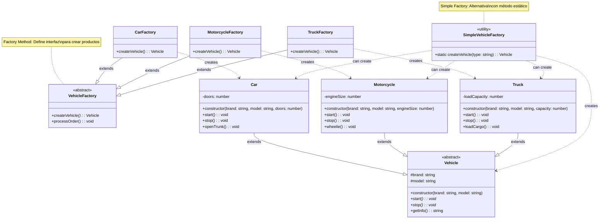

# Patrón Factory Method - Diagrama UML

## Estructura del Patrón Factory Method

**Propósito:**
Define una interfaz para crear objetos, pero permite a las subclases decidir qué clase instanciar.

**Dos variantes implementadas:**

### 1. Factory Method Clásico
- `VehicleFactory` - Creator abstracto con factory method
- `CarFactory`, `MotorcycleFactory`, `TruckFactory` - Creators concretos
- Cada factory se especializa en crear un tipo específico de vehículo

### 2. Simple Factory (Variante)
- `SimpleVehicleFactory` - Clase utilitaria con método estático
- Centraliza la lógica de creación en un solo lugar
- Más simple pero menos extensible

**Productos:**
- `Vehicle` - Producto abstracto
- `Car`, `Motorcycle`, `Truck` - Productos concretos

**Ventajas:**
- 🏭 Elimina acoplamiento entre creator y productos concretos
- ➕ Fácil agregar nuevos tipos de productos
- 🎯 Principio de Responsabilidad Única
- 🔓 Principio Abierto/Cerrado