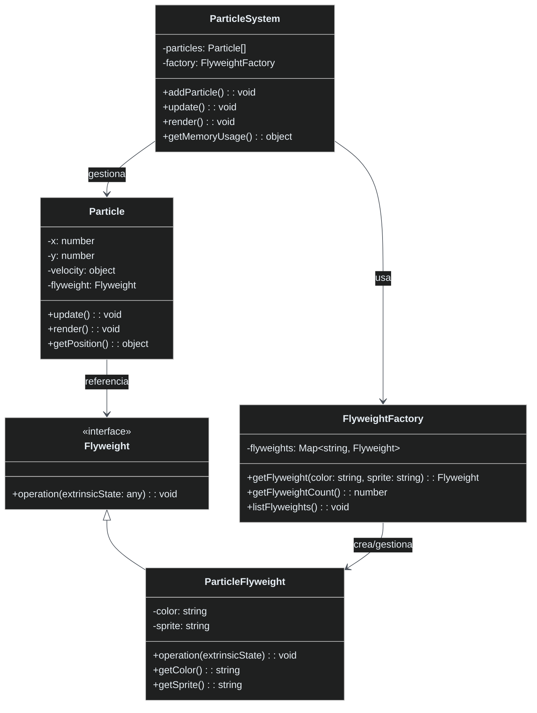

# Patrón Flyweight

🇪🇸 Español | [🇺🇸 English](README.md)

## Descripción

El **Patrón Flyweight** minimiza el uso de memoria compartiendo eficientemente entre múltiples objetos. Separa el estado intrínseco (compartido) del estado extrínseco (único) para reducir la huella de memoria al manejar grandes números de objetos similares.

## Problema

Cuando tu aplicación necesita crear miles o millones de objetos que:
- Comparten datos comunes (color, textura, sprite)
- Tienen estado único (posición, velocidad)
- Consumirían memoria excesiva si cada uno almacena todos los datos
- Causan problemas de rendimiento debido a sobrecarga de memoria

## Solución

El patrón Flyweight:
- **Estado Intrínseco**: Datos compartidos almacenados en objetos flyweight
- **Estado Extrínseco**: Datos únicos pasados como parámetros
- **Factory**: Gestiona y reutiliza instancias flyweight
- **Contexto**: Almacena estado extrínseco y referencia al flyweight

## Estructura



## Implementación

### Componentes Principales

1. **Interfaz Flyweight**: Define operaciones usando estado extrínseco
2. **Flyweight Concreto**: Almacena estado intrínseco (color, sprite)
3. **Factory Flyweight**: Gestiona pool de flyweights y asegura compartición
4. **Contexto (Particle)**: Almacena estado extrínseco (posición, velocidad)
5. **Cliente (ParticleSystem)**: Coordina flyweights y contextos

### Separación de Estados

```typescript
// Estado Intrínseco (compartido entre muchos objetos)
class ParticleFlyweight {
    private color: string;      // Compartido
    private sprite: string;     // Compartido
}

// Estado Extrínseco (único para cada objeto)
class Particle {
    private x: number;          // Único
    private y: number;          // Único
    private velocity: object;   // Único
}
```

### Ejemplo de Uso

```typescript
const particleSystem = new ParticleSystem();

// Crear muchas partículas - los flyweights se comparten automáticamente
for (let i = 0; i < 1000; i++) {
    particleSystem.addParticle(
        Math.random() * 100,     // x (extrínseco)
        Math.random() * 100,     // y (extrínseco)
        Math.random() * 2,       // velocityX (extrínseco)
        Math.random() * 2,       // velocityY (extrínseco)
        "red",                   // color (intrínseco - compartido)
        "fire"                   // sprite (intrínseco - compartido)
    );
}

// Resultado: 1000 partículas, pero solo unos pocos objetos flyweight
console.log(`Partículas: ${particleSystem.getParticleCount()}`);
console.log(`Flyweights: ${particleSystem.getFlyweightCount()}`);
// Salida: Partículas: 1000, Flyweights: 25 (96% reducción de memoria)
```

## Beneficios Clave

- **Eficiencia de Memoria**: Reducción dramática en el uso de memoria
- **Rendimiento**: Mejor localidad de caché y reducción de presión en GC
- **Escalabilidad**: Manejar miles de objetos eficientemente
- **Transparencia**: El código cliente no necesita gestionar la compartición

## Comparación de Memoria

| Enfoque | Objetos | Uso de Memoria | Ejemplo |
|---------|---------|----------------|---------|
| **Sin Flyweight** | 1000 partículas | Cada una almacena color, sprite, textura, mesh | ~1000 objetos pesados |
| **Con Flyweight** | 1000 partículas | 25 flyweights + 1000 contextos ligeros | ~97.5% reducción |

## Cuándo Usar

✅ **Bueno para:**
- Gran número de objetos similares
- Objetos con estado intrínseco/extrínseco separable
- Entornos con restricciones de memoria
- Desarrollo de juegos (partículas, sprites)
- Procesamiento de texto (formato de caracteres)

❌ **Evitar cuando:**
- Pocos objetos o objetos únicos
- No se puede separar estado intrínseco/extrínseco
- Compartir añade complejidad sin beneficio
- Los objetos cambian frecuentemente el estado intrínseco

## Ejemplos del Mundo Real

- **Motores de Juegos**: Sistemas de partículas, renderizado de sprites
- **Editores de Texto**: Formato de caracteres (fuente, tamaño, color compartidos)
- **Navegadores Web**: Optimización de nodos DOM
- **Librerías Gráficas**: Renderizado de glifos en fuentes
- **Mapas**: Juegos basados en tiles (tiles de terreno compartidos)

## Comparación con Otros Patrones

| Patrón | Propósito | Diferencia Clave |
|--------|-----------|------------------|
| **Flyweight** | Optimización de memoria | Comparte estado intrínseco entre objetos |
| **Singleton** | Instancia única | Una instancia globalmente, no compartición |
| **Object Pool** | Reutilizar objetos | Reutiliza objetos completos, no partes |
| **Prototype** | Clonar objetos | Crea copias, no comparte estado |

## Características de Rendimiento

- **Memoria**: O(flyweights únicos) en lugar de O(objetos totales)
- **Creación**: Más lenta primera creación, instantánea para subsiguientes
- **Acceso**: Ligeramente más lento debido a indirección
- **General**: Los ahorros masivos de memoria típicamente superan la pequeña sobrecarga

## Ejecutar el Ejemplo

```bash
cd flyweight
npx ts-node Main.ts
```

Esto demuestra:
- Compartición básica de flyweight y eficiencia de memoria
- Escalado a 1000+ objetos con flyweights mínimos
- Comparación de memoria con/sin patrón flyweight
- Operaciones en tiempo de ejecución con flyweights compartidos
- Estadísticas de uso de memoria y métricas de optimización