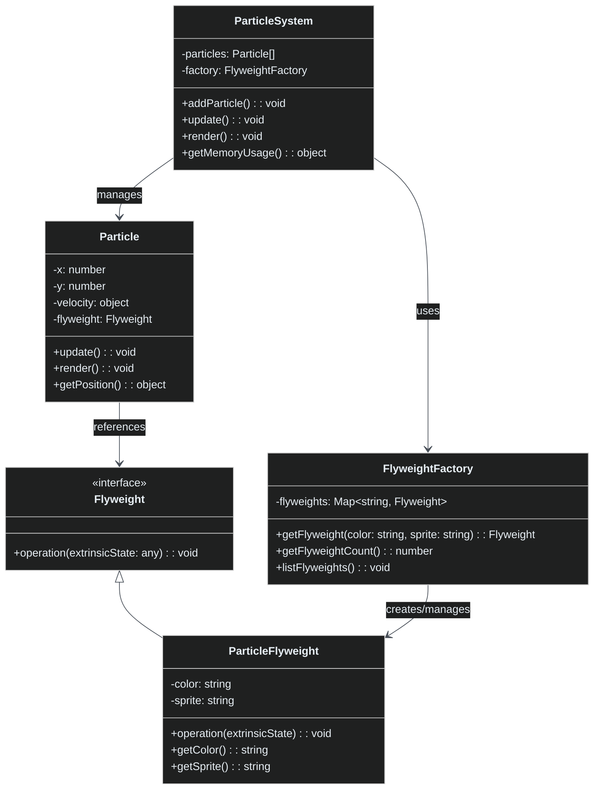

# Flyweight Pattern

[🇪🇸 Español](README.es.md) | 🇺🇸 English

## Overview

The **Flyweight Pattern** minimizes memory usage by sharing efficiently among multiple objects. It separates intrinsic state (shared) from extrinsic state (unique) to reduce memory footprint when dealing with large numbers of similar objects.

## Problem

When your application needs to create thousands or millions of objects that:
- Share common data (color, texture, sprite)
- Have unique state (position, velocity)
- Would consume excessive memory if each stored all data
- Cause performance issues due to memory overhead

## Solution

The Flyweight pattern:
- **Intrinsic State**: Shared data stored in flyweight objects
- **Extrinsic State**: Unique data passed as parameters
- **Factory**: Manages and reuses flyweight instances
- **Context**: Stores extrinsic state and references flyweight

## Structure



## Implementation

### Core Components

1. **Flyweight Interface**: Defines operations using extrinsic state
2. **Concrete Flyweight**: Stores intrinsic state (color, sprite)
3. **Flyweight Factory**: Manages flyweight pool and ensures sharing
4. **Context (Particle)**: Stores extrinsic state (position, velocity)
5. **Client (ParticleSystem)**: Coordinates flyweights and contexts

### State Separation

```typescript
// Intrinsic State (shared among many objects)
class ParticleFlyweight {
    private color: string;      // Shared
    private sprite: string;     // Shared
}

// Extrinsic State (unique to each object)
class Particle {
    private x: number;          // Unique
    private y: number;          // Unique
    private velocity: object;   // Unique
}
```

### Example Usage

```typescript
const particleSystem = new ParticleSystem();

// Create many particles - flyweights are automatically shared
for (let i = 0; i < 1000; i++) {
    particleSystem.addParticle(
        Math.random() * 100,     // x (extrinsic)
        Math.random() * 100,     // y (extrinsic)
        Math.random() * 2,       // velocityX (extrinsic)
        Math.random() * 2,       // velocityY (extrinsic)
        "red",                   // color (intrinsic - shared)
        "fire"                   // sprite (intrinsic - shared)
    );
}

// Result: 1000 particles, but only a few flyweight objects
console.log(`Particles: ${particleSystem.getParticleCount()}`);
console.log(`Flyweights: ${particleSystem.getFlyweightCount()}`);
// Output: Particles: 1000, Flyweights: 25 (96% memory reduction)
```

## Key Benefits

- **Memory Efficiency**: Dramatic reduction in memory usage
- **Performance**: Better cache locality and reduced GC pressure
- **Scalability**: Handle thousands of objects efficiently
- **Transparency**: Client code doesn't need to manage sharing

## Memory Comparison

| Approach | Objects | Memory Usage | Example |
|----------|---------|--------------|---------|
| **Without Flyweight** | 1000 particles | Each stores color, sprite, texture, mesh | ~1000 heavy objects |
| **With Flyweight** | 1000 particles | 25 flyweights + 1000 lightweight contexts | ~97.5% reduction |

## When to Use

✅ **Good for:**
- Large numbers of similar objects
- Objects with separable intrinsic/extrinsic state
- Memory-constrained environments
- Game development (particles, sprites)
- Text processing (character formatting)

❌ **Avoid when:**
- Few objects or unique objects
- Cannot separate intrinsic/extrinsic state
- Sharing adds complexity without benefit
- Objects change intrinsic state frequently

## Real-World Examples

- **Game Engines**: Particle systems, sprite rendering
- **Text Editors**: Character formatting (font, size, color shared)
- **Web Browsers**: DOM node optimization
- **Graphics Libraries**: Glyph rendering in fonts
- **Maps**: Tile-based games (terrain tiles shared)

## Comparison with Other Patterns

| Pattern | Purpose | Key Difference |
|---------|---------|----------------|
| **Flyweight** | Memory optimization | Shares intrinsic state among objects |
| **Singleton** | Single instance | One instance globally, not sharing |
| **Object Pool** | Reuse objects | Reuses entire objects, not parts |
| **Prototype** | Clone objects | Creates copies, doesn't share state |

## Performance Characteristics

- **Memory**: O(unique flyweights) instead of O(total objects)
- **Creation**: Slower first creation, instant for subsequent
- **Access**: Slightly slower due to indirection
- **Overall**: Massive memory savings typically outweigh small overhead

## Running the Example

```bash
cd flyweight
npx ts-node Main.ts
```

This demonstrates:
- Basic flyweight sharing and memory efficiency
- Scaling to 1000+ objects with minimal flyweights
- Memory comparison with/without flyweight pattern
- Runtime operations with shared flyweights
- Memory usage statistics and optimization metrics