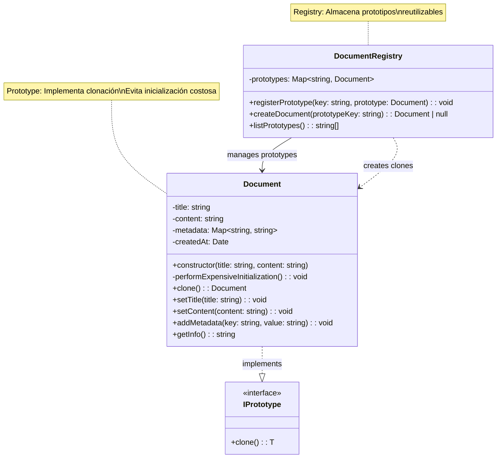

# Patrón Prototype

🇪🇸 Versión en Español | [🇺🇸 English Version](./README.md)

## Diagrama UML



## ¿Qué es el Patrón Prototype?

El patrón **Prototype** es un patrón de diseño creacional que permite crear nuevos objetos clonando instancias existentes en lugar de crearlos desde cero. Es especialmente útil cuando la creación de un objeto es costosa en términos de tiempo o recursos.

## Problema que Resuelve

### ❌ Sin Prototype
```typescript
// Cada documento requiere inicialización costosa
for(let i = 0; i < 1000; i++) {
    const doc = new Document("Reporte", "Contenido");
    // Carga plantillas, valida, configura metadata... (500ms cada uno)
    // Total: 1000 × 500ms = 8.3 minutos 😱
}
```

### ✅ Con Prototype
```typescript
// Crear prototipo una vez (500ms)
const prototype = new Document("Plantilla", "Base");

// Clonar rápidamente (1ms cada uno)
for(let i = 0; i < 1000; i++) {
    const doc = prototype.clone(); // Solo 1ms
    doc.setTitle(`Reporte ${i}`);
    // Total: 500ms + (1000 × 1ms) = 1.5 segundos ⚡
}
```

## Componentes del Patrón

### 1. **IPrototype<T>** (Prototype Interface)
- Define el método `clone()` que debe implementar todo prototipo
- Genérico para permitir diferentes tipos de objetos

### 2. **Document** (Concrete Prototype)
- Implementa la interfaz `IPrototype`
- Contiene la lógica de clonación específica
- Maneja la copia profunda de estructuras complejas (como Maps)

### 3. **DocumentRegistry** (Prototype Registry)
- Almacena prototipos pre-configurados
- Permite crear objetos por nombre/clave
- Centraliza la gestión de prototipos

## Cuándo Usar Prototype

✅ **Úsalo cuando:**
- La creación de objetos es costosa (DB, red, cálculos complejos)
- Necesitas muchos objetos similares con pequeñas variaciones
- Quieres evitar jerarquías complejas de Factory
- Los objetos tienen configuraciones complejas difíciles de recrear

❌ **No lo uses cuando:**
- Los objetos son simples y baratos de crear
- Las instancias no comparten configuración común
- La clonación es más compleja que la creación directa

## Ventajas

🚀 **Rendimiento**: Evita operaciones costosas de inicialización
🔧 **Flexibilidad**: Permite configuraciones dinámicas en runtime
🎯 **Simplicidad**: Cliente no necesita conocer clases concretas
♻️ **Reutilización**: Configuraciones complejas se reutilizan fácilmente

## Desventajas

⚠️ **Clonación Compleja**: Objetos con referencias circulares son difíciles de clonar
🧠 **Memoria**: Mantener prototipos consume memoria adicional
🔍 **Debugging**: Más difícil rastrear el origen de objetos clonados

## Ejemplo Práctico: Sistema de Documentos

En nuestro ejemplo, simulamos un sistema donde crear documentos desde cero es costoso:

1. **Carga de plantillas** desde base de datos
2. **Validación** de formatos y esquemas
3. **Configuración** de metadata predeterminada
4. **Inicialización** de estructuras internas

### Flujo de Trabajo

1. Se crean prototipos "dorados" una sola vez
2. Se registran en el `DocumentRegistry`
3. Cuando se necesita un documento, se clona del prototipo
4. Se personaliza el clon según necesidades específicas

### Casos de Uso Reales

- **Configuración de servidores**: Templates de VMs en la nube
- **Emails masivos**: Plantillas de marketing personalizadas  
- **Videojuegos**: NPCs con comportamientos base
- **Documentos legales**: Contratos con cláusulas estándar

## Relación con Otros Patrones

- **vs Factory Method**: Prototype usa clonación, Factory usa construcción
- **vs Builder**: Prototype clona objetos complejos, Builder los construye paso a paso
- **con Singleton**: Registry puede ser Singleton para acceso global
- **con Command**: Comandos complejos pueden ser prototipos