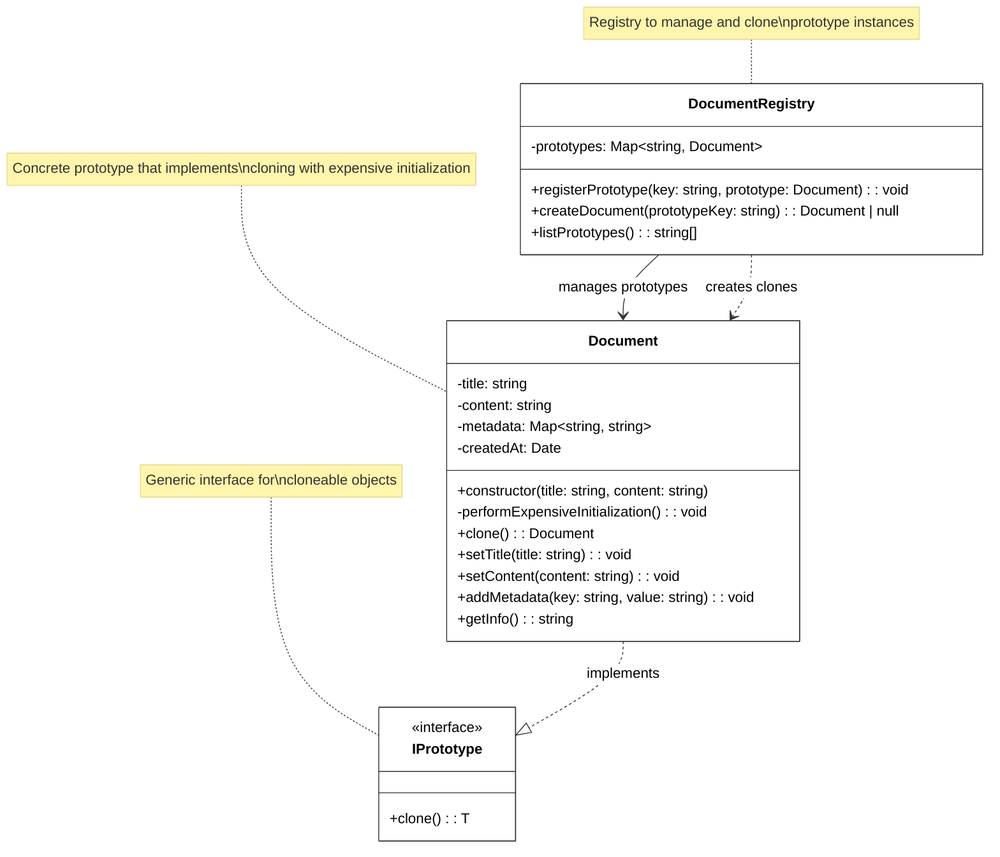

# Prototype Pattern

🇺🇸 English Version | [🇪🇸 Versión en Español](./README.es.md)

## UML Diagram



## What is the Prototype Pattern?

The **Prototype** pattern is a creational design pattern that allows you to **copy existing objects** without making your code dependent on their concrete classes. Instead of creating objects from scratch, it creates new instances by cloning prototypes.

## Problem it Solves

### ❌ Without Prototype: Expensive Object Creation
```typescript
class ReportSystem {
    createMonthlyReport(): Document {
        // PROBLEM! Expensive initialization every time
        const report = new Document("Monthly Report", "Base content");
        
        // Expensive operations repeated for each instance:
        // - Load templates from database
        // - Validate document structure  
        // - Configure complex metadata
        // - Setup formatting rules
        
        report.addMetadata("type", "report");
        report.addMetadata("department", "general");
        // ... many more expensive operations
        
        return report; // Slow creation process
    }
}

// Problems:
// 1. Expensive initialization on every creation
// 2. Repetitive configuration code
// 3. Tight coupling to concrete classes
// 4. Difficult to maintain complex object creation
```

### ✅ With Prototype: Fast Object Cloning
```typescript
class DocumentRegistry {
    private prototypes = new Map<string, Document>();
    
    constructor() {
        // Create prototypes once (expensive)
        const reportPrototype = new Document("Report Template", "Base structure");
        // ... expensive initialization
        this.prototypes.set("report", reportPrototype);
    }
    
    createDocument(type: string): Document {
        const prototype = this.prototypes.get(type);
        return prototype.clone(); // Fast cloning!
    }
}

// Benefits:
// 1. Expensive initialization only once
// 2. Fast object creation through cloning
// 3. Reuse of complex configurations
// 4. Decouples client from concrete classes
```

## Pattern Components

### 1. **Prototype Interface** (`IPrototype`)
- Declares the cloning method common to all prototypes
- Usually contains a single `clone()` method
- Can be generic to work with different types

### 2. **Concrete Prototype** (`Document`)
- Implements the prototype interface
- Provides the actual cloning implementation
- Handles deep copying of complex internal state

### 3. **Registry/Manager** (`DocumentRegistry`)
- Manages a collection of prototype instances
- Provides convenient access to prototypes
- Can include factory methods for creation

### 4. **Client**
- Creates new objects by requesting clones from prototypes
- Doesn't need to know concrete classes
- Works with objects through the prototype interface

## Implementation Variants

### 1. **Simple Cloning**
```typescript
class SimpleDocument implements IPrototype<SimpleDocument> {
    constructor(private title: string, private content: string) {}
    
    clone(): SimpleDocument {
        return new SimpleDocument(this.title, this.content);
    }
}
```

### 2. **Deep Cloning with Complex State**
```typescript
class ComplexDocument implements IPrototype<ComplexDocument> {
    private metadata: Map<string, string>;
    
    clone(): ComplexDocument {
        const cloned = Object.create(Object.getPrototypeOf(this));
        cloned.title = this.title;
        cloned.metadata = new Map(this.metadata); // Deep copy
        return cloned;
    }
}
```

### 3. **Registry Pattern**
```typescript
class PrototypeRegistry<T extends IPrototype<T>> {
    private prototypes = new Map<string, T>();
    
    register(key: string, prototype: T): void {
        this.prototypes.set(key, prototype);
    }
    
    create(key: string): T | null {
        const prototype = this.prototypes.get(key);
        return prototype ? prototype.clone() : null;
    }
}
```

## When to Use Prototype

✅ **Use it when:**
- Object creation is expensive (database access, network calls, complex calculations)
- You need many similar objects with slight variations
- You want to avoid subclasses of creator classes
- Object configuration is complex and should be reused
- Runtime object composition is required

❌ **Don't use it when:**
- Objects are simple and cheap to create
- You rarely need copies of objects
- Object cloning is more complex than direct creation
- Deep copying causes performance issues

## Advantages

⚡ **Performance**: Avoids expensive object initialization
🔄 **Flexibility**: Easy to create object variations
🎯 **Decoupling**: Client doesn't depend on concrete classes
📋 **Configuration Reuse**: Complex setups can be shared
🔗 **Runtime Composition**: Dynamic object creation

## Disadvantages

🧩 **Complex Cloning**: Deep copying can be complicated
📈 **Memory Usage**: Keeping prototypes in memory
🔍 **Maintenance**: Changes in prototypes affect all clones
⚠️ **Circular References**: Can cause cloning issues

## Practical Example: Document System

### Real-world Scenario
A document management system needs to create different types of documents:

**Document Types:**
- **Reports**: Corporate reports with standard structure
- **Contracts**: Legal documents with predefined terms
- **Proposals**: Business proposals with templates
- **Invoices**: Billing documents with calculations

### Complete Workflow
```typescript
// 1. Setup prototype registry
const registry = new DocumentRegistry();

// 2. Register prototypes (expensive operations done once)
const reportPrototype = new Document("Report Template", "Standard structure");
reportPrototype.addMetadata("type", "report");
reportPrototype.addMetadata("department", "general");
registry.registerPrototype("report", reportPrototype);

// 3. Create documents quickly by cloning
const monthlyReport = registry.createDocument("report");
if (monthlyReport) {
    monthlyReport.setTitle("October 2025 Report");
    monthlyReport.setContent("Monthly activity summary");
    // Ready to use!
}
```

### Performance Comparison
```typescript
// Traditional Creation (slow)
function createTraditional(): Document {
    const doc = new Document("Report", "Content");
    // Expensive initialization...
    return doc; // ~200ms
}

// Prototype Creation (fast)
function createWithPrototype(registry: DocumentRegistry): Document {
    return registry.createDocument("report"); // ~5ms
}

// 40x faster with prototypes!
```

## Real-world Use Cases

### 🎮 **Game Object Creation**
```typescript
class GameObjectPrototype implements IPrototype<GameObjectPrototype> {
    constructor(
        private sprite: string,
        private animations: Animation[],
        private stats: Stats
    ) {}
    
    clone(): GameObjectPrototype {
        return new GameObjectPrototype(
            this.sprite,
            [...this.animations], // Clone animations
            { ...this.stats }     // Clone stats
        );
    }
}

// Usage
const enemyRegistry = new PrototypeRegistry<GameObjectPrototype>();
enemyRegistry.register("goblin", goblinPrototype);
enemyRegistry.register("orc", orcPrototype);

// Spawn enemies quickly
const goblin1 = enemyRegistry.create("goblin");
const goblin2 = enemyRegistry.create("goblin");
```

### 🌐 **Network Configuration**
```typescript
class NetworkConfig implements IPrototype<NetworkConfig> {
    constructor(
        private servers: Server[],
        private loadBalancer: LoadBalancer,
        private securityRules: SecurityRule[]
    ) {}
    
    clone(): NetworkConfig {
        return new NetworkConfig(
            this.servers.map(s => s.clone()),
            this.loadBalancer.clone(),
            this.securityRules.map(r => r.clone())
        );
    }
}

// Create environment configurations
const prodConfig = registry.create("production");
const testConfig = registry.create("testing");
```

### 🎨 **UI Component Templates**
```typescript
class ComponentTemplate implements IPrototype<ComponentTemplate> {
    constructor(
        private styles: CSSStyles,
        private layout: Layout,
        private bindings: DataBinding[]
    ) {}
    
    clone(): ComponentTemplate {
        return new ComponentTemplate(
            { ...this.styles },
            this.layout.clone(),
            this.bindings.map(b => b.clone())
        );
    }
}

// Create component variations
const buttonTemplate = registry.create("button");
const primaryButton = buttonTemplate.clone();
primaryButton.setStyle("background", "blue");
```

### 🏭 **Manufacturing Process Templates**
```typescript
class ProcessTemplate implements IPrototype<ProcessTemplate> {
    constructor(
        private steps: ProcessStep[],
        private quality: QualityControl,
        private resources: Resource[]
    ) {}
    
    clone(): ProcessTemplate {
        return new ProcessTemplate(
            this.steps.map(s => s.clone()),
            this.quality.clone(),
            this.resources.map(r => r.clone())
        );
    }
}

// Create process variations for different products
const standardProcess = registry.create("standard");
const premiumProcess = registry.create("premium");
```

## Prototype vs Other Patterns

### **Prototype vs Factory Method**
- **Prototype**: Creates objects by cloning existing instances
- **Factory Method**: Creates objects using constructors and configuration

### **Prototype vs Abstract Factory**
- **Prototype**: Clones individual objects
- **Abstract Factory**: Creates families of related objects

### **Prototype vs Builder**
- **Prototype**: Creates objects through cloning
- **Builder**: Constructs objects step by step

### **Prototype vs Singleton**
- **Prototype**: Creates multiple similar instances
- **Singleton**: Ensures only one instance exists

## Relationship with Other Patterns

- **Abstract Factory**: Can use Prototype to create product families
- **Command**: Commands can be stored as prototypes for undo functionality
- **Composite**: Tree structures can be cloned as prototypes
- **Decorator**: Decorated objects can serve as prototypes

## Implementation Considerations

### **Deep vs Shallow Cloning**
```typescript
class DocumentWithAttachments implements IPrototype<DocumentWithAttachments> {
    private attachments: File[];
    
    // Shallow clone (shares attachments)
    shallowClone(): DocumentWithAttachments {
        const clone = Object.create(Object.getPrototypeOf(this));
        clone.attachments = this.attachments; // Shared reference
        return clone;
    }
    
    // Deep clone (copies attachments)
    clone(): DocumentWithAttachments {
        const clone = Object.create(Object.getPrototypeOf(this));
        clone.attachments = this.attachments.map(f => f.copy()); // Deep copy
        return clone;
    }
}
```

### **Cloning with Immutable Objects**
```typescript
class ImmutableDocument implements IPrototype<ImmutableDocument> {
    constructor(
        private readonly title: string,
        private readonly content: string,
        private readonly metadata: ReadonlyMap<string, string>
    ) {}
    
    clone(): ImmutableDocument {
        // Immutable objects can safely share references
        return new ImmutableDocument(
            this.title,
            this.content,
            this.metadata
        );
    }
    
    withTitle(newTitle: string): ImmutableDocument {
        return new ImmutableDocument(newTitle, this.content, this.metadata);
    }
}
```

### **Registry with Lazy Loading**
```typescript
class LazyPrototypeRegistry {
    private prototypes = new Map<string, () => Document>();
    
    register(key: string, factory: () => Document): void {
        this.prototypes.set(key, factory);
    }
    
    create(key: string): Document | null {
        const factory = this.prototypes.get(key);
        if (!factory) return null;
        
        const prototype = factory(); // Create prototype on demand
        return prototype.clone();
    }
}
```

The Prototype pattern is especially useful in scenarios where object creation is expensive and you need multiple similar instances with slight variations, providing significant performance improvements and flexible object creation.