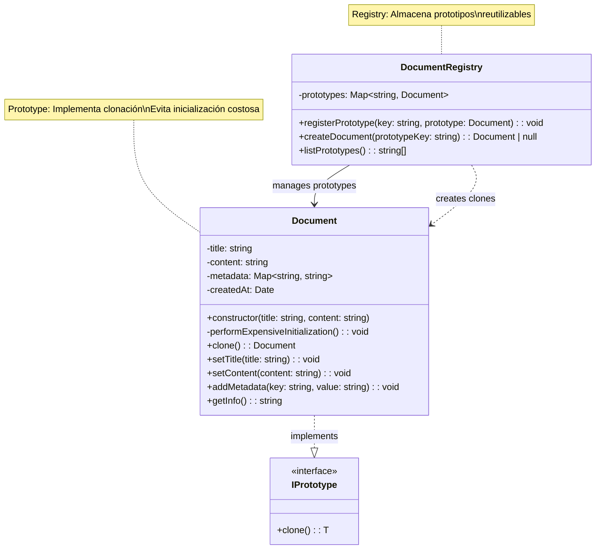

# Patrón Prototype - Diagrama UML

## Estructura del Patrón Prototype

**Componentes principales:**
- `IPrototype<T>` - Interface que define el método de clonación
- `Document` - Clase concreta que implementa la clonación
- `DocumentRegistry` - Registro que mantiene prototipos reutilizables

**Flujo:**
1. Se crean prototipos costosos una sola vez
2. Se registran en el DocumentRegistry
3. Se clonan rápidamente según necesidad
4. Se personalizan los clones sin afectar el prototipo original

**Ventaja clave:** Evita la inicialización costosa al reutilizar objetos pre-configurados.