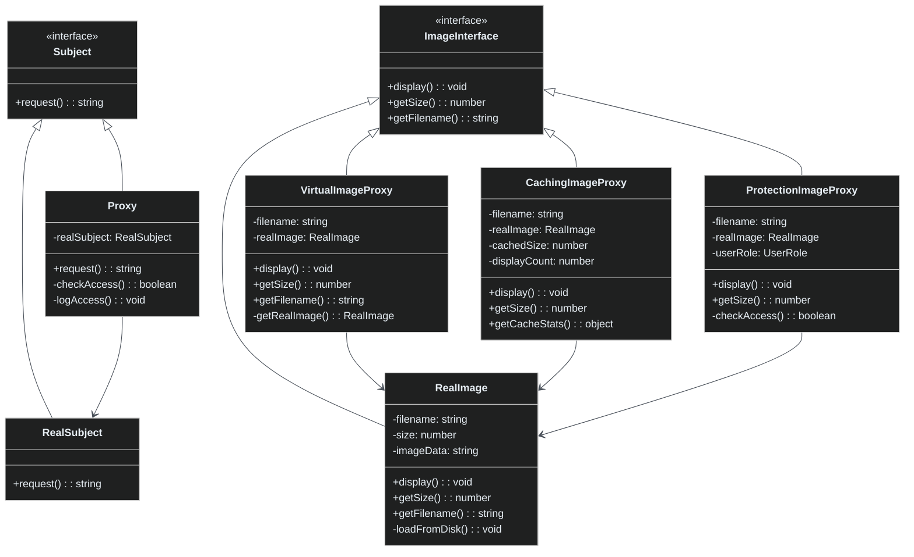

# Patrón Proxy

🇪🇸 Español | [🇺🇸 English](README.md)

## Descripción

El **Patrón Proxy** proporciona un marcador de posición o sustituto para otro objeto para controlar el acceso a él. Actúa como intermediario que puede añadir funcionalidad extra como carga perezosa, caché, control de acceso o logging sin cambiar el objeto original.

## Problema

Cuando necesitas:
- Controlar la creación de objetos costosos (crear solo cuando sea necesario)
- Añadir control de acceso o seguridad a objetos existentes
- Cachear resultados para mejorar el rendimiento
- Añadir logging, monitoreo u otras preocupaciones transversales
- Proporcionar representación local de objetos remotos

## Solución

El patrón Proxy crea un objeto proxy que:
- Implementa la misma interfaz que el objeto real
- Controla el acceso al objeto real
- Puede añadir comportamiento adicional antes/después de delegar al objeto real
- Mantiene transparencia para los clientes

## Estructura



## Tipos de Proxies

### 1. Proxy Virtual (Carga Perezosa)
Retrasa la creación de objetos costosos hasta que sea realmente necesario.

```typescript
// Crear proxy instantáneamente (sin carga)
const image = new VirtualImageProxy("large_photo.jpg");

// La imagen se carga solo cuando se accede por primera vez
image.display(); // Dispara la carga
image.display(); // Usa la imagen ya cargada
```

### 2. Proxy de Caché
Cachea resultados para mejorar el rendimiento en operaciones repetidas.

```typescript
const cachedImage = new CachingImageProxy("image.jpg");

cachedImage.getSize(); // Calcula y cachea
cachedImage.getSize(); // Devuelve resultado cacheado
cachedImage.display(); // Primera visualización carga
cachedImage.display(); // Visualizaciones subsiguientes usan caché
```

### 3. Proxy de Protección
Controla el acceso basado en permisos o reglas de seguridad.

```typescript
const guestImage = new ProtectionImageProxy("premium.jpg", UserRole.GUEST);
const adminImage = new ProtectionImageProxy("confidential.jpg", UserRole.ADMIN);

guestImage.display(); // Acceso denegado
adminImage.display(); // Acceso concedido
```

## Beneficios Clave

- **Inicialización Perezosa**: Crear objetos costosos solo cuando sea necesario
- **Control de Acceso**: Añadir seguridad sin modificar objetos originales
- **Rendimiento**: Cachear resultados y optimizar operaciones repetidas
- **Transparencia**: Los clientes usan la misma interfaz que los objetos reales
- **Separación de Responsabilidades**: Mantener lógica de negocio separada de preocupaciones transversales

## Cuándo Usar

✅ **Bueno para:**
- Creación de objetos costosos (conexiones de base de datos, archivos grandes)
- Acceso a objetos remotos (servicios web, APIs)
- Control de acceso y seguridad
- Caché y optimización de rendimiento
- Logging y monitoreo

❌ **Evitar cuando:**
- Objetos simples sin operaciones costosas
- No hay necesidad de control de acceso o comportamiento adicional
- La sobrecarga de rendimiento supera los beneficios
- La interfaz cambia frecuentemente

## Comparación con Otros Patrones

| Patrón | Propósito | Diferencia Clave |
|--------|-----------|------------------|
| **Proxy** | Controlar acceso | Mantiene misma interfaz, añade control/comportamiento |
| **Decorator** | Añadir comportamiento | Se enfoca en añadir nuevas capacidades dinámicamente |
| **Adapter** | Compatibilidad de interfaz | Hace que interfaces incompatibles trabajen juntas |
| **Facade** | Simplificar interfaz | Proporciona interfaz más simple a subsistema complejo |

## Ejemplos del Mundo Real

- **Memoria Virtual**: SO usa memoria virtual como proxy a memoria física
- **CDN**: Redes de entrega de contenido como proxy para recursos web
- **ORM**: Mapeo objeto-relacional como proxy a base de datos
- **Carga Perezosa**: Galerías de imágenes, scroll infinito
- **Proxies de Seguridad**: Capas de autenticación y autorización
- **Punteros Inteligentes**: Punteros inteligentes de C++ controlando ciclo de vida de objetos

## Características de Rendimiento

| Tipo de Proxy | Velocidad de Creación | Velocidad de Acceso | Uso de Memoria |
|---------------|----------------------|---------------------|----------------|
| **Virtual** | Muy Rápida | Lento primer acceso, rápido subsiguiente | Bajo inicial, alto después de cargar |
| **Caché** | Rápida | Muy rápida después del primer acceso | Mayor (almacena caché) |
| **Protección** | Rápida | Ligeramente más lenta (verificaciones de acceso) | Baja sobrecarga |

## Ejecutar el Ejemplo

```bash
cd proxy
npx ts-node Main.ts
```

Esto demuestra:
- Funcionalidad básica de proxy con control de acceso
- Proxy virtual con carga perezosa para operaciones costosas
- Proxy de caché mejorando el rendimiento de operaciones repetidas
- Proxy de protección con control de acceso basado en roles
- Comparación de rendimiento entre acceso directo y patrones proxy