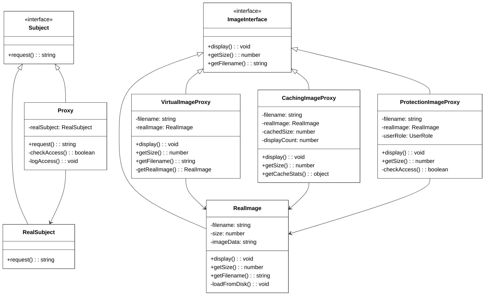

# Proxy Pattern

[🇪🇸 Español](README.es.md) | 🇺🇸 English

## Overview

The **Proxy Pattern** provides a placeholder or surrogate for another object to control access to it. It acts as an intermediary that can add extra functionality like lazy loading, caching, access control, or logging without changing the original object.

## Problem

When you need to:
- Control expensive object creation (only create when needed)
- Add access control or security to existing objects
- Cache results to improve performance
- Add logging, monitoring, or other cross-cutting concerns
- Provide local representation of remote objects

## Solution

The Proxy pattern creates a proxy object that:
- Implements the same interface as the real object
- Controls access to the real object
- Can add additional behavior before/after delegating to real object
- Maintains transparency to clients

## Structure



## Types of Proxies

### 1. Virtual Proxy (Lazy Loading)
Delays expensive object creation until actually needed.

```typescript
// Create proxy instantly (no loading)
const image = new VirtualImageProxy("large_photo.jpg");

// Image loads only when first accessed
image.display(); // Triggers loading
image.display(); // Uses already loaded image
```

### 2. Caching Proxy
Caches results to improve performance on repeated operations.

```typescript
const cachedImage = new CachingImageProxy("image.jpg");

cachedImage.getSize(); // Calculates and caches
cachedImage.getSize(); // Returns cached result
cachedImage.display(); // First display loads
cachedImage.display(); // Subsequent displays use cache
```

### 3. Protection Proxy
Controls access based on permissions or security rules.

```typescript
const guestImage = new ProtectionImageProxy("premium.jpg", UserRole.GUEST);
const adminImage = new ProtectionImageProxy("confidential.jpg", UserRole.ADMIN);

guestImage.display(); // Access denied
adminImage.display(); // Access granted
```

## Key Benefits

- **Lazy Initialization**: Create expensive objects only when needed
- **Access Control**: Add security without modifying original objects
- **Performance**: Cache results and optimize repeated operations
- **Transparency**: Clients use same interface as real objects
- **Separation of Concerns**: Keep business logic separate from cross-cutting concerns

## When to Use

✅ **Good for:**
- Expensive object creation (database connections, large files)
- Remote object access (web services, APIs)
- Access control and security
- Caching and performance optimization
- Logging and monitoring

❌ **Avoid when:**
- Simple objects with no expensive operations
- No need for access control or additional behavior
- Performance overhead outweighs benefits
- Interface changes frequently

## Comparison with Other Patterns

| Pattern | Purpose | Key Difference |
|---------|---------|----------------|
| **Proxy** | Control access | Maintains same interface, adds control/behavior |
| **Decorator** | Add behavior | Focuses on adding new capabilities dynamically |
| **Adapter** | Interface compatibility | Makes incompatible interfaces work together |
| **Facade** | Simplify interface | Provides simpler interface to complex subsystem |

## Real-World Examples

- **Virtual Memory**: OS uses virtual memory as proxy to physical memory
- **CDN**: Content delivery networks as proxy for web resources
- **ORM**: Object-relational mapping as proxy to database
- **Lazy Loading**: Image galleries, infinite scroll
- **Security Proxies**: Authentication and authorization layers
- **Smart Pointers**: C++ smart pointers controlling object lifecycle

## Performance Characteristics

| Proxy Type | Creation Speed | Access Speed | Memory Usage |
|------------|---------------|--------------|--------------|
| **Virtual** | Very Fast | Slow first access, fast subsequent | Low initial, high after loading |
| **Caching** | Fast | Very fast after first access | Higher (stores cache) |
| **Protection** | Fast | Slightly slower (access checks) | Low overhead |

## Running the Example

```bash
cd proxy
npx ts-node Main.ts
```

This demonstrates:
- Basic proxy functionality with access control
- Virtual proxy with lazy loading for expensive operations
- Caching proxy improving repeated operation performance
- Protection proxy with role-based access control
- Performance comparison between direct access and proxy patterns