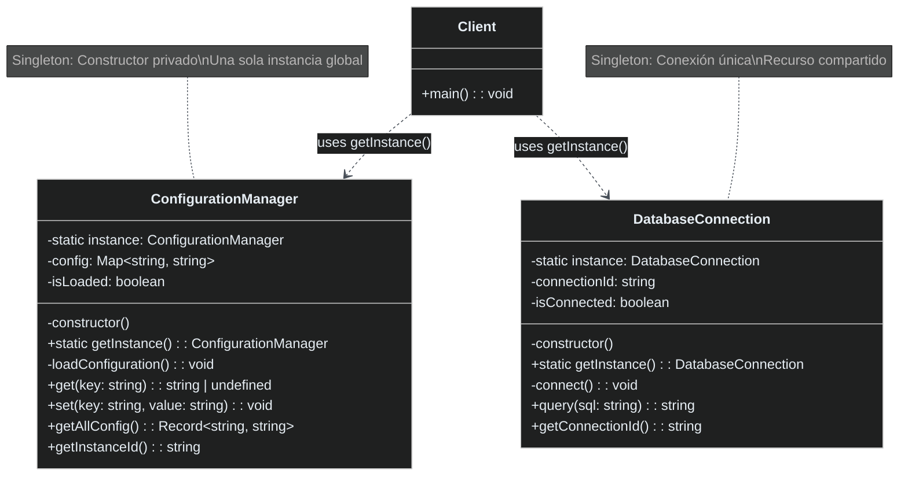

# Patrón Singleton

[🇺🇸 English Version](./README.md) | 🇪🇸 Versión en Español

## Diagrama UML



## ¿Qué es el Patrón Singleton?

El patrón **Singleton** es un patrón de diseño creacional que garantiza que una clase tenga **una sola instancia** y proporciona un **punto de acceso global** a ella. Es uno de los patrones más conocidos pero también uno de los más controvertidos.

## Problema que Resuelve

### ❌ Sin Singleton
```typescript
// Múltiples instancias pueden causar problemas
const config1 = new ConfigurationManager(); // Carga configuración
const config2 = new ConfigurationManager(); // Carga configuración OTRA VEZ
const config3 = new ConfigurationManager(); // Y OTRA VEZ más...

// Problemas:
// 1. Recursos desperdiciados (múltiples cargas)
// 2. Estado inconsistente entre instancias
// 3. Posibles conflictos de recursos
```

### ✅ Con Singleton
```typescript
// Una sola instancia garantizada
const config1 = ConfigurationManager.getInstance(); // Crea y carga
const config2 = ConfigurationManager.getInstance(); // Reutiliza
const config3 = ConfigurationManager.getInstance(); // Reutiliza

console.log(config1 === config2 === config3); // true
// Beneficios:
// 1. Una sola carga de configuración
// 2. Estado consistente en toda la app
// 3. Acceso controlado al recurso
```

## Componentes del Patrón

### 1. **Constructor Privado**
- Previene la instanciación directa con `new`
- Solo la propia clase puede crear instancias

### 2. **Variable Estática Instance**
- Almacena la única instancia de la clase
- Compartida por todos los accesos

### 3. **Método getInstance()**
- Punto de acceso global controlado
- Implementa inicialización perezosa (lazy loading)
- Retorna siempre la misma instancia

## Cuándo Usar Singleton

✅ **Úsalo cuando:**
- Necesitas exactamente una instancia (configuración, logger)
- Requieres acceso global a un recurso compartido
- Quieres controlar el acceso a recursos limitados (conexiones DB)
- Necesitas mantener estado global consistente

❌ **No lo uses cuando:**
- Puedes usar métodos estáticos simples
- El objeto no mantiene estado
- Necesitas múltiples instancias con configuraciones diferentes
- Quieres facilitar el testing (Singleton dificulta mocking)

## Ventajas

🎯 **Instancia Única**: Garantizada matemáticamente
🌍 **Acceso Global**: Disponible desde cualquier parte del código
⚡ **Inicialización Perezosa**: Solo se crea cuando se necesita
💾 **Ahorro de Recursos**: Evita instancias duplicadas
🔒 **Control de Acceso**: Centraliza el acceso a recursos críticos

## Desventajas

🧪 **Testing Difícil**: Complica unit testing y mocking
🔄 **Acoplamiento**: Crea dependencias globales implícitas  
🧵 **Thread Safety**: Requiere sincronización en entornos multi-hilo
🏗️ **Principio Responsabilidad Única**: Viola SRP (controla instanciación Y lógica de negocio)
🔧 **Extensibilidad**: Difícil de extender o modificar

## Variantes del Patrón

### 1. **Eager Initialization**
```typescript
class EagerSingleton {
    private static instance = new EagerSingleton(); // Creado inmediatamente
    private constructor() {}
    public static getInstance() { return EagerSingleton.instance; }
}
```

### 2. **Lazy Initialization** (Nuestra implementación)
```typescript
class LazySingleton {
    private static instance: LazySingleton;
    private constructor() {}
    public static getInstance() {
        if (!LazySingleton.instance) {
            LazySingleton.instance = new LazySingleton(); // Creado bajo demanda
        }
        return LazySingleton.instance;
    }
}
```

### 3. **Thread-Safe** (para entornos multi-hilo)
```typescript
class ThreadSafeSingleton {
    private static instance: ThreadSafeSingleton;
    private static lock = new Object();
    
    public static getInstance() {
        if (!ThreadSafeSingleton.instance) {
            synchronized(ThreadSafeSingleton.lock) {
                if (!ThreadSafeSingleton.instance) {
                    ThreadSafeSingleton.instance = new ThreadSafeSingleton();
                }
            }
        }
        return ThreadSafeSingleton.instance;
    }
}
```

## Ejemplo Práctico: Sistema de Configuración

En nuestro ejemplo implementamos dos Singletons:

### **ConfigurationManager**
- Carga configuración de la aplicación una sola vez
- Proporciona acceso global a configuraciones
- Permite actualizar configuraciones en runtime

### **DatabaseConnection**
- Mantiene una conexión única a la base de datos
- Evita el overhead de múltiples conexiones
- Centraliza el acceso a datos

## Casos de Uso Reales

### 🔧 **Configuración de Aplicaciones**
```typescript
const config = ConfigurationManager.getInstance();
const apiUrl = config.get('api_url');
const timeout = config.get('request_timeout');
```

### 📝 **Sistema de Logging**
```typescript
const logger = Logger.getInstance();
logger.info('Usuario logueado');
logger.error('Error en la transacción');
```

### 🗄️ **Pool de Conexiones**
```typescript
const pool = ConnectionPool.getInstance();
const connection = pool.getConnection();
```

### 🧠 **Cache Global**
```typescript
const cache = CacheManager.getInstance();
cache.set('user:123', userData);
const user = cache.get('user:123');
```

## Anti-Pattern: ¿Por qué es Controvertido?

Muchos desarrolladores consideran Singleton un **anti-pattern** porque:

1. **Estado Global Oculto**: Introduce dependencias globales no explícitas
2. **Testing Pesadilla**: Dificulta aislamiento en tests
3. **Acoplamiento Fuerte**: Las clases se acoplan implícitamente al Singleton
4. **Violación SRP**: Mezcla lógica de negocio con control de instanciación

## Alternativas Modernas

### **Dependency Injection**
```typescript
class UserService {
    constructor(private config: ConfigurationManager) {}
}

// En lugar de:
// const config = ConfigurationManager.getInstance();
```

### **Módulos ES6**
```typescript
// config.ts
export const config = new ConfigurationManager();

// app.ts
import { config } from './config';
```

## Relación con Otros Patrones

- **vs Factory**: Factory crea múltiples instancias, Singleton solo una
- **con Abstract Factory**: La factory puede ser Singleton
- **con Facade**: Facade puede implementarse como Singleton
- **con State/Strategy**: El contexto puede ser Singleton