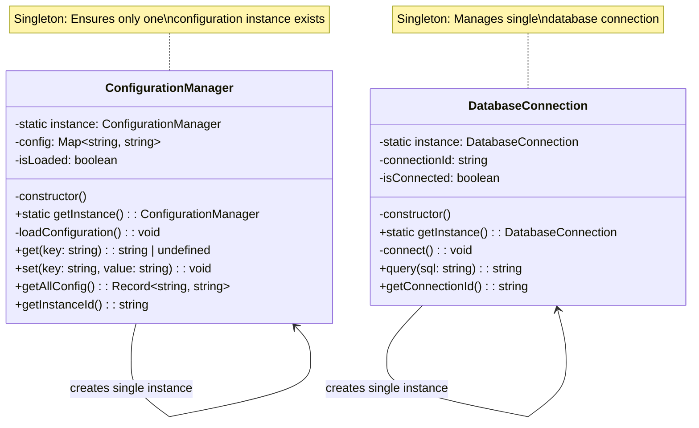

# Singleton Pattern

🇺🇸 English Version | [🇪🇸 Versión en Español](./README.es.md)

## UML Diagram



## What is the Singleton Pattern?

The **Singleton** pattern is a creational design pattern that ensures a class has **only one instance** and provides a global point of access to that instance. It's useful when exactly one object is needed to coordinate actions across the system.

## Problem it Solves

### ❌ Without Singleton: Multiple Instances Problem
```typescript
class ConfigurationManager {
    private config: Map<string, string>;
    
    constructor() {
        this.config = new Map();
        this.loadExpensiveConfiguration(); // Expensive operation!
    }
}

// PROBLEM! Multiple instances created
const config1 = new ConfigurationManager(); // Loads config
const config2 = new ConfigurationManager(); // Loads AGAIN
const config3 = new ConfigurationManager(); // Loads AGAIN

config1.set("theme", "dark");
console.log(config2.get("theme")); // undefined! Different instance

// Problems:
// 1. Expensive initialization repeated
// 2. Inconsistent state across instances
// 3. Wasted memory resources
// 4. No shared global state
```

### ✅ With Singleton: Single Instance Guaranteed
```typescript
class ConfigurationManager {
    private static instance: ConfigurationManager;
    private config: Map<string, string>;
    
    private constructor() { // Private constructor!
        this.config = new Map();
        this.loadExpensiveConfiguration(); // Only once!
    }
    
    static getInstance(): ConfigurationManager {
        if (!this.instance) {
            this.instance = new ConfigurationManager();
        }
        return this.instance;
    }
}

// SOLUTION! Always the same instance
const config1 = ConfigurationManager.getInstance(); // Creates instance
const config2 = ConfigurationManager.getInstance(); // Returns same instance
const config3 = ConfigurationManager.getInstance(); // Returns same instance

config1.set("theme", "dark");
console.log(config2.get("theme")); // "dark" - Shared state!

// Benefits:
// 1. Expensive initialization only once
// 2. Consistent shared state
// 3. Controlled global access
// 4. Resource efficiency
```

## Pattern Components

### 1. **Private Constructor**
- Prevents direct instantiation with `new`
- Forces clients to use the static method
- Essential for maintaining single instance

### 2. **Static Instance Variable**
- Holds the single instance of the class
- Usually private to prevent external modification
- Initialized lazily when first requested

### 3. **Static getInstance() Method**
- Provides global access point to the instance
- Creates instance if it doesn't exist (lazy initialization)
- Returns existing instance on subsequent calls

### 4. **Instance Methods**
- Normal business logic methods
- Operate on the single shared instance
- Maintain state across the application

## Implementation Variants

### 1. **Lazy Initialization (Standard)**
```typescript
class Lazysingleton {
    private static instance: LazysingLeton;
    
    private constructor() {}
    
    static getInstance(): LazysingLeton {
        if (!this.instance) {
            this.instance = new LazysingLeton();
        }
        return this.instance;
    }
}
```

### 2. **Eager Initialization**
```typescript
class EagerSingleton {
    private static instance: EagerSingleton = new EagerSingleton();
    
    private constructor() {}
    
    static getInstance(): EagerSingleton {
        return this.instance;
    }
}
```

### 3. **Thread-Safe Singleton (TypeScript/JavaScript is single-threaded)**
```typescript
class ThreadSafeSingleton {
    private static instance: ThreadSafeSingleton;
    private static creating = false;
    
    private constructor() {}
    
    static getInstance(): ThreadSafeSingleton {
        if (!this.instance && !this.creating) {
            this.creating = true;
            this.instance = new ThreadSafeSingleton();
            this.creating = false;
        }
        return this.instance;
    }
}
```

### 4. **Enum Singleton (Alternative)**
```typescript
enum SingletonEnum {
    INSTANCE
}

namespace SingletonEnum {
    export function doSomething(): void {
        console.log("Singleton behavior");
    }
}

// Usage: SingletonEnum.INSTANCE or SingletonEnum.doSomething()
```

## When to Use Singleton

✅ **Use it when:**
- You need exactly one instance of a class (database connection, logger, cache)
- The instance must be accessible from multiple points in the application
- You want to control access to shared resources
- The instance maintains global state that should be consistent
- Lazy initialization is desired for expensive objects

❌ **Don't use it when:**
- Multiple instances might be needed in the future
- The class doesn't maintain state
- It makes testing difficult (global state)
- It violates Single Responsibility Principle
- It creates tight coupling

## Advantages

🎯 **Single Instance**: Guarantees only one instance exists
🌍 **Global Access**: Accessible from anywhere in the application
⚡ **Lazy Loading**: Created only when needed
💾 **Memory Efficient**: Prevents multiple instances
🔒 **Controlled Access**: Centralized point of control

## Disadvantages

🧪 **Testing Difficulties**: Hard to mock and test
🔗 **Tight Coupling**: Creates dependencies throughout code
📈 **Scalability Issues**: Can become bottleneck
🔄 **State Problems**: Global mutable state is problematic
🚫 **Violates SOLID**: Often violates Single Responsibility Principle

## Practical Example: Configuration System

### Real-world Scenario
An application needs to manage configuration settings that should be:

**Requirements:**
- **Consistent**: Same configuration across the entire application
- **Efficient**: Load configuration only once from file/database
- **Accessible**: Available from any part of the application
- **Updatable**: Allow runtime configuration changes

### Complete Workflow
```typescript
// 1. Get configuration instance
const config = ConfigurationManager.getInstance();

// 2. Access configuration values
const apiKey = config.get("api_key");
const dbUrl = config.get("database_url");

// 3. Update configuration at runtime
config.set("feature_flag", "enabled");

// 4. From anywhere else in the application
const sameConfig = ConfigurationManager.getInstance(); // Same instance!
const featureFlag = sameConfig.get("feature_flag"); // "enabled"
```

### Database Connection Management
```typescript
// Multiple parts of application request database access
const userService = new UserService();
const orderService = new OrderService();
const reportService = new ReportService();

// All services use the same database connection
const db1 = DatabaseConnection.getInstance(); // Creates connection
const db2 = DatabaseConnection.getInstance(); // Reuses connection
const db3 = DatabaseConnection.getInstance(); // Reuses connection

console.log(db1 === db2 === db3); // true - Same instance!
```

## Real-world Use Cases

### 📝 **Application Logger**
```typescript
class Logger {
    private static instance: Logger;
    private logLevel: LogLevel = LogLevel.INFO;
    
    private constructor() {}
    
    static getInstance(): Logger {
        if (!this.instance) {
            this.instance = new Logger();
        }
        return this.instance;
    }
    
    log(level: LogLevel, message: string): void {
        if (level >= this.logLevel) {
            console.log(`[${LogLevel[level]}] ${new Date().toISOString()}: ${message}`);
        }
    }
    
    setLogLevel(level: LogLevel): void {
        this.logLevel = level;
    }
}

// Usage throughout application
Logger.getInstance().log(LogLevel.ERROR, "Database connection failed");
Logger.getInstance().setLogLevel(LogLevel.DEBUG);
```

### 🗄️ **Cache Manager**
```typescript
class CacheManager {
    private static instance: CacheManager;
    private cache = new Map<string, { data: any; expiry: number }>();
    
    private constructor() {}
    
    static getInstance(): CacheManager {
        if (!this.instance) {
            this.instance = new CacheManager();
        }
        return this.instance;
    }
    
    set(key: string, data: any, ttlSeconds: number = 300): void {
        const expiry = Date.now() + (ttlSeconds * 1000);
        this.cache.set(key, { data, expiry });
    }
    
    get(key: string): any {
        const item = this.cache.get(key);
        if (!item || Date.now() > item.expiry) {
            this.cache.delete(key);
            return null;
        }
        return item.data;
    }
}

// Shared cache across application
const cache = CacheManager.getInstance();
cache.set("user:123", userData, 600);
```

### 🔧 **Application Settings**
```typescript
class AppSettings {
    private static instance: AppSettings;
    private settings = new Map<string, any>();
    
    private constructor() {
        this.loadDefaultSettings();
    }
    
    static getInstance(): AppSettings {
        if (!this.instance) {
            this.instance = new AppSettings();
        }
        return this.instance;
    }
    
    private loadDefaultSettings(): void {
        this.settings.set("theme", "light");
        this.settings.set("language", "en");
        this.settings.set("notifications", true);
    }
    
    get<T>(key: string): T {
        return this.settings.get(key);
    }
    
    set(key: string, value: any): void {
        this.settings.set(key, value);
        this.saveSettings(); // Persist changes
    }
    
    private saveSettings(): void {
        // Save to localStorage, file, or database
        localStorage.setItem("appSettings", JSON.stringify(Object.fromEntries(this.settings)));
    }
}
```

### 🌐 **API Client**
```typescript
class APIClient {
    private static instance: APIClient;
    private baseURL: string;
    private authToken?: string;
    
    private constructor() {
        this.baseURL = process.env.API_BASE_URL || "https://api.example.com";
    }
    
    static getInstance(): APIClient {
        if (!this.instance) {
            this.instance = new APIClient();
        }
        return this.instance;
    }
    
    setAuthToken(token: string): void {
        this.authToken = token;
    }
    
    async get(endpoint: string): Promise<any> {
        const headers: Record<string, string> = {};
        if (this.authToken) {
            headers.Authorization = `Bearer ${this.authToken}`;
        }
        
        const response = await fetch(`${this.baseURL}${endpoint}`, { headers });
        return response.json();
    }
}

// Single API client instance across app
const api = APIClient.getInstance();
api.setAuthToken("abc123");
```

### 🎮 **Game State Manager**
```typescript
class GameState {
    private static instance: GameState;
    private score: number = 0;
    private level: number = 1;
    private lives: number = 3;
    
    private constructor() {}
    
    static getInstance(): GameState {
        if (!this.instance) {
            this.instance = new GameState();
        }
        return this.instance;
    }
    
    addScore(points: number): void {
        this.score += points;
        if (this.score > this.level * 1000) {
            this.levelUp();
        }
    }
    
    loseLife(): void {
        this.lives--;
        if (this.lives <= 0) {
            this.gameOver();
        }
    }
    
    private levelUp(): void {
        this.level++;
        console.log(`Level up! Now at level ${this.level}`);
    }
    
    private gameOver(): void {
        console.log(`Game Over! Final score: ${this.score}`);
    }
    
    getState(): { score: number; level: number; lives: number } {
        return { score: this.score, level: this.level, lives: this.lives };
    }
}
```

## Singleton vs Other Patterns

### **Singleton vs Factory Method**
- **Singleton**: Ensures single instance of one class
- **Factory Method**: Creates multiple instances of different classes

### **Singleton vs Abstract Factory**
- **Singleton**: Controls instantiation of single class
- **Abstract Factory**: Creates families of related objects

### **Singleton vs Prototype**
- **Singleton**: Prevents multiple instances
- **Prototype**: Creates multiple instances through cloning

## Relationship with Other Patterns

- **Abstract Factory**: Factory classes can be implemented as Singletons
- **Builder**: Director class can be a Singleton
- **Facade**: Facade objects are often Singletons
- **State**: State objects can be implemented as Singletons

## Modern Alternatives to Singleton

### **Dependency Injection**
```typescript
// Instead of Singleton
class DatabaseService {
    constructor(private connection: DatabaseConnection) {}
}

// Inject the same instance
const dbConnection = new DatabaseConnection();
const userService = new DatabaseService(dbConnection);
const orderService = new DatabaseService(dbConnection);
```

### **Module Pattern**
```typescript
// config.ts - Natural singleton through module system
let config: Map<string, string> = new Map();

export function getConfig(key: string): string | undefined {
    return config.get(key);
}

export function setConfig(key: string, value: string): void {
    config.set(key, value);
}

// Usage - same instance across imports
import { getConfig, setConfig } from './config';
```

### **Service Container**
```typescript
class ServiceContainer {
    private services = new Map<string, any>();
    
    register<T>(key: string, factory: () => T): void {
        this.services.set(key, factory);
    }
    
    get<T>(key: string): T {
        const factory = this.services.get(key);
        return factory ? factory() : null;
    }
}

const container = new ServiceContainer();
container.register("database", () => new DatabaseConnection());
```

## Testing Considerations

### **Problem with Testing**
```typescript
// Hard to test because of global state
function getUserData(id: string): User {
    const db = DatabaseConnection.getInstance(); // Hard to mock!
    return db.query(`SELECT * FROM users WHERE id = ${id}`);
}
```

### **Solutions for Testing**
```typescript
// 1. Reset method for tests
class TestablesingLeton {
    private static instance: TestablesingLeton;
    
    static getInstance(): TestablesingLeton { /* ... */ }
    
    // For testing only
    static resetInstance(): void {
        this.instance = undefined;
    }
}

// 2. Dependency injection interface
interface IDatabase {
    query(sql: string): any;
}

class DatabaseSingleton implements IDatabase {
    // Singleton implementation
}

function getUserData(id: string, db: IDatabase = DatabaseSingleton.getInstance()): User {
    return db.query(`SELECT * FROM users WHERE id = ${id}`);
}

// Now testable with mock
const mockDb: IDatabase = { query: jest.fn() };
getUserData("123", mockDb);
```

## Best Practices

### **Lazy vs Eager Loading**
```typescript
// Lazy (better for expensive objects)
class LazysingLeton {
    private static instance: LazysingLeton;
    
    static getInstance(): LazysingLeton {
        if (!this.instance) {
            this.instance = new LazysingLeton(); // Created when needed
        }
        return this.instance;
    }
}

// Eager (better for lightweight objects)
class EagerSingleton {
    private static instance: EagerSingleton = new EagerSingleton(); // Created immediately
    
    static getInstance(): EagerSingleton {
        return this.instance;
    }
}
```

### **Preventing Inheritance Issues**
```typescript
class FinalSingleton {
    private static instance: FinalSingleton;
    
    private constructor() {
        // Prevent inheritance
        if (new.target !== FinalSingleton) {
            throw new Error("Cannot inherit from Singleton");
        }
    }
    
    static getInstance(): FinalSingleton {
        if (!this.instance) {
            this.instance = new FinalSingleton();
        }
        return this.instance;
    }
}
```

The Singleton pattern is powerful for managing global state and expensive resources, but should be used judiciously due to its impact on testability and coupling. Modern alternatives like dependency injection and module patterns often provide better solutions.