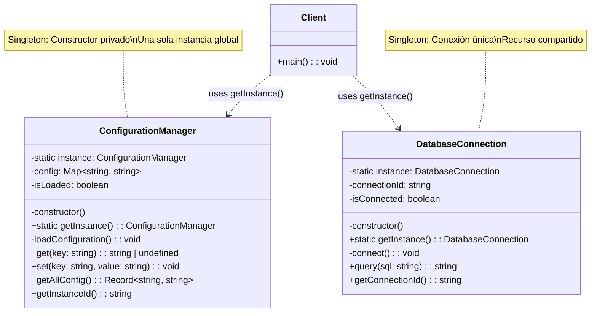

# Patrón Singleton - Diagrama UML

## Estructura del Patrón Singleton

**Componentes principales:**
- Constructor privado que previene instanciación directa
- Variable estática `instance` que almacena la única instancia
- Método estático `getInstance()` que controla el acceso
- Inicialización perezosa (lazy initialization)

**Características clave:**
- ✅ Una sola instancia garantizada
- ✅ Acceso global controlado
- ✅ Inicialización bajo demanda
- ✅ Compartición de recursos (configuración, conexiones)

**Casos de uso típicos:**
- Configuraciones de aplicación
- Conexiones a base de datos
- Loggers centralizados
- Pools de recursos